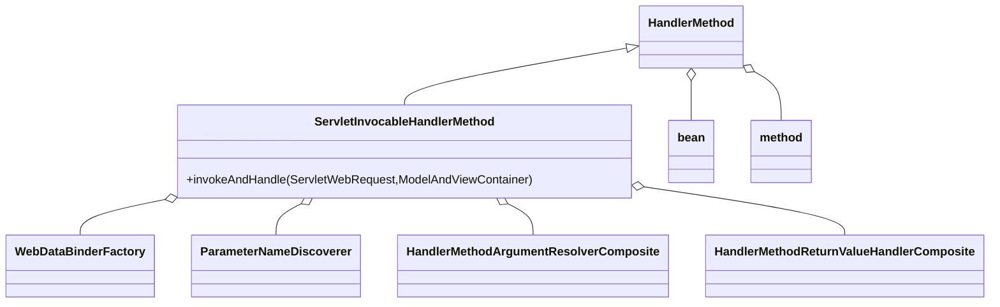
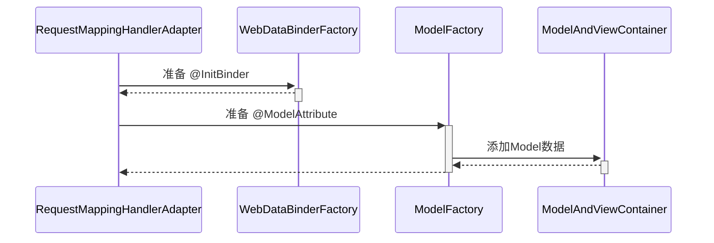
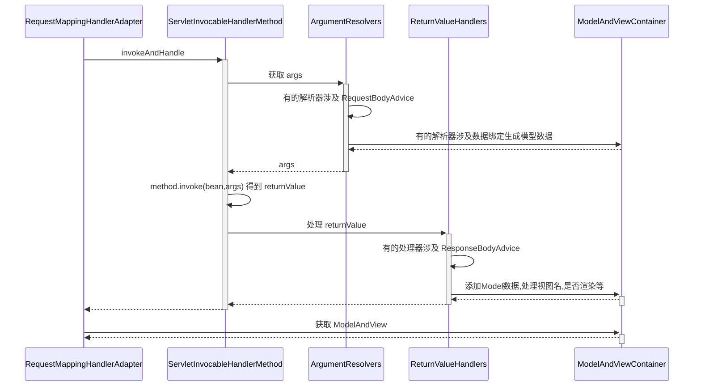

# Spring原理知识

### 一、BeanFactory

1. 什么是BeanFactory  
	- ApplicationContext的父接口  
	-  Spring的核心容器，主要的ApplicationContext实现都组合了它的功能
## 第二讲、容器实现
1. BeanFactory实现的特点
	
	- BeanFactory实现
	
	  - a.beanFactory不会做的事
	    - 1.beanFactory不会主动调用BeanFactory后处理器
	    - 2.不会主动添加Bean后处理器
	    - 3.不会主动初始化单例对象
	    - 4.不会解析beanFactory 还不会解析${}与#{}
	
	- ```java
	  package com.yyue;  
	  import org.slf4j.Logger;  
	  import org.slf4j.LoggerFactory;  
	  import org.springframework.beans.factory.BeanFactory;  
	  import org.springframework.beans.factory.annotation.Autowired;  
	  import org.springframework.beans.factory.config.BeanFactoryPostProcessor;  
	  import org.springframework.beans.factory.support.AbstractBeanDefinition;  
	  import org.springframework.beans.factory.support.BeanDefinitionBuilder;  
	  import org.springframework.beans.factory.support.DefaultListableBeanFactory;  
	  import org.springframework.context.annotation.AnnotationConfigUtils;  
	  import org.springframework.context.annotation.Bean;  
	  import org.springframework.context.annotation.Configuration;  
	  public class TestBeanFactory {  
	      public static void main(String[] args) {  
	          DefaultListableBeanFactory beanFactory = new DefaultListableBeanFactory();  
	          //bean的定义（class，scope，初始化，销毁）  
	          AbstractBeanDefinition beanDefinition =  
	              BeanDefinitionBuilder.genericBeanDefinition(Config.class).setScope("singleton").getBeanDefinition();  
	          beanFactory.registerBeanDefinition("config",beanDefinition);  
	    
	          //此时会发现只有config这一个beanname  
	          //但是在Config类中却使用@Bean注入了两个bean，所以此时还未解析@Configuration这个注解  
	          for (String beanDefinitionName : beanFactory.getBeanDefinitionNames()) {  
	              System.out.println(beanDefinitionName);  
	          }  
	    
	          //给beanfactory添加一些常用的后处理器（只是添加未被使用）  
	          AnnotationConfigUtils.registerAnnotationConfigProcessors(beanFactory);  
	    
	          System.out.println(&quot;================================================&quot;);  
	          for (String beanDefinitionName : beanFactory.getBeanDefinitionNames()) {  
	              System.out.println(beanDefinitionName);  
	          }  
	          //internalConfigurationAnnotationProcessor用来处理Configuration注解  
	          //通过类型获取beanFactory的后处理器  
	          beanFactory.getBeansOfType(BeanFactoryPostProcessor.class).values().stream().forEach(beanFactoryPostProcessor -&gt; {  
	              //执行beanFactory后处理器  
	              beanFactoryPostProcessor.postProcessBeanFactory(beanFactory);  
	          });  
	          System.out.println(&quot;================================================&quot;);  
	          for (String beanDefinitionName : beanFactory.getBeanDefinitionNames()) {  
	              System.out.println(beanDefinitionName);  
	          }  
	          
	          //获取bean1容器,调用getBean2来获取bean2
	          //并未获取到bean，也就意味着@Autowired注解未被解析
	  //        System.out.println(beanFactory.getBean(Bean1.class).getBean2());
	          //解析@Autowired需要bean的后处理器
	          //bean后处理器与bean工厂后处理器的不同点是，bean后处理器针对每个bean生命周期（bean创建、依赖注入、初始化等阶段）提供扩展功能
	          beanFactory.getBeansOfType(BeanPostProcessor.class).values().stream().forEach(beanFactory::addBeanPostProcessor);
	          //提前创建好单例对象，因为一开始都是需要用到的时候才会去创建（默认延迟创建单例对象）
	          beanFactory.preInstantiateSingletons();
	          System.out.println(&quot;=================================&quot;);
	          System.out.println(beanFactory.getBean(Bean1.class).getBean2());
	          
	      }  
	    
	      @Configuration  
	      static class Config{  
	          @Bean  
	          public Bean1 bean1(){  
	              return new Bean1();  
	          }  
	    
	          @Bean  
	          public Bean2 bean2(){  
	              return new Bean2();  
	          }  
	    
	      }  
	    
	      static class Bean1 {  
	          private static final Logger log = LoggerFactory.getLogger(Bean1.class);  
	          @Autowired  
	          private Bean2 bean2;  
	          public Bean1(){  
	              log.info(&quot;构造 bean1()&quot;);  
	          }  
	          public Bean2 getBean2(){  
	              return bean2;  
	          }  
	    
	      }  
	      static class Bean2{  
	          private static final Logger log = LoggerFactory.getLogger(Bean2.class);  
	          public Bean2(){  
	              log.info(&quot;构造 bean2()&quot;);  
	          }  
	      }  
	  }
	  ```
	
2. ApplicationContext

   - 学到了什么

     -  常见的ApplicationContext容器实现
     - 内嵌容器，DispatcherServlet的创建方法、作用

   - ```java
     package com.yyue;
     
     import org.slf4j.Logger;
     import org.slf4j.LoggerFactory;
     import org.springframework.boot.autoconfigure.web.servlet.DispatcherServletRegistrationBean;
     import org.springframework.boot.web.embedded.tomcat.TomcatServletWebServerFactory;
     import org.springframework.boot.web.servlet.context.AnnotationConfigServletWebApplicationContext;
     import org.springframework.boot.web.servlet.context.AnnotationConfigServletWebServerApplicationContext;
     import org.springframework.boot.web.servlet.server.ServletWebServerFactory;
     import org.springframework.context.annotation.AnnotationConfigApplicationContext;
     import org.springframework.context.annotation.Bean;
     import org.springframework.context.annotation.Configuration;
     import org.springframework.context.support.ClassPathXmlApplicationContext;
     import org.springframework.context.support.FileSystemXmlApplicationContext;
     import org.springframework.web.servlet.DispatcherServlet;
     import org.springframework.web.servlet.ModelAndView;
     import org.springframework.web.servlet.mvc.Controller;
     import javax.servlet.http.HttpServletRequest;
     import javax.servlet.http.HttpServletResponse;
     public class A02ApplicationContext {
         private static final Logger log = LoggerFactory.getLogger(A02ApplicationContext.class);
         public static void main(String[] args) {
     //        testClassPathXmlApplicationContext();
     //        testFileSystemXmlApplicationContext();
     //        testAnnotationConfigApplicationContext();
             testAnnotationConfigServletWebServerApplicationContext();
             //ClassPathXmlApplicationContext内部实现
     //        DefaultListableBeanFactory beanFactory = new DefaultListableBeanFactory();
     //        System.out.println("====================");
     //        for (String name : beanFactory.getBeanDefinitionNames()) {
     //            System.out.println(name);
     //        }
     //
     //        System.out.println("===========================");
     //        XmlBeanDefinitionReader reader = new XmlBeanDefinitionReader(beanFactory);
     //        reader.loadBeanDefinitions(new ClassPathResource("b01.xml"));
     //        for (String name : beanFactory.getBeanDefinitionNames()) {
     //            System.out.println(name);
     //        }
         }
         
         //比较经典的容器，基于classpath下xml格式的配置文件
         private static void testClassPathXmlApplicationContext(){
             ClassPathXmlApplicationContext context =
                     new ClassPathXmlApplicationContext("b01.xml");
             for (String name : context.getBeanDefinitionNames()) {
                 System.out.println(name);
             }
             System.out.println("=====================================");
             System.out.println(context.getBean(Bean2.class).getBean1());
         }
     
         //基于磁盘路径下xml格式的配置文件来创建、
         private static void testFileSystemXmlApplicationContext(){
             FileSystemXmlApplicationContext context = new FileSystemXmlApplicationContext("E:\\projectwork\\springboot_project\\springboot_16_cache\\src\\main\\resources\\Resource\\b01.xml");
             for (String name : context.getBeanDefinitionNames()) {
                 System.out.println(name);
             }
             System.out.println("=====================================");
             System.out.println(context.getBean(Bean2.class).getBean1());
         }
     
         //较为经典的容器，基于java配置类来创建
         private static void testAnnotationConfigApplicationContext(){
             AnnotationConfigApplicationContext context = new AnnotationConfigApplicationContext(SpringConfig.class);
             for (String name : context.getBeanDefinitionNames()) {
                 System.out.println(name);
             }
             System.out.println("=====================================");
             System.out.println(context.getBean(Bean2.class).getBean1());
         }
     
         //较为经典的容器，基于java配置类来创建，用于web环境
         private static void testAnnotationConfigServletWebServerApplicationContext(){
             AnnotationConfigServletWebServerApplicationContext context =
                     new AnnotationConfigServletWebServerApplicationContext(WebConfig.class);
         }
     
         @Configuration
         static class WebConfig{
             @Bean
             public ServletWebServerFactory servletWebServerFactory(){
                 return new TomcatServletWebServerFactory();
             }
             //前控制器
             @Bean
             public DispatcherServlet dispatcherServlet(){
                 return new DispatcherServlet();
             }
             @Bean
             public DispatcherServletRegistrationBean registrationBean(DispatcherServlet dispatcherServlet){
                 return new DispatcherServletRegistrationBean(dispatcherServlet,"/");
             }
             //控制器
             @Bean("/hello")
             public Controller controller1() {
                 return (httpServletRequest, httpServletResponse) -> {
                     httpServletResponse.getWriter().print("hello");
                     return null;
                 };
             }
         }
     
         @Configuration
         static class SpringConfig{
             @Bean
             public Bean1 bean1(){
                 return new Bean1();
             }
             @Bean
             public Bean2 bean2(Bean1 bean1){
                 Bean2 bean2 = new Bean2();
                 bean2.setBean1(bean1);
                 return bean2;
             }
         }
         
         static class Bean1 {
         }
     
         static class Bean2 {
             private Bean1 bean1;
             public Bean1 getBean1() {
                 return bean1;
             }
             public void setBean1(Bean1 bean1) {
                 this.bean1 = bean1;
             }
         }
     }
     ```
## 第三讲、bean的生命周期

### 1.Spring  Bean 生命周期各个阶段

- 创建
- 依赖注入
- 初始化
- 销毁

```java
@Component
public class LifeCycleBean {
    private static final Logger log = LoggerFactory.getLogger(LifeCycleBean.class);
    public LifeCycleBean(){
        log.debug("构造");
    }
    @Autowired
    public void autowire(@Value("${java_home}") String home){
        log.debug("依赖注入：{}", home);
    }
    @PostConstruct
    public void init(){
        log.debug("初始化");
    }
    @PreDestroy
    public void destory() {
        log.debug("销毁");
    }
}
```

```java
//可以在各个阶段对方法进行增强
@Component
public class MyBeanPostProcessor implements InstantiationAwareBeanPostProcessor, DestructionAwareBeanPostProcessor {
    private static final Logger log = LoggerFactory.getLogger(MyBeanPostProcessor.class);
    @Override
    public void postProcessBeforeDestruction(Object bean, String beanName) throws BeansException {
        if (beanName.equals("lifeCycleBean")){
            log.debug("<<<<<<<<<<<<<<销毁之前执行，如@PreDestroy");
        }
    }
    @Override
    public Object postProcessBeforeInstantiation(Class<?> beanClass, String beanName) throws BeansException {
        if (beanName.equals("lifeCycleBean")){
            log.debug("<<<<<<<<<<<<<<<<<<<<<<<<<<<<<<<<<<<<<,实例化之前执行，这里返回的对象会替换掉原本的bean");
        }
        return null;
    }
    @Override
    public boolean postProcessAfterInstantiation(Object bean, String beanName) throws BeansException {
        if (beanName.equals("lifeCycleBean")){
            log.debug("<<<<<<<<<<<<<<<<<<<<实例化之后执行，这里如果返回false会跳过依赖注入阶段");
        }
        return true;
    }
    @Override
    public PropertyValues postProcessProperties(PropertyValues pvs, Object bean, String beanName) throws BeansException {
        if (beanName.equals("lifeCycleBean")){
            log.debug("<<<<<<<<<<<<<<<<<<依赖注入阶段执行，如@Autowired,@Value,@Resource");
        }
        return pvs;
    }
    @Override
    public Object postProcessBeforeInitialization(Object bean, String beanName) throws BeansException {
        if (beanName.equals("lifeCycleBean")){
            log.debug("<<<<<<<<<<<<<<<<<<初始化之前执行，这里返回的对象会替换掉原本的bean，如PostConstruct，@ConfigurationProperties");
        }
        return bean;
    }
    @Override
    public Object postProcessAfterInitialization(Object bean, String beanName) throws BeansException {
        if (beanName.equals("lifeCycleBean")){
            log.debug("<<<<<<<<<<<<<<<<<<初始化之后执行，这里返回的对象会替换掉原本的bean，如代理增强");
        }
        return bean;
    }
}
```

### 2.模板设计模式

```java
public class TestMethodTemplate {
    public static void main(String[] args) {
        MyBeanFactory beanFactory = new MyBeanFactory();
        beanFactory.addBeanPostProcessor(new BeanPostProcessor() {
            @Override
            public void inject(Object bean) {
                System.out.println("解析 @Autowired");
            }
        });
        beanFactory.addBeanPostProcessor(bean-> System.out.println("解析 @Resource"));
        beanFactory.getBean();
    }

    //模板方法
    static class MyBeanFactory{
        public Object getBean(){
            Object bean = new Object();
            System.out.println("构造"+bean);
            System.out.println("依赖注入"+bean);

            for (BeanPostProcessor processor : processors) {
                processor.inject(bean);
            }
            System.out.println("初始化"+bean);
            return bean;
        }
        private List<BeanPostProcessor> processors = new ArrayList<>();
        public void addBeanPostProcessor(BeanPostProcessor processor){
            processors.add(processor);
        }
    }
    static interface BeanPostProcessor {
        //对依赖注入进行拓展
        public void inject(Object bean);
    }
}
```

## 第四讲、Bean后处理器

### 1.Bean后处理器的作用：为Bean生命周期各个阶段提供扩展

- ```java
  public class A04Application {
      public static void main(String[] args) {
          // GenericApplicationContext是一个干净的容器，（未添加额外的beanFactory后处理器，Bean后处理器等）
          GenericApplicationContext context = new GenericApplicationContext();
  
          //用原始方法注册三个bean
          context.registerBean("bean1",Bean1.class);
          context.registerBean("bean2",Bean2.class);
          context.registerBean("bean3",Bean3.class);
  
          context.getDefaultListableBeanFactory().setAutowireCandidateResolver(new ContextAnnotationAutowireCandidateResolver());
          //添加解析@Autowired @Value的后处理器
          context.registerBean(AutowiredAnnotationBeanPostProcessor.class); //@Autowired @Value //此时会出现错误，无法解析String，所以需要在解析前，给beanFactory设置
  
          context.registerBean(CommonAnnotationBeanPostProcessor.class);//@Resource @PostConstruct @PreDestroy
  		//@ConfigurationProperties
          ConfigurationPropertiesBindingPostProcessor.register(context.getDefaultListableBeanFactory()); 
          // 初始化容器
          context.refresh();
  	    System.out.println(context.getBean(Bean4.class));
          //销毁容器
          context.close();
      }
  }
  ```

- ```java
  public class Bean1 {
      private static final Logger log = LoggerFactory.getLogger(Bean1.class);
  
      private Bean2 bean2;
  
      @Autowired
      public void setBean2(Bean2 bean2){
          log.debug("@Autowired 生效：{}", bean2);
          this.bean2 = bean2;
      }
      private Bean3 bean3;
      @Resource
      public void setBean3(Bean3 bean3){
          log.debug("@Resouurce 生效：{}",bean3);
          this.bean3 = bean3;
      }
  
      private String home;
      @Autowired
      public void setHome(@Value("${JAVA_HOME}") String home){
          log.debug("@Value 生效：{}",home);
          this.home = home;
      }
  
      @PostConstruct
      public void init(){
          log.debug("@PostConstruct 生效");
      }
  
      @PreDestroy
      public void destroy(){
          log.debug("@PreDestroy 生效");
      }
  
      @Override
      public String toString() {
          final StringBuilder sb = new StringBuilder("Bean1{");
          sb.append("bean2=").append(bean2);
          sb.append(", bean3=").append(bean3);
          sb.append(", home='").append(home).append('\'');
          sb.append('}');
          return sb.toString();
      }
  }
  ```

- ```java
  @ConfigurationProperties(prefix = "java")
  public class Bean4 {
      private String home;
      private String version;
  
      public String getHome() {
          return home;
      }
  
      public void setHome(String home) {
          this.home = home;
      }
  
      public String getVersion() {
          return version;
      }
  
      public void setVersion(String version) {
          this.version = version;
      }
  
      @Override
      public String toString() {
          final StringBuilder sb = new StringBuilder("Bean4{");
          sb.append("home='").append(home).append('\'');
          sb.append(", version='").append(version).append('\'');
          sb.append('}');
          return sb.toString();
      }
  }
  ```

### 2.常见的后处理器

- AutowiredAnnotationBeanPostProcessor后处理器  运行分析

- ```java
  //AutowiredAnnotationBeanPostProcessor 运行分析
  public class DigInAutowired {
      public static void main(String[] args) throws Throwable {
          DefaultListableBeanFactory beanFactory = new DefaultListableBeanFactory();
          beanFactory.registerSingleton("bean2",new Bean2());//bean2已经是创建好了的对象不会在初始化等等。。。。
          beanFactory.registerSingleton("bean3",new Bean3());
          //给beanFactory设置解析器,否则无法获取@Value中的值
          beanFactory.setAutowireCandidateResolver(new ContextAnnotationAutowireCandidateResolver());//@Autowired
          beanFactory.addEmbeddedValueResolver(new StandardEnvironment()::resolvePlaceholders); //内嵌池解析器-----》解析${}
  
          //1.查找哪些属性、方法加了@Autowired，这称之为InjectionMetadata
          AutowiredAnnotationBeanPostProcessor processor = new AutowiredAnnotationBeanPostProcessor();
          processor.setBeanFactory(beanFactory);
  
          Bean1 bean1 = new Bean1();
          System.out.println(bean1);
  //        processor.postProcessProperties(null, bean1, "bean1"); //执行依赖注入，@Autowired @Value
  //        System.out.println(bean1);
          //查询到所有带@Autowired注解的方法
          Method findAutowiringMetadata = AutowiredAnnotationBeanPostProcessor.class.getDeclaredMethod("findAutowiringMetadata", String.class, Class.class, PropertyValues.class);
          findAutowiringMetadata.setAccessible(true);//反射原理，私有方法可以访问
          InjectionMetadata metadata = (InjectionMetadata) findAutowiringMetadata.invoke(processor, "bean1", Bean1.class, null); //此时带有@Autowired注解的方法已被找到加载
          System.out.println(metadata);
  //
  //        //2.调用InjectionMetadata来进行依赖注入，注入时按类型查找
          metadata.inject(bean1, "bean1", null);
          System.out.println(bean1);
  //
  //        //3.按类型查找
          Field bean3 = Bean1.class.getDeclaredField("bean3");  //获取Bean1类中私有属性bean3
          DependencyDescriptor dd1 = new DependencyDescriptor(bean3, false);
          Object o = beanFactory.doResolveDependency(dd1, null, null, null);//从beanFactory中根据名字找到要注入的对象
          System.out.println(o);
  //
  //        //根据方法参数类型到容器中来查找是否有bean2类型的bean
          Method setBean2 = Bean1.class.getDeclaredMethod("setBean2", Bean2.class);
          DependencyDescriptor dd2 = new DependencyDescriptor(new MethodParameter(setBean2, 0), false);//setBean2方法的第0个参数，也就是
          Object o1 = beanFactory.doResolveDependency(dd2, null, null, null);
          System.out.println(o1);
  
          Method setHome = Bean1.class.getDeclaredMethod("setHome", String.class);
          DependencyDescriptor dd3 = new DependencyDescriptor(new MethodParameter(setHome, 0), false);
          Object o2 = beanFactory.doResolveDependency(dd3, null, null, null);
          System.out.println(o2);
      }
  }
  ```

## 第五讲、BeanFactory后处理器

### 1.BeanFactory后处理器的作用：为BeanFactory提供扩展

### 2.常见的BeanFactory后处理器

//使用GenericApplicationContext作为容器，向容器中注入config

```java
public class A05Application {
    private static final Logger log = LoggerFactory.getLogger(A05Application.class);

    public static void main(String[] args) {
        //GenericApplicationContext是一个干净的容器
        GenericApplicationContext context = new GenericApplicationContext();
        context.registerBean("config",Config.class);
        //初始化容器
        context.refresh();
        for (String name : context.getBeanDefinitionNames()) {
            System.out.println(name);
        }
        //销毁容器
        context.close();
    }
}
```

//但此时并没有打印出除了config以外的Bean信息，也就是说Config类中的@ComponentScan和@Bean注解都没有生效,

根据经验，可能缺少某些后置处理器,添加beanFactory后处理器ConfigurationClassPostProcessor.class

```java
public class A05Application {
    private static final Logger log = LoggerFactory.getLogger(A05Application.class);

    public static void main(String[] args) {
        //GenericApplicationContext是一个干净的容器
        GenericApplicationContext context = new GenericApplicationContext();
        context.registerBean("config",Config.class);
        //添加beanFactory后处理器
        context.registerBean(ConfigurationClassPostProcessor.class);//@ComponentScan @Bean @Import @ImportResource
        //初始化容器
        context.refresh();
        for (String name : context.getBeanDefinitionNames()) {
            System.out.println(name);
        }
        //销毁容器
        context.close();
    }
}
```

在使用Mybatis时，经常会使用到@Mapper注解，而这个注解的解析也需要使用到特定的BeanFactory后置处理器

以下两个接口被@Mapper注解标记：

```java
package com.yyue.a05.mapper;
@Mapper
public interface Mapper1 {
}
@Mapper
public interface Mapper2 {
}
```

然后添加解析@Mapper注解的后置处理器，basePackage是MapperScannerConfigurer类的一个成员变量，表示需要扫描的包路径，设置的值恰好是被@Mapper注解标记的接口所在的包路径

```java
public class A05Application {
    private static final Logger log = LoggerFactory.getLogger(A05Application.class);
    public static void main(String[] args) {
        //GenericApplicationContext是一个干净的容器
        GenericApplicationContext context = new GenericApplicationContext();
        context.registerBean("config",Config.class);
        //添加beanFactory后处理器
        context.registerBean(ConfigurationClassPostProcessor.class);//@ComponentScan @Bean @Import @ImportResource
        // @MapperScanner
        context.registerBean(MapperScannerConfigurer.class, bd ->
            bd.getPropertyValues().add("basePackage", "com.yyue.a05.mapper"));
        //初始化容器
        context.refresh();
        for (String name : context.getBeanDefinitionNames()) {
            System.out.println(name);
        }
        //销毁容器
        context.close();
    }
}
```

模拟实现上述的两个常见的BeanFactory后处理器ConfigurationClassPostProcessor、MapperScannerConfigurer、自行编码实现

- 模拟实现@ComponentScan组件扫描

- ```java
  package com.yyue.a05;
  
  import org.mybatis.spring.mapper.MapperScannerConfigurer;
  import org.slf4j.Logger;
  import org.slf4j.LoggerFactory;
  import org.springframework.beans.factory.support.AbstractBeanDefinition;
  import org.springframework.beans.factory.support.BeanDefinitionBuilder;
  import org.springframework.context.annotation.AnnotationBeanNameGenerator;
  import org.springframework.context.annotation.ComponentScan;
  import org.springframework.context.annotation.ConfigurationClassPostProcessor;
  import org.springframework.context.support.GenericApplicationContext;
  import org.springframework.core.annotation.AnnotationUtils;
  import org.springframework.core.io.Resource;
  import org.springframework.core.type.AnnotationMetadata;
  import org.springframework.core.type.classreading.CachingMetadataReaderFactory;
  import org.springframework.core.type.classreading.MetadataReader;
  import org.springframework.stereotype.Component;
  
  import java.io.IOException;
  
  public class A05Application {
      private static final Logger log = LoggerFactory.getLogger(A05Application.class);
  
      public static void main(String[] args) throws IOException {
          //GenericApplicationContext是一个干净的容器
          GenericApplicationContext context = new GenericApplicationContext();
          context.registerBean("config",Config.class);
          //添加beanFactory后处理器
  //        context.registerBean(ConfigurationClassPostProcessor.class);//@ComponentScan @Bean @Import @ImportResource
  ////        context.registerBean(MapperScannerConfigurer.class);// @MapperScanner
  //        context.registerBean(MapperScannerConfigurer.class, bd ->
  //            bd.getPropertyValues().add("basePackage", "com.yyue.a05.mapper"));
  
         //查找某个类上是否加注解,查查找Config类上是否有ComponentScan注解
          ComponentScan componentScan = AnnotationUtils.findAnnotation(Config.class, ComponentScan.class);
          AnnotationBeanNameGenerator generator = new AnnotationBeanNameGenerator();//生成bean的名字
          //判断是否找到
          if(componentScan != null){
              //找到该注解，取其属性
              for (String basePackage : componentScan.basePackages()) {
                  System.out.println(basePackage);
                  //com.yyue.a05.component ->  classpath*:com/yyue/a05/component/**/*.class
                  String path = "classpath*:" + basePackage.replace(".","/") + "/**/*.class";
                  System.out.println(path);
                  //读取类的源信息
                  CachingMetadataReaderFactory factory = new CachingMetadataReaderFactory();
                  //获取所有该路径下的class
                  Resource[] resources = context.getResources(path);
                  for (Resource resource : resources) {
  //                    System.out.println(resource);
                      MetadataReader reader = factory.getMetadataReader(resource);
                      System.out.println("类名："+reader.getClassMetadata().getClassName());
                      AnnotationMetadata annotationMetadata = reader.getAnnotationMetadata();
                      //获取该类是否加上了Component注解
  //                    System.out.println("是否加上@Component注解："+ annotationMetadata.hasAnnotation(Component.class.getName()));
                      //此时出现问题：只能扫描到直接加@Component注解，无法扫描到@Component的派生如@Controller等
  //                    System.out.println("是否加上@Component一些列派生注解："+ annotationMetadata.hasMetaAnnotation(Component.class.getName()));
                      //如果路径下的类上加了@Component注解或者是@Component派生注解，则将其类定义为Bean
                      if (annotationMetadata.hasAnnotation(Component.class.getName())
                              || annotationMetadata.hasMetaAnnotation(Component.class.getName())){
                          AbstractBeanDefinition bd = BeanDefinitionBuilder
                                  .genericBeanDefinition(reader.getClassMetadata().getClassName())
                                  .getBeanDefinition();
                          String beanName = generator.generateBeanName(bd, context.getDefaultListableBeanFactory());
                          //将其加入BeanFctory中
                          context.getDefaultListableBeanFactory().registerBeanDefinition(beanName, bd);//需要bean的名字
                      }
                  }
              }
          }
  
          //初始化容器
          context.refresh();
  
          for (String name : context.getBeanDefinitionNames()) {
              System.out.println(name);
          }
  
          //销毁容器
          context.close();
      }
  
  }
  ```

- 将其方法抽出，作为一个beanFactory后处理器

- ```java
  package com.yyue.a05;
  
  import org.springframework.beans.BeansException;
  import org.springframework.beans.factory.config.BeanFactoryPostProcessor;
  import org.springframework.beans.factory.config.ConfigurableListableBeanFactory;
  import org.springframework.beans.factory.support.AbstractBeanDefinition;
  import org.springframework.beans.factory.support.BeanDefinitionBuilder;
  import org.springframework.beans.factory.support.DefaultListableBeanFactory;
  import org.springframework.context.annotation.AnnotationBeanNameGenerator;
  import org.springframework.context.annotation.ComponentScan;
  import org.springframework.core.annotation.AnnotationUtils;
  import org.springframework.core.io.Resource;
  import org.springframework.core.io.support.PathMatchingResourcePatternResolver;
  import org.springframework.core.type.AnnotationMetadata;
  import org.springframework.core.type.classreading.CachingMetadataReaderFactory;
  import org.springframework.core.type.classreading.MetadataReader;
  import org.springframework.stereotype.Component;
  
  import javax.imageio.IIOException;
  import java.io.IOException;
  
  public class ComponentScanPostProcessor implements BeanFactoryPostProcessor {
      @Override  // context.refresh()
      public void postProcessBeanFactory(ConfigurableListableBeanFactory configurableListableBeanFactory) throws BeansException {
          try {
              //查找某个类上是否加注解,查查找Config类上是否有ComponentScan注解
              ComponentScan componentScan = AnnotationUtils.findAnnotation(Config.class, ComponentScan.class);
              AnnotationBeanNameGenerator generator = new AnnotationBeanNameGenerator();//生成bean的名字
              //判断是否找到
              if (componentScan != null) {
                  //找到该注解，取其属性
                  for (String basePackage : componentScan.basePackages()) {
                      System.out.println(basePackage);
                      //com.yyue.a05.component ->  classpath*:com/yyue/a05/component/**/*.class
                      String path = "classpath*:" + basePackage.replace(".", "/") + "/**/*.class";
                      System.out.println(path);
                      //读取类的源信息
                      CachingMetadataReaderFactory factory = new CachingMetadataReaderFactory();
                      //获取所有该路径下的class
                      Resource[] resources = new PathMatchingResourcePatternResolver().getResources(path);
                      for (Resource resource : resources) {
  //                    System.out.println(resource);
                          MetadataReader reader = factory.getMetadataReader(resource);
                          System.out.println("类名：" + reader.getClassMetadata().getClassName());
                          AnnotationMetadata annotationMetadata = reader.getAnnotationMetadata();
                          //获取该类是否加上了Component注解
  //                    System.out.println("是否加上@Component注解："+ annotationMetadata.hasAnnotation(Component.class.getName()));
                          //此时出现问题：只能扫描到直接加@Component注解，无法扫描到@Component的派生如@Controller等
  //                    System.out.println("是否加上@Component一些列派生注解："+ annotationMetadata.hasMetaAnnotation(Component.class.getName()));
                          //如果路径下的类上加了@Component注解或者是@Component派生注解，则将其类定义为Bean
                          if (annotationMetadata.hasAnnotation(Component.class.getName())
                                  || annotationMetadata.hasMetaAnnotation(Component.class.getName())) {
                              AbstractBeanDefinition bd = BeanDefinitionBuilder
                                      .genericBeanDefinition(reader.getClassMetadata().getClassName())
                                      .getBeanDefinition();
                              if (configurableListableBeanFactory instanceof DefaultListableBeanFactory) {
                                  DefaultListableBeanFactory beanFactory = (DefaultListableBeanFactory) configurableListableBeanFactory;
                                  String beanName = generator.generateBeanName(bd, beanFactory);
                                  //将其加入BeanFctory中
                                  beanFactory.registerBeanDefinition(beanName, bd);//需要bean的名字
                              }
                          }
                      }
                  }
              }
          }catch (IOException e){
              e.printStackTrace();
          }
      }
  }
  ```

- ```java
  public class A05Application {
      private static final Logger log = LoggerFactory.getLogger(A05Application.class);
  
      public static void main(String[] args) throws IOException {
          //GenericApplicationContext是一个干净的容器
          GenericApplicationContext context = new GenericApplicationContext();
          context.registerBean(ComponentScanPostProcessor.class);
          //初始化容器
          context.refresh();
          for (String name : context.getBeanDefinitionNames()) {
              System.out.println(name);
          }
          //销毁容器
          context.close();
      }
  
  }
  ```

- 工厂后处理器模拟实现——@Bean（即把@Bean标注的那些方法变成beanDefinition，最后加到容器中去）

- ```java
  public class A05Application {
      private static final Logger log = LoggerFactory.getLogger(A05Application.class);
  
      public static void main(String[] args) throws IOException {
          //GenericApplicationContext是一个干净的容器
          GenericApplicationContext context = new GenericApplicationContext();
          context.registerBean("config",Config.class);
  
          //context.registerBean(ComponentScanPostProcessor.class);
  
          CachingMetadataReaderFactory factory = new CachingMetadataReaderFactory();
          MetadataReader reader = factory.getMetadataReader(new ClassPathResource("com/yyue/a05/Config.class"));//用该类来读不走类加载，效率比反射高
          Set<MethodMetadata> methods = reader.getAnnotationMetadata().getAnnotatedMethods(Bean.class.getName());//获取所有跟注解相关的源数据，进而获取被@Bean注解标注的方法
          for (MethodMetadata method : methods) {
              System.out.println(method);
              BeanDefinitionBuilder builder = BeanDefinitionBuilder.genericBeanDefinition();
              builder.setFactoryMethodOnBean(method.getMethodName(), "config");//定义了以下config的工厂方法
              AbstractBeanDefinition bd = builder.getBeanDefinition();
              context.getDefaultListableBeanFactory().registerBeanDefinition(method.getMethodName(), bd);
          }
          //初始化容器
          context.refresh();
  
          for (String name : context.getBeanDefinitionNames()) {
              System.out.println(name);
          }
          //销毁容器
          context.close();
      }
  }
  ```

- 此时出现错误，sqlsession这个bean未被注入成功，因为该方法有参数，要指定自动装配模式去解析该参数

- 对于构造方法的参数、以及工厂方法的参数用AUTOWIRE_CONSTRUCTOR

- ```java
  //添加自动装配模式
  builder.setAutowireMode(AbstractBeanDefinition.AUTOWIRE_CONSTRUCTOR);
  ```

- 此时发现@Bean注解括号中的方法未被解析

- ```java
  CachingMetadataReaderFactory factory = new CachingMetadataReaderFactory();
  MetadataReader reader = factory.getMetadataReader(new ClassPathResource("com/yyue/a05/Config.class"));//用该类来读不走类加载，效率比反射高
  Set<MethodMetadata> methods = reader.getAnnotationMetadata().getAnnotatedMethods(Bean.class.getName());//获取所有跟注解相关的源数据，进而获取被@Bean注解标注的方法
  for (MethodMetadata method : methods) {
      System.out.println(method);
      String initMethod = method.getAnnotationAttributes(Bean.class.getName()).get("initMethod").toString();//获取initMethod属性的值
      BeanDefinitionBuilder builder = BeanDefinitionBuilder.genericBeanDefinition();
      builder.setFactoryMethodOnBean(method.getMethodName(), "config");//定义了以下config的工厂方法
      builder.setAutowireMode(AbstractBeanDefinition.AUTOWIRE_CONSTRUCTOR);
      if (initMethod.length() > 0){
          builder.setInitMethodName(initMethod);
      }
      AbstractBeanDefinition bd = builder.getBeanDefinition();
      context.getDefaultListableBeanFactory().registerBeanDefinition(method.getMethodName(), bd);
  }
  ```

- 将其封装成一个方法，实现BeanFactoryPostProcessor接口，重写方法

- ```java
  public class AtBeanPostProcessor implements BeanFactoryPostProcessor {
      @Override
      public void postProcessBeanFactory(ConfigurableListableBeanFactory configurableListableBeanFactory) throws BeansException {
          try {
              CachingMetadataReaderFactory factory = new CachingMetadataReaderFactory();
              MetadataReader reader = factory.getMetadataReader(new ClassPathResource("com/yyue/a05/Config.class"));//用该类来读不走类加载，效率比反射高
              Set<MethodMetadata> methods = reader.getAnnotationMetadata().getAnnotatedMethods(Bean.class.getName());//获取所有跟注解相关的源数据，进而获取被@Bean注解标注的方法
              for (MethodMetadata method : methods) {
                  System.out.println(method);
                  String initMethod = method.getAnnotationAttributes(Bean.class.getName()).get("initMethod").toString();//获取initMethod属性的值
                  BeanDefinitionBuilder builder = BeanDefinitionBuilder.genericBeanDefinition();
                  builder.setFactoryMethodOnBean(method.getMethodName(), "config");//定义了以下config的工厂方法
                  builder.setAutowireMode(AbstractBeanDefinition.AUTOWIRE_CONSTRUCTOR);
                  if (initMethod.length() > 0){
                      builder.setInitMethodName(initMethod);
                  }
                  AbstractBeanDefinition bd = builder.getBeanDefinition();
                  if (configurableListableBeanFactory instanceof DefaultListableBeanFactory){
                      DefaultListableBeanFactory beanFactory = (DefaultListableBeanFactory) configurableListableBeanFactory;
                      beanFactory.registerBeanDefinition(method.getMethodName(), bd);
                  }
  
              }
          }catch (Exception e){
              e.printStackTrace();
          }
      }
  }
  ```

- 工厂后处理器模拟实现——Mapper

- ```java
  public class MapperPostProcessor implements BeanDefinitionRegistryPostProcessor {
      @Override
      public void postProcessBeanDefinitionRegistry(BeanDefinitionRegistry beanFactory) throws BeansException {
          try {
              PathMatchingResourcePatternResolver resolver = new PathMatchingResourcePatternResolver();
              //获取该路径下的所有类资源
              Resource[] resources = resolver.getResources("classpath:com/yyue/a05/mapper/**/*.class");
              CachingMetadataReaderFactory factory = new CachingMetadataReaderFactory();
              AnnotationBeanNameGenerator generator = new AnnotationBeanNameGenerator();
              for (Resource resource : resources) {
                  MetadataReader reader = factory.getMetadataReader(resource);//读取信息
                  ClassMetadata classMetadata = reader.getClassMetadata();//获取类的源信息
                  //判断该类是否是接口
                  if (classMetadata.isInterface()){
                      AbstractBeanDefinition bd = BeanDefinitionBuilder.genericBeanDefinition(MapperFactoryBean.class)
                              .addConstructorArgValue(classMetadata.getClassName())
                              .setAutowireMode(AbstractBeanDefinition.AUTOWIRE_BY_TYPE)
                              .getBeanDefinition();
                      //此bd2仅为生成名称
                      AbstractBeanDefinition bd2 = BeanDefinitionBuilder.genericBeanDefinition(classMetadata.getClassName()).getBeanDefinition();//根据Mapper接口生成一个beanDefinition
                      String name = generator.generateBeanName(bd2, beanFactory);
                      beanFactory.registerBeanDefinition(name, bd);
                  }
              }
          }catch (IOException e){
              e.printStackTrace();
          }
  
      }
  
      @Override
      public void postProcessBeanFactory(ConfigurableListableBeanFactory beanFactory) throws BeansException {
      }
  }
  ```


## 第六讲、Aware接口

### 1.Aware接口提供一种内置的注入手段，可以注入BeanFactory，ApplicationContext

```java
/**
 * 初始化该对象时，会调用Aware接口，调用setBeanName方法（注册时指定的名字myBean）
 */
public class MyBean implements BeanNameAware , ApplicationContextAware , InitializingBean {
    private static final Logger log = LoggerFactory.getLogger(MyBean.class);
    @Override
    public void setBeanName(String name) {
        log.debug("当前bean "+ this +"名字为："+name);
    }

    @Override
    public void setApplicationContext(ApplicationContext applicationContext) throws BeansException {
        log.debug("当前bean "+ this +"容器为："+applicationContext);
    }

    @Override
    public void afterPropertiesSet() throws Exception {
        log.debug("当前bean "+ this + "初始化");
    }
}
```

```java
/**
 * Aware接口及InitializingBean 接口
 */
public class A06Application {
    private static final Logger log = LoggerFactory.getLogger(A06Application.class);

    public static void main(String[] args) {
        /**
         * 1.Aware 接口用于注入一些与容器相关信息，例如
         * a. BeanNameAware 注入bean名字
         * b. BeanFactoryAware注入BeanFactory容器
         * c. ApplicationContextAware注入ApplicationContext容器
         * d. EmbeddedValueResolverAware ${}
         */

        GenericApplicationContext context = new 4GenericApplicationContext();
        context.registerBean("myBean",MyBean.class);
        context.refresh();
        context.close();
    }
}
```

b，c，d功能用@Autowired就能实现，为什么还要使用Aware接口呢？

- @Autowired的解析需要用到bean后处理器，属于扩展功能
- 而Aware接口属于内置功能，不加任何扩展，spring就能识别
- 某些情况下，扩展功能会失效，而内置功能不会失效

### 2.InitializingBean接口提供一种内置的初始化手段

### 3.内置的注入和初始化不受扩展功能的影响，总会被执行，因此Spring框架内部的类常用它们

### 4.实战@Autowired失效分析

```java
@Configuration
public class MyConfig1 {
    private static final Logger log = LoggerFactory.getLogger(MyConfig1.class);
    @Autowired
    public void setApplicationContext(ApplicationContext applicationContext){
        log.debug("注入 ApplicationContext");
    }

    @PostConstruct
    public void init(){
        log.debug("初始化");
    }

    @Bean
    public BeanFactoryPostProcessor processor(){
        return beanFactory -> {
          log.debug("执行processor");
        };
    }
}
```

```java
public class A06Application {
    private static final Logger log = LoggerFactory.getLogger(A06Application.class);

    public static void main(String[] args) {
        /**
         * 1.Aware 接口用于注入一些与容器相关信息，例如
         * a. BeanNameAware 注入bean名字
         * b. BeanFactoryAware注入BeanFactory容器
         * c. ApplicationContextAware注入ApplicationContext容器
         * d. EmbeddedValueResolverAware ${}
         */

        GenericApplicationContext context = new GenericApplicationContext();
//        context.registerBean("myBean",MyBean.class);
        context.registerBean("myConfig1",MyConfig1.class);
        context.registerBean(AutowiredAnnotationBeanPostProcessor.class);
        context.registerBean(CommonAnnotationBeanPostProcessor.class);
        context.registerBean(ConfigurationClassPostProcessor.class);
        context.refresh();
        context.close();
    }
}
```

此时，只执行了processor这个方法

失效分析：执行步骤：首先会执行beanFactory后处理器，然后添加bean处理器，初始化单例，

- 
- 解决方法：实现ApplicationContextAware , InitializingBean接口，利用内置的初始化手段以及内置的容器注入

## 第七讲、Bean初始化与销毁

### 1.Spring提供了多种初始化和销毁手段

提供三种bean的初始化与销毁方法

- @PostConstruct注解的初始化、实现InitializingBean接口的初始化方法、@Bean注解添加的初始化方法

```java
public class Bean1 implements InitializingBean {
    private static final Logger log = LoggerFactory.getLogger(Bean1.class);

    @PostConstruct
    public void init1(){
        log.debug("初始化1");
    }

    @Override
    public void afterPropertiesSet() throws Exception {
        log.debug("初始化2");
    }

    public void init3(){
        log.debug("初始化3");
    }
}
```

```java
@Bean(initMethod = "init3")
public Bean1 bean1(){
    return new Bean1();
}
```

销毁方法

```java
public class Bean2 implements DisposableBean {
    private static final Logger log = LoggerFactory.getLogger(Bean2.class);
    private void destroy3() {
        log.debug("销毁3");
    }

    @PreDestroy
    public void destroy1(){
        log.debug("销毁1");
    }
    @Override
    public void destroy() throws Exception {
        log.debug("销毁2");
    }
}
```

```java
@Bean(destroyMethod = "destroy3")
public Bean2 bean2(){
    return new Bean2();
}
```

### 2.它们的执行顺序

执行顺序：首先是@PostConstruct初始化，其次是实现InitializingBean接口的初始化，最后是@Bean添加的初始化方法

## 第八讲、scope

### 1.Scope类型

```
singleton , prototype, request, session, application
```

### 2.在singleton中使用其他几种scope的注意事项

要添加注解@Lazy

- 出现问题：单例中配置多例，多例失效

- ```java
  @Component
  public class E {
      @Autowired
      private F1 f1;
      public F1 getF1(){
          return f1;
      }
  }
  @Scope("prototype")
  @Component
  public class F1 {
  }
  ```

- ```java
  public static void main(String[] args) {
      AnnotationConfigApplicationContext context = new AnnotationConfigApplicationContext(A09Application.class);
      E e = context.getBean(E.class);
      //期望是不同的F1，但此时是相同的，单例中配置多例，多例失效
      log.debug("{}", e.getF1());
      log.debug("{}", e.getF1());
      log.debug("{}", e.getF1());
  
      context.close();
  }
  ```

- 结果：

  - ```java
    13:11:04.412 [main] DEBUG com.yyue.a09.A09Application - com.yyue.a09.F1@2c34f934
    13:11:04.412 [main] DEBUG com.yyue.a09.A09Application - com.yyue.a09.F1@2c34f934
    13:11:04.412 [main] DEBUG com.yyue.a09.A09Application - com.yyue.a09.F1@2c34f934
    ```

- 解决方法：

  - ①在需要解决的注入多例对象上添加注解@Lazy

  - ②在多例对象上面@Scope注解中添加属性proxyMode=ScopeProxyMode.TARGET_CLASS

  - ③注入多例对象时，不直接注入对象，而使用注入对象工厂的方式

    - ```java
      @Autowired
      private ObjectFactory<F3> f3;
      public F3 getF3(){
      	return f3.getObject();
      }
      ```

  - ④通过注入Application对象去获取多例对象

    - ```java
      @Autowired
      private ApplicationContext context;
      public F4 getF4(){
      	return context.getBean(F4.class);
      }
      ```

### 3.scope销毁

request的销毁：请求结束销毁

session销毁：会话结束时销毁

## 第九讲、AOP实现之ajc编译器

AOP的另一种实现及原理

## 第十讲、AOP实现之agent类加载

AOP的另一种实现及原理

## 第十一讲、AOP实现之proxy

### 1.jdk动态代理实现及要点

```java
public class JdkProxyDemo {
    interface Foo{
        void foo();
    }
    static class Target implements Foo {

        public void foo() {
            System.out.println("target foo");
        }
    }
    //jdk  只能针对接口代理
    //cglib
    public static void main(String[] args){
        //目标对象
        Target target = new Target();
        ClassLoader loader = JdkProxyDemo.class.getClassLoader();//用来加载在运行期间动态产生的字节码
        //第二个参数，将来这个代理类要实现那些接口，代理类调用任何代理方法将要实现的行为
        Foo proxy = (Foo) Proxy.newProxyInstance(loader, new Class[]{Foo.class}, new InvocationHandler() {
            @Override
            public Object invoke(Object proxy, Method method, Object[] args) throws Throwable {
                //前置增强
                System.out.println("before......");
                //目标.方法(参数)
                //方法.invoke(目标, 参数)
                Object result = method.invoke(target, args);
                //后置增强
                System.out.println("after....");
                return result;//让代理也返回目标方法执行的结果
            }
        });
        proxy.foo();
    }
}
```

### 2.cglib代理实现及要点

```java
public class CglibProxyDemo {
    static class Target {
        public void foo(){
            System.out.println("target foo....");
        }
    }
//代理类是子类型，目标是父类型
    public static void main(String[] param) {
        Target target = new Target();
        Target proxy = (Target) Enhancer.create(Target.class, (MethodInterceptor) (o, method, args, methodProxy) -> {
            System.out.println("before...");
            Object invoke = method.invoke(target, args);  //方法反射来调用目标
            System.out.println("after...");
            return invoke;
        });
        proxy.foo();
    }
}
```

**注：目标类是final修饰时，不能实现代理，因为cglib代理实现的代理类是目标类的子类型，而此时目标类不能创建子类型。同时目标类的方法若是final修饰，则也不行，因为子父级关系一般是重写方法，而此时目标类的方法由final修饰，不能被重写。**

此时：都是利用方法反射来调用目标。但在cglib中提供了methodProxy可以避免调用反射

利用methodProxy避免调用反射

- 方式一

- ```java
  //代理类是子类型，目标是父类型
      public static void main(String[] param) {
          Target target = new Target();
          Target proxy = (Target) Enhancer.create(Target.class, (MethodInterceptor) (o, method, args, methodProxy) -> {
              System.out.println("before...");
  //            Object invoke = method.invoke(target, args);
              Object invoke = methodProxy.invoke(target, args); //内部没有用反射，参数传的是目标
              System.out.println("after...");
              return invoke;
          });
          proxy.foo();
      }
  ```

- 方式二

- ```java
  //代理类是子类型，目标是父类型
      public static void main(String[] param) {
  //        Target target = new Target();
          Target proxy = (Target) Enhancer.create(Target.class, (MethodInterceptor) (o, method, args, methodProxy) -> {
              System.out.println("before...");
  //            Object invoke = method.invoke(target, args);//用方法反射调用目标
  //            Object invoke = methodProxy.invoke(target, args);//内部没有用反射，需要目标
              Object invoke = methodProxy.invokeSuper(o, args);  //内部没有用反射，需要代理
              System.out.println("after...");
              return invoke;
          });
          proxy.foo();
      }
  }
  ```

## 第十二讲、jdk代理原理

### 1.手写JDK代理源码

- 写死的代理

- ```java
  public class A13 {
      interface Foo {
          void foo();
      }
      static class Target implements Foo{
  
          @Override
          public void foo() {
              System.out.println("target foo");
          }
      }
      public static void main(String[] param) {
          Foo proxy = new $Proxy0();
          proxy.foo();
      }
  }
  ```

- ```java
  public class $Proxy0 implements Foo {
      @Override
      public void foo() {
          //1.功能增强
          System.out.println("before...");
          //2.调用目标
          new Target().foo();
      }
  }
  ```

- 但是，在实际过程中，代理的方法是不会写死的，所以一般用抽象方法，具体真正用的时候，再去实现。

- ```java
  public class A13 {
      interface Foo {
          void foo();
      }
      static class Target implements Foo{
  
          @Override
          public void foo() {
              System.out.println("target foo");
          }
      }
      interface InvocationHandler{
          void invoke();
      }
  
      public static void main(String[] param) {
  
          Foo proxy = new $Proxy0(new InvocationHandler() {
              @Override
              public void invoke() {
                  //1.功能增强
                  System.out.println("before...");
                  //2.调用目标
                  new Target().foo();
              }
          });
          proxy.foo();
      }
  }
  ```

- ```java
  public class $Proxy0 implements Foo {
      private InvocationHandler h;
      public $Proxy0(InvocationHandler h){
          this.h = h;
      }
  
      @Override
      public void foo() {
  //        //1.功能增强
  //        System.out.println("before...");
  //        //2.调用目标
  //        new Target().foo();
          h.invoke();
      }
  }
  ```

- 还存在的问题：若是有两个方法需要进行增强，在上述代码中再添加一个抽象方法，但是增强调用的还是foo方法

- ```java
  public class A13 {
      interface Foo {
          void foo() throws NoSuchMethodException, InvocationTargetException, IllegalAccessException;
          void bar() throws NoSuchMethodException, InvocationTargetException, IllegalAccessException;
      }
      static class Target implements Foo{
  
          @Override
          public void foo() {
              System.out.println("target foo");
          }
  
          @Override
          public void bar() {
              System.out.println("target bar");
          }
      }
      interface InvocationHandler{
          void invoke(Method method, Object[] args) throws Throwable;
      }
  
      public static void main(String[] param) throws Throwable {
  
          Foo proxy = new $Proxy0(new InvocationHandler() {
              @Override
              public void invoke(Method method, Object[] args) throws InvocationTargetException, IllegalAccessException {
                  //1.功能增强
                  System.out.println("before...");
                  //2.调用目标
                  method.invoke(new Target(), args);
              }
          });
          proxy.foo();
          proxy.bar();
      }
  }
  ```

- ```java
  public class $Proxy0 implements Foo {
      private InvocationHandler h;
      public $Proxy0(InvocationHandler h){
          this.h = h;
      }
  
      @Override
      public void foo() {
  //        //1.功能增强
  //        System.out.println("before...");
  //        //2.调用目标
  //        new Target().foo();
          try {
              Method foo = Foo.class.getMethod("foo");
              h.invoke(foo, new Object[0]);
          } catch (Throwable throwable) {
              throwable.printStackTrace();
          }
      }
  
      @Override
      public void bar(){
  
          try {
              Method bar = Foo.class.getMethod("bar");
              h.invoke(bar, new Object[0]);
          } catch (Throwable throwable) {
              throwable.printStackTrace();
          }
      }
  }
  ```

- 继续调整

- ```java
  public class A13 {
      interface Foo {
          void foo() throws NoSuchMethodException, InvocationTargetException, IllegalAccessException;
          int bar() throws NoSuchMethodException, InvocationTargetException, IllegalAccessException;
      }
      static class Target implements Foo{
  
          @Override
          public void foo() {
              System.out.println("target foo");
          }
  
          @Override
          public int bar() {
              System.out.println("target bar");
              return 100;
          }
      }
      interface InvocationHandler{
          Object invoke(Object proxy, Method method, Object[] args) throws Throwable;
      }
  
      public static void main(String[] param) throws Throwable {
  
          Foo proxy = new $Proxy0( (proxy1, method, args) -> {
                  //1.功能增强
                  System.out.println("before...");
                  //2.调用目标
                  return method.invoke(new Target(), args);
          });
          proxy.foo();
          proxy.bar();
      }
  }
  ```

- ```java
  public class $Proxy0 implements Foo {
      private InvocationHandler h;
      public $Proxy0(InvocationHandler h){
          this.h = h;
      }
  
      @Override
      public void foo() {
  //        //1.功能增强
  //        System.out.println("before...");
  //        //2.调用目标
  //        new Target().foo();
          try {
              h.invoke(this, foo, new Object[0]);
          } catch (RuntimeException | Error e){//运行时异常
          throw e;
      } catch (Throwable e) { //检查异常
          throw new UndeclaredThrowableException(e);
      }
      }
  
      @Override
      public int bar(){
  
          try {
              Object result = h.invoke(this, bar, new Object[0]);
              return (int)result;
          } catch (RuntimeException | Error e){//运行时异常
              throw e;
          } catch (Throwable e) { //检查异常
              throw new UndeclaredThrowableException(e);
          }
      }
  
      //由于方法的获取只需要一次，所以将其放入静态代码块中
      static Method foo;
      static Method bar;
      static {
          try {
              foo = Foo.class.getMethod("foo");
              bar = Foo.class.getMethod("bar");
          } catch (NoSuchMethodException e) {
              throw new NoSuchMethodError(e.getMessage());
          }
      }
  }
  ```

- 继续改写：直接用jdk提供的InvocationHandler，以及继承Proxy，直接调用父类的构造方法

- ```java
  public class A13 {
      interface Foo {
          void foo() throws NoSuchMethodException, InvocationTargetException, IllegalAccessException;
          int bar() throws NoSuchMethodException, InvocationTargetException, IllegalAccessException;
      }
      static class Target implements Foo{
  
          @Override
          public void foo() {
              System.out.println("target foo");
          }
  
          @Override
          public int bar() {
              System.out.println("target bar");
              return 100;
          }
      }
  //    interface InvocationHandler{
  //        Object invoke(Object proxy, Method method, Object[] args) throws Throwable;
  //    }
  
      public static void main(String[] param) throws Throwable {
  
          Foo proxy = new $Proxy0( (proxy1, method, args) -> {
                  //1.功能增强
                  System.out.println("before...");
                  //2.调用目标
                  return method.invoke(new Target(), args);
          });
          proxy.foo();
          proxy.bar();
      }
  }
  ```

- ```java
  public class $Proxy0 extends Proxy implements Foo {
  //    private InvocationHandler h;
      public $Proxy0(InvocationHandler h){//直接用jdk提供的InvocationHandler
          super(h);//继承了父类，直接调用父类的构造方法即可
      }
  
      @Override
      public void foo() {
  //        //1.功能增强
  //        System.out.println("before...");
  //        //2.调用目标
  //        new Target().foo();
          try {
              h.invoke(this, foo, new Object[0]);
          } catch (RuntimeException | Error e){//运行时异常
          throw e;
      } catch (Throwable e) { //检查异常
          throw new UndeclaredThrowableException(e);
      }
      }
  
      @Override
      public int bar(){
  
          try {
              Object result = h.invoke(this, bar, new Object[0]);
              return (int)result;
          } catch (RuntimeException | Error e){//运行时异常
              throw e;
          } catch (Throwable e) { //检查异常
              throw new UndeclaredThrowableException(e);
          }
      }
  
      static Method foo;
      static Method bar;
      static {
          try {
              foo = Foo.class.getMethod("foo");
              bar = Foo.class.getMethod("bar");
          } catch (NoSuchMethodException e) {
              throw new NoSuchMethodError(e.getMessage());
          }
      }
  }
  ```

### 2.jdk代理源码

可以利用arthas工具查看

### 3.jdk代理字节码生成 

jdk生成代理类时，并没有经历源码阶段、编译阶段，直接到字节码阶段。

直接生成字节码的底层技术：ASM（广泛用于spring框架，jdk）

步骤：

- 首先编写一个$Proxy0.class文件

- ```java
  public class $Proxy0 extends Proxy implements Foo {
      public $Proxy0(InvocationHandler handler){
          super(handler);
      }
      @Override
      public void foo() {
          try {
              this.h.invoke(this, foo, null);
          } catch (Throwable throwable) {
              throw new UndeclaredThrowableException(throwable);
          }
      }
      
      static Method foo;
      static {
          try {
              foo = Foo.class.getMethod("foo");
          } catch (NoSuchMethodException e) {
              throw new NoSuchMethodError(e.getMessage());
          }
      }
  }
  ```

- 右击选择show Bytecode outline，生成ASM，将ASMified中的代码复制命名成$Proxy0Dump.java.

- 进而利用字节码文件生成类

- ```java
  public class Test {
      public static void main(String[] args) throws Exception {
          byte[] dump = $Proxy0Dump.dump();//二进制字节码
  //        FileOutputStream os = new FileOutputStream("$Proxy0.class");
  //        os.write(dump, 0, dump.length);
  //        os.close();
          //加载二进制字节码
          //
          ClassLoader loader = new ClassLoader() {
              //重写findClass方法，去查找一个类
              @Override
              protected Class<?> findClass(String name) throws ClassNotFoundException {
                  return super.defineClass(name, dump, 0, dump.length);//根据字节数组生成类对象，name：类的名字，dump：字节数组，起始位置：0，偏移量：length
              }
          };
          //真正加载这个类
          Class<?> proxyClass = loader.loadClass("com.yyue.a14.$Proxy0");//得到类对象
          Constructor<?> constructor = proxyClass.getConstructor(InvocationHandler.class);//得到构造方法
          Foo proxy = (Foo) constructor.newInstance(new InvocationHandler() {//创建实例
              @Override
              public Object invoke(Object proxy, Method method, Object[] args) throws Throwable {
                  System.out.println("before...");
                  System.out.println("调用目标");
                  return null;
              }
          });
          proxy.foo();
      }
  }
  ```

## 第十三讲、cglib代理原理

### 1.手写cglib源码

cglib代理是基于子类继承父类目标的

- 被代理的类，Target：目标类

- ```java
  public class Target {
      public void save(){
          System.out.println("save()....");
      }
      public void save(int i){
          System.out.println("save(int)...");
      }
      public void save(long j){
          System.out.println("save(long)...");
      }
  }
  ```

- Proxy：代理类

- ```java
  public class Proxy extends Target{
      private MethodInterceptor methodInterceptor;
      public void setMethodInterceptor(MethodInterceptor methodInterceptor) {
          this.methodInterceptor = methodInterceptor;
      }
      static Method save0;
      static Method save1;
      static Method save2;
      static MethodProxy save0Proxy;
      static MethodProxy save1Proxy;
      static MethodProxy save2Proxy;
      static {
          try {
              save0 = Target.class.getMethod("save");
              save1 = Target.class.getMethod("save", int.class);
              save2 = Target.class.getMethod("save", long.class);
              //save增强类型的方法，saveProxy为原始类型方法
              save0Proxy = MethodProxy.create(Target.class, Proxy.class, "()V","save", "saveSuper"); //()：参数类型，V：返回值为void
              save1Proxy = MethodProxy.create(Target.class, Proxy.class, "(I)V","save", "saveSuper");//():参数类型整型I，V：返回值为void
              save2Proxy = MethodProxy.create(Target.class, Proxy.class, "(J)V","save", "saveSuper");//():参数类型长整型J,V:返回值void
          } catch (NoSuchMethodException e) {
              throw new NoSuchMethodError(e.getMessage());
          }
      }
      //>>>>>>>>>>>>>>>带原始功能的方法
      public void saveSuper(){
          super.save();
      }
      public void saveSuper(int i){
          super.save(i);
      }
      public void saveSuper(long j){
          super.save(j);
      }
      //>>>>>>>>>>>>>...带增强功能的方法
      @Override
      public void save() {
          try {
              methodInterceptor.intercept(this, save0, new Object[0], save0Proxy
              );
          } catch (Throwable throwable) {
              throw new UndeclaredThrowableException(throwable);
          }
      }
      @Override
      public void save(int i) {
          try {
              methodInterceptor.intercept(this, save1, new Object[]{i}, save1Proxy);
          } catch (Throwable throwable) {
              throw new UndeclaredThrowableException(throwable);
          }
      }
      @Override
      public void save(long j) {
          try {
              methodInterceptor.intercept(this, save2, new Object[]{j}, save2Proxy);
          } catch (Throwable throwable) {
              throw new UndeclaredThrowableException(throwable);
          }
      }
  }
  ```

- 测试

- ```java
  public class A14 {
      public static void main(String[] args) {
          Proxy proxy = new Proxy();
          Target target = new Target();
          proxy.setMethodInterceptor(new MethodInterceptor() {
              @Override
              public Object intercept(Object o, Method method, Object[] args, MethodProxy methodProxy) throws Throwable {
                  System.out.println("before...");
  //                return method.invoke(target, args);
  //                return methodProxy.invoke(target, args);
                  return methodProxy.invokeSuper(o, args);
              }
          });
          proxy.save();
          proxy.save(1);
          proxy.save(2L);
      }
  }
  ```

### 2.CGlib中避免反射调用

cglib避免反射调用

```java
public class Proxy extends Target{
    private MethodInterceptor methodInterceptor;

    public void setMethodInterceptor(MethodInterceptor methodInterceptor) {
        this.methodInterceptor = methodInterceptor;
    }

    static Method save0;
    static Method save1;
    static Method save2;
    static MethodProxy save0Proxy;
    static MethodProxy save1Proxy;
    static MethodProxy save2Proxy;
    static {
        try {
            save0 = Target.class.getMethod("save");
            save1 = Target.class.getMethod("save", int.class);
            save2 = Target.class.getMethod("save", long.class);
            //save增强类型的方法，saveSuper为原始类型方法
            save0Proxy = MethodProxy.create(Target.class, Proxy.class, "()V","save", "saveSuper"); //()：参数类型，V：返回值为void
            save1Proxy = MethodProxy.create(Target.class, Proxy.class, "(I)V","save", "saveSuper");//():参数类型整型I，V：返回值为void
            save2Proxy = MethodProxy.create(Target.class, Proxy.class, "(J)V","save", "saveSuper");//():参数类型长整型J,V:返回值void
        } catch (NoSuchMethodException e) {
            throw new NoSuchMethodError(e.getMessage());
        }
    }
    //>>>>>>>>>>>>>>>带原始功能的方法
    public void saveSuper(){
        super.save();
    }
    public void saveSuper(int i){
        super.save(i);
    }
    public void saveSuper(long j){
        super.save(j);
    }
    //>>>>>>>>>>>>>...带增强功能的方法
    @Override
    public void save() {
        try {
            methodInterceptor.intercept(this, save0, new Object[0], save0Proxy
            );
        } catch (Throwable throwable) {
            throw new UndeclaredThrowableException(throwable);
        }
    }

    @Override
    public void save(int i) {
        try {
            methodInterceptor.intercept(this, save1, new Object[]{i}, save1Proxy);
        } catch (Throwable throwable) {
            throw new UndeclaredThrowableException(throwable);
        }
    }

    @Override
    public void save(long j) {
        try {
            methodInterceptor.intercept(this, save2, new Object[]{j}, save2Proxy);
        } catch (Throwable throwable) {
            throw new UndeclaredThrowableException(throwable);
        }
    }
}
```

```java
public class A14 {
    public static void main(String[] args) {
        Proxy proxy = new Proxy();
        Target target = new Target();
        proxy.setMethodInterceptor(new MethodInterceptor() {
            @Override
            public Object intercept(Object o, Method method, Object[] args, MethodProxy methodProxy) throws Throwable {
                System.out.println("before...");
//                return method.invoke(target, args);
//                return methodProxy.invoke(target, args);//内部无反射，结合目标用
                return methodProxy.invokeSuper(o, args);//内部无反射，结合代理用
            }
        });
        proxy.save();
        proxy.save(1);
        proxy.save(2L);
    }
}
```

#### 1.MethodProxy如何避免反射调用方法

调用methodProxy.invoke()方法时，会额外使用一个代理类，该代理类配合目标对象使用。调用methodProxy.invokeSuper()方法时，也会额外使用一个代理类，该代理类配合代理对象使用

当调用这些方法时，就会生成这两个代理类，都继承FastClass（抽象类，内部有多个抽象方法）

1. 创建MethodProxy时

   - ```java
     save0Proxy = MethodProxy.create(Target.class, Proxy.class, "()V","save", "saveSuper");
     ```

   - 就可以根据方法的签名，得到每个方法签名对应的编号

2. 调用methodProxy时，会将目标、参数传入

   - ```java
     return methodProxy.invoke(target, args);
     ```

   - 内部就会调用FastClass的invoke方法

   - ```java
     //根据方法的编号，正常调用目标对象中的方法
     public Object invoke(int index, Object target, Object[] args){
         if (index == 0){
             ((Target) target).save();
             return null;
         }else if (index == 1){
             ((Target) target).save((int) args[0]);
             return null;
         }else if (index == 2){
             ((Target) target).save((long) args[0]);
             return null;
         }else {
             throw new RuntimeException("无此方法");
         }
     }
     ```

3. ```java
   //配合目标对象使用
   public class TargetFastClass {
       //定义方法签名，签名包括方法名、参数、返回值
       static Signature s0 = new Signature("save","()V");
       static Signature s1 = new Signature("save", "(I)V");
       static Signature s2 = new Signature("save", "(J)V");
       //获取目标方法的编号
       /**
        * Target
        *      save()          0
        *      save(int)       1
        *      save(long)      2
        * Signature签名信息包括方法的名字，方法的参数，方法的返回值等。。。
        */
       //根据签名信息来获取编号
       public int getIndex(Signature signature){
           if(s0.equals(signature)){
               return 0;
           }else if (s1.equals(signature)){
               return 1;
           }else if (s2.equals(signature)){
               return 2;
           }
           return -1;
       }
   
       //根据方法的编号，正常调用目标对象中的方法
       public Object invoke(int index, Object target, Object[] args){
           if (index == 0){
               ((Target) target).save();
               return null;
           }else if (index == 1){
               ((Target) target).save((int) args[0]);
               return null;
           }else if (index == 2){
               ((Target) target).save((long) args[0]);
               return null;
           }else {
               throw new RuntimeException("无此方法");
           }
       }
   }
   ```

4. ```java
   //配合代理对象使用
   public class ProxyFastClass {
       static Signature s0 = new Signature("saveSuper","()V");
       static Signature s1 = new Signature("saveSuper","(I)V");
       static Signature s2 = new Signature("saveSuper","(J)V");
       //获取代理方法的编号
       /*
       * proxy
       *   saveSuper()      0
       *   saveSuper(int)   1
       *   saveSuper(long)  2
       * */
       //根据签名信息来获取编号
       public int getIndex(Signature signature){
           if(s0.equals(signature)){
               return 0;
           }else if (s1.equals(signature)){
               return 1;
           }else if (s2.equals(signature)){
               return 2;
           }
           return -1;
       }
       //根据方法的编号，正常调用目标对象中的方法
       public Object invoke(int index, Object proxy, Object[] args){
           if (index == 0){
               ((Proxy) proxy).saveSuper();
               return null;
           }else if (index == 1){
               ((Proxy) proxy).saveSuper((int) args[0]);
               return null;
           }else if (index == 2){
               ((Proxy) proxy).saveSuper((long) args[0]);
               return null;
           }else {
               throw new RuntimeException("无此方法");
           }
       }
   
       public static void main(String[] args) {
           ProxyFastClass fastClass = new ProxyFastClass();
           int index = fastClass.getIndex(new Signature("saveSuper", "()V"));
           System.out.println(index);
           fastClass.invoke(index, new Proxy(), new Object[0]);
       }
   }
   ```

5. 总结

   - 调用MethodProxy.create()方法创建MethodProxy对象时，要求传递带增强功能的方法名称，带原始功能的方法名称以及方法描述符
   - 根据两个方法名称和方法描述符可以在调用生成的两个代理类中的getIndex()方法时获取被增强方法的编号，之后
     - 调用methodProxy.invoke()方法时，就相当于调用TargetFastClass中的invoke()方法,并在这个invoke()方法中正常调用目标对象方法(Spring底层的选择)
     - 调用methodProxy.invokeSuper()方法时，就相当于调用ProxyFastClass中的invoke()方法，并在这个invoke()方法中正常调用代理对象中带原始功能的方法

   ##### 2.与JDK相比

   - 注：
     - 在JDK中需要反射调 用16次方法后才会生成优化反射调用的代理类，而在CGLib中，当调用MethodProxy.create()方法时就会生成由于优化反射调用的代理类
       - 在JDK中一个方法的反射调用优化   

## 第15讲 jdk和cglib的统一

### 1.spring的代理选择规则

### 2.底层的切点实现

### 3.底层的通知实现

### 4.底层的切面实现

```java
public class A17 {
    public static void main(String[] args) {
        //1.备好切点
        AspectJExpressionPointcut pointcut = new AspectJExpressionPointcut();
        pointcut.setExpression("execution(* foo())");
        //2.备好通知(这与上一节的MethodInterceptor不一样，包不一样)
        MethodInterceptor advice = new MethodInterceptor() {
            @Override
            public Object invoke(MethodInvocation methodInvocation) throws Throwable {
                System.out.println("before...");
                Object result = methodInvocation.proceed();//调用目标的方法
                System.out.println("after....");
                return result;
            }
        };
        //3.备好切面
        DefaultPointcutAdvisor advisor = new DefaultPointcutAdvisor(pointcut, advice);
        //4.创建代理
        Target1 target1 = new Target1();
        ProxyFactory factory = new ProxyFactory();
        factory.setTarget(target1);//设置目标
        factory.addAdvisor(advisor);
        I1 proxy = (I1) factory.getProxy();
        System.out.println(proxy.getClass());
        proxy.foo();
        proxy.bar();
    }
    interface I1{
        void foo();
        void bar();
    }
    static class Target1 implements I1{

        @Override
        public void foo() {
            System.out.println("target1 foo.....");
        }

        @Override
        public void bar() {
            System.out.println("target1 bar.....");
        }
    }
    static class Target2{
        public void foo(){
            System.out.println("target2 foo.....");
        }
        public void bar(){
            System.out.println("target2 bar.....");
        }
    }
}
```

结果是被cglib增强

- 结果

  - ```
    class com.yyue.a17.A17$Target1$$EnhancerBySpringCGLIB$$d1c76336
    before...
    target1 foo.....
    after....
    target1 bar.....
    ```

- 创建代理的时候，若不主动设置，则并不知道是否实现了接口

  - ```
    * a.proxyTargetClass = false , 目标实现了接口，用JDK实现
    * b.proxyTargetClass = false, 目标没有实现接口，用cglib实现
    * c.proxyTargetClass = true, 总是使用cglib实现
    ```

  - 所以需要主动设置一下

  - ```java
    //若不主动设置，并不知道目标是否实现了接口
    factory.setInterfaces(target1.getClass().getInterfaces());
    ```

  - 结果：（JDK代理增强）

  - ```
    class com.yyue.a17.$Proxy0
    before...
    target1 foo.....
    after....
    target1 bar.....
    ```

## 第16讲切点匹配

### 1.常见切点匹配实现

```java
public class A18 {
    public static void main(String[] args) throws NoSuchMethodException {
        AspectJExpressionPointcut pointcut = new AspectJExpressionPointcut();
        pointcut.setExpression("execution(* bar())");
        //根据方法的名字进行匹配
        System.out.println(pointcut.matches(T1.class.getMethod("foo"), T1.class));
        System.out.println(pointcut.matches(T1.class.getMethod("bar"), T1.class));
        //根据方法上的注解进行匹配 
        AspectJExpressionPointcut pt2 = new AspectJExpressionPointcut();
        pt2.setExpression("@annotation(org.springframework.transaction.annotation.Transactional)");
        System.out.println(pt2.matches(T1.class.getMethod("foo"), T1.class));
        System.out.println(pt2.matches(T1.class.getMethod("bar"), T1.class));
    }
    static class T1{
        @Transactional
        public void foo(){
        }
        public void bar(){
        }
    }
    @Transactional
    static class T2{
        public void foo(){}
    }
    @Transactional
    interface I3 {
        void foo();
    }
    static class T3 implements I3{
        public void foo() {

        }
    }
}
```

- 切点表达式AspectJExpressionPointcut具有一定的局限性，只能匹配指定的方法，或者方法上是否添加注解，而无法处理类上的信息。

- 所以要处理类上的信息就不可以用AspectJExpressionPointcut，换一个实现类。

  - ```java
    StaticMethodMatcherPointcut pt3 = new StaticMethodMatcherPointcut() {
            @Override
            public boolean matches(Method method, Class<?> targetClass) {
                //读取一些注解信息,检查方法上是否添加了Transactional注解
                MergedAnnotations annotations = MergedAnnotations.from(method);
                if (annotations.isPresent(Transactional.class)){
                    return true;
                }
                //查看类上是否添加注解Transactional
                annotations = MergedAnnotations.from(targetClass);
                if (annotations.isPresent(Transactional.class)){
                    return true;
                }
                return false;
            }
        };
      System.out.println(pt3.matches(T1.class.getMethod("foo"), T1.class));  //true
      System.out.println(pt3.matches(T2.class.getMethod("foo"), T2.class));  //true
      System.out.println(pt3.matches(I3.class.getMethod("foo"), I3.class));  //true
      System.out.println(pt3.matches(T3.class.getMethod("foo"), T3.class));  //false
    }
    ```

  - 此时T3实现接口I3但是返回false没有被匹配，因为默认只会检查当前一层

  - 添加：MergedAnnotations.SearchStrategy.TYPE_HIERARCHY

    - ```java
      //查看类上是否添加注解Transactional,   MergedAnnotations.SearchStrategy.TYPE_HIERARCHY从继承树上找，不仅搜索本类还会搜索父类
      annotations = MergedAnnotations.from(targetClass, MergedAnnotations.SearchStrategy.TYPE_HIERARCHY);
      if (annotations.isPresent(Transactional.class)){
          return true;
      }
      ```

## 第17讲，从@Aspect到Advisor

### 1.高级的@Aspect切面

### 2.低级的Advisor切面

1. 创建两个目标类

2. 一个使用@Aspect的高级切面

3. 一个利用配置类实现的低级切面Advisor

   - ```java
     public class A19 {
         public static void main(String[] args) {
         }
         static class Target1{
             public void foo(){
                 System.out.println("target1 foo...");
             }
         }
         static class Target2{
             public void bar(){
                 System.out.println("target2 bar...");
             }
         }
         @Aspect//高级切面类
         static class Aspect1 {
             @Before("execution(* foo())")
             public void before(){
                 System.out.println("aspect1 before...");
             }
     
             @After("execution(* foo())")
             public void after(){
                 System.out.println("aspect1 after...");
             }
         }
         //低级的Advisor切面
         @Configuration
         static class Config{
             @Bean
             public Advisor advisor3(MethodInterceptor advice3){
                 AspectJExpressionPointcut pointcut = new AspectJExpressionPointcut();
                 pointcut.setExpression("execution(* foo())");
                 return new DefaultPointcutAdvisor(pointcut, advice3);
             }
             @Bean
             public MethodInterceptor advice3(){
                 return new MethodInterceptor() {
                     @Override
                     public Object invoke(MethodInvocation methodInvocation) throws Throwable {
                         System.out.println("advice3 before...");
                         methodInvocation.proceed();
                         System.out.println("advice after...");
                         return null;
                     }
                 };
             }
         }
     }
     ```

4. 编写main方法创建Spring容器，并添加必要的Bean

   - ```java
     public static void main(String[] args) {
         GenericApplicationContext context = new GenericApplicationContext();
         context.registerBean("aspect1", Aspect1.class);
         context.registerBean("config",Config.class);
         context.registerBean(ConfigurationClassPostProcessor.class);//添加后处理器，解析@bean注解
         context.refresh();
         for (String beanDefinitionName : context.getBeanDefinitionNames()) {
             System.out.println(beanDefinitionName);
         }
     }
     ```

5. 运行main方法后，控制台输出

   - ```
     aspect1
     config
     org.springframework.context.annotation.ConfigurationClassPostProcessor
     advisor3
     advice3
     ```

6. spring存在一个名为AnnotationAwareAspectJAutoProxyCreator的Bean后置处理器，尽管它的名称中没有BeanPostProcessor的字样，但它确实是实现了BeanPostProcessor接口的

7. AnnotationAwareAspectJAutoProxyCreator有两个主要作用

   1. 找到容器中所有的切面，针对高级切面，将其转换成低 级切面
   2. 根据切面信息，利用ProxyFactory创建代理对象

8. AnnotationAwareAspectJAutoProxyCreator实现了BeanPostProcessor，可以在Bean生命周期的一些阶段对Bean进行拓展。AnnotationAwareAspectJAutoProxyCreator可以在Bean进行依赖注入之前、Bean初始化之后对Bean进行拓展。

9. 重点介绍AnnotationAwareAspectJAutoProxyCreator中的两个方法：

   1. findEligibleAdvisors()：位于父类AbstractAdvisorAutoProxyCreator中，用于找到符合条件的切面类。低级切面直接添加，高级切面转换成低级切面再添加

   2. wrapIfNecessary():位于父类AbstractAutoProxyCreator中，用于将有资格被代理的Bean进行包装，及创建代理对象。

      1. findEligibleAdvisors()方法

         1. findEligibleAdvisors()方法接收两个参数

            1. beanClass：配合切面使用的目标类Class信息
            2. beanName：当前被代理的Bean的名称

         2. 修改main()方法，向容器中添加AnnotationAwareAspectJAutoProxyCreator后置处理器，测试findEligibleAdvisors()方法：

         3. ```
            AnnotationAwareAspectJAutoProxyCreator creator = context.getBean(AnnotationAwareAspectJAutoProxyCreator.class);
            //获取能够配合Target1使用的切面
            List<Advisor> advisors = creator.findEligibleAdvisors(Target1.class, "target1");
            advisor.forEach(System.out::println);
            ```

         4. 由于findEligibleAdvisors方法是protected所以需要创建子类来用或者将测试类与这个类放在一个包中来测试

         5. 此时控制台打印出4个能配合Target1使用的切面信息，

            1. 第一个切面ExposeInvocationInterceptor.ADVISOR是spring为每个代理对象都会添加的切面
            2. 第二个切面DefaultPointcutAdvisor是自行编写的低级切面
            3. 第三个和第四个切面InstantiationModelAwarePointcutAdvisor是由高级切面转换得到的两个低级切面

         6. 若按照creator.findEligibleAdvisors(Target2.class, "target2");的方式进行调用，控制台不会打印出任何信息，因为没有任何切面能够配合Target2使用

      2. wrapIfNecessary()方法

      3. wrapIfNecessary()方法内部调用了findEligibleAdvisors()方法,若findEligibleAdvisors()方法返回的集合不为空，则表示需要创建代理对象，如果需要创建对象，wrapIfNeceessary()方法返回的是代理对象，否则返回仍然是原对象

      4. wrapIfNecessary()方法接收三个参数：

         - bean：原始Bean实例

         - beanName：Bean的名称

         - cacheKey:用于元数据访问的缓存key

         - ```java
           Object o1 = creator.wrapIfNecessary(new Target1(), "target1","target1");
           System.out.println(o1.getClass());
           Object o2 = creator.wrapIfNecessary(new Target1(), "target1","target1");
           System.out.println(o2.getClass);
           ```

         - 控制台输出的Target1对象是被代理的，Target2对象依旧是原对象

         - 如果将O1装换成Target1，并调用foo()方法，foo()方法将被增强

         - 根据打印信息可知，低级切面相比于高级切面先一步被执行，这个执行顺序是可以被控制的。

         - 针对高级切面来说，可以再类上使用@Order注解

           - 在高级切面中，@Order只有放在类上才生效，放在方法上不会生效。比如高级切面中由多个前置通知，这些前置通知对应的方法上使用@Order注解是无法生效的

           - ```java
             @Aspect//高级切面类
             @Order(1)
             static class Aspect1 {
                 @Before("execution(* foo())")
                 public void before(){
                     System.out.println("aspect1 before...");
                 }
             
                 @After("execution(* foo())")
                 public void after(){
                     System.out.println("aspect1 after...");
                 }
             }
             ```

           - 针对低级切面，需要设置advisor的order值，而不是向高级切面那样使用@Order注解，使用@Order注解设置在advisor3()方法上是无用的

           - ```java
             @Bean
             public Advisor advisor3(MethodInterceptor advice3){
                 AspectJExpressionPointcut pointcut = new AspectJExpressionPointcut();
                 pointcut.setExpression("execution(* foo())");
                 DefaultPointcutAdvisor advisor = new DefaultPointcutAdvisor(pointcut, advice3);
                 advisor.setOrder(2);
                 return advisor;
             }
             ```

### 3.代理创建时机

创建代理对象的时机有以下两个选择：

- Bean的依赖注入之前

- Bean初始化完成之后

- ```java
  public class A20 {
      public static void main(String[] args) {
          GenericApplicationContext context = new GenericApplicationContext();
          //bean工厂后处理器用于解析@Bean
          context.registerBean(ConfigurationClassPostProcessor.class);
          context.registerBean(Config.class);
          context.refresh();
          context.close();
  
      }
  
      @Configuration
      static class Config{
          /**
           * 解析@Aspect注解，产生代理
           * @return
           */
          @Bean
          public AnnotationAwareAspectJAutoProxyCreator annotationAwareAspectJAutoProxyCreator(){
              return new AnnotationAwareAspectJAutoProxyCreator();
          }
  
          /**
           * 解析@Autowired
           * @return
           */
          @Bean
          public AutowiredAnnotationBeanPostProcessor autowiredAnnotationBeanPostProcessor(){
              return new AutowiredAnnotationBeanPostProcessor();
          }
  
          /**
           * 解析 @PostConstruct
           * @return
           */
          @Bean
          public CommonAnnotationBeanPostProcessor commonAnnotationBeanPostProcessor(){
              return new CommonAnnotationBeanPostProcessor();
          }
  
          //切面
          @Bean
          public Advisor advisor(MethodInterceptor advice){
              AspectJExpressionPointcut pointcut = new AspectJExpressionPointcut();
              pointcut.setExpression("execution(* foo())");
              return new DefaultPointcutAdvisor(pointcut,advice);
          }
  
          //通知
          @Bean
          public MethodInterceptor advice(){
              return new MethodInterceptor() {
                  @Override
                  public Object invoke(MethodInvocation methodInvocation) throws Throwable {
                      System.out.println("before...");
                      return methodInvocation.proceed();
                  }
              };
          }
  
          @Bean
          public Bean1 bean1(){
              return new Bean1();
          }
          @Bean
          public Bean2 bean2(){
              return new Bean2();
          }
      }
  
          static class Bean1{
              public void foo(){}
              public Bean1(){
                  System.out.println("Bean1()");
              }
  
              @PostConstruct
              public void init(){
                  System.out.println("Bean1 init()");
              }
          }
          static class Bean2{
              public Bean2(){
                  System.out.println("Bean2");
              }
              @Autowired
              public void setBean1(Bean1 bean1){
                  System.out.println("Bean2 setBean1(bean1) class is:"+bean1.getClass());
              }
              @PostConstruct
              public void init(){
                  System.out.println("Bean2 init()");
              }
          }
  }
  ```

- 在位bean2进行依赖注入时，注入的bean1是代理对象

- 此时，在Bean1类中添加setBean2()方法，表示向bean1中注入bean2，此时bean1依赖bean2，而bean2原本就依赖了bean1，此时出现循环依赖

- ```java
  @Autowired
  public void setBean2(Bean2 bean2){
      System.out.println("Bean1 setBean2(bean2) class is:"+bean2.getClass());
  }
  ```

- 再次运行main()方法查看bean1的代理对象生成时机

- 首先进行Bean1实例化，然后进行bean1的依赖注入，但此时容器中并没有bean2，因此需要进行bean2的实例化，接下来进行bean2的依赖注入，向bean2中注入bean1，注入的bean1应该是被增强的，即它的代理对象，因此创建bena1的代理对象后再完成bean2的依赖注入，接着继续bean2的生命周期，完成bean2的初始阶段，最后回到bean1的依赖注入阶段，向bean1中注入bean2，最后完成bean1的初始化阶段

### 4.高级切面转成低级切面

```java
public class A19_2 {

    static class Aspect{
        @Before("execution(* foo())")
        public void before(){
            System.out.println("before1");
        }
        @Before("execution(* foo())")
        public void before2(){
            System.out.println("before2");
        }
    }
    static class Target{
        public void foo(){
            System.out.println("target foo");
        }
    }

    public static void main(String[] args) {
        AspectInstanceFactory factory = new SingletonAspectInstanceFactory(new Aspect());
        //高级切面转换成低级切面
        List<Advisor> advisors = new ArrayList<>();
        //获取Aspect类上的全部方法
        for (Method method : Aspect.class.getDeclaredMethods()) {
            //查看方法上是否标注了@Before注解
            if (method.isAnnotationPresent(Before.class)) {
                //获取@Before注解里的值
                String expression = method.getAnnotation(Before.class).value();
                AspectJExpressionPointcut pointcut = new AspectJExpressionPointcut();
                pointcut.setExpression(expression);
                //通知类
                AspectJMethodBeforeAdvice advice = new AspectJMethodBeforeAdvice(method, pointcut, factory);
                Advisor advisor = new DefaultPointcutAdvisor(pointcut, advice);
                advisors.add(advisor);
            }
        }
        for (Advisor advisor : advisors) {
            System.out.println(advisor);
        }
    }
}
```

- 高级切面中与通知类型相关的常用注解有五个

  - @Before
  - @After
  - @Around
  - @AfterReturning
  - @AfterThrowing

- 以解析@Before注解为例

- ```java
   public static void main(String[] args) {
          AspectInstanceFactory factory = new SingletonAspectInstanceFactory(new Aspect());
          //高级切面转换成低级切面
          List<Advisor> advisors = new ArrayList<>();
          //获取Aspect类上的全部方法
          for (Method method : Aspect.class.getDeclaredMethods()) {
              //查看方法上是否标注了@Before注解
              if (method.isAnnotationPresent(Before.class)) {
                  //获取@Before注解里的值
                  String expression = method.getAnnotation(Before.class).value();
                  AspectJExpressionPointcut pointcut = new AspectJExpressionPointcut();
                  pointcut.setExpression(expression);
                  //通知类
                  AspectJMethodBeforeAdvice advice = new AspectJMethodBeforeAdvice(method, pointcut, factory);
                  Advisor advisor = new DefaultPointcutAdvisor(pointcut, advice);
                  advisors.add(advisor);
              }
          }
          for (Advisor advisor : advisors) {
              System.out.println(advisor);
          }
      }
  ```

- 控制台打印

  - ```
    org.springframework.aop.support.DefaultPointcutAdvisor: pointcut [AspectJExpressionPointcut: () execution(* foo())]; advice [org.springframework.aop.aspectj.AspectJMethodBeforeAdvice: advice method [public void com.yyue.a19.A19_2$Aspect.before()]; aspect name '']
    org.springframework.aop.support.DefaultPointcutAdvisor: pointcut [AspectJExpressionPointcut: () execution(* foo())]; advice [org.springframework.aop.aspectj.AspectJMethodBeforeAdvice: advice method [public void com.yyue.a19.A19_2$Aspect.before2()]; aspect name '']
    ```

- @Before标记的前置通知会被转换成原始的AspectJMethodBeforeAdvice形式

## 第18讲静态通知调用

### 1.不同通知统一转换成环绕通知，适配器模式体现

- 通知相关注解都对应一个原始通知类，在Spring底层会将这些通知转换成环绕通知MethodInterceptor。如果原始通知类本就实现了MethodInterceptor接口，则无需转换

- AspectJMethodBeforeAdvice、AspectJAfterReturningAdvice需要转换

- 使用ProxyFactory无论基于哪种方式创建对象，最终调用advice(通知，或者说通知对应的方法)的都是MethodInvocation对象

- 项目中存在的advisor(原本的低级切面和由高级切面转换得到的低级切面)往往不止一个，它们一个套一个地被调用，因此需要一个调用链对象，即MethodInvocation

- MethodInvocation需要直到advice有哪些，还需要直到目标对象是哪个。调用次序为：before1》before2》target》after2》after1

- 由此可见，环绕通知最适合作为advice，而Before、AfterReturning都应该转换成环绕通知

- 统一转换成环绕通知的形式，体现了设计模式中的适配器模式

  - 对外更方便使用和区分各种通知类型
  - 对内统一都是环绕通知，统一使用MethodInterceptor表示

- 通过ProxyFactory对象的getInterceptorsAndDynamicInterceptionAdvice方法将其他通知统一转换为MethodInterceptor环绕通知

- | 注解            | 原始通知类                  | 适配器                             | 拦截器                          |
  | --------------- | --------------------------- | ---------------------------------- | ------------------------------- |
  | @Before         | AspectJMethodBeforeAdvice   | MethodBeforeAdviceAdapter          | MethodBeforeAdviceInterceptor   |
  | @AfterReturning | AspectJAfterReturningAdvice | AspectJAfterReturningAdviceAdapter | AfterReturningAdviceInterceptor |

- 转换得到的通知都是静态通知，体现在getInterceptorsAndDynamicInterceptionAdvice（）方法中的Interceptors部分，这些通知在被调用时无需再次检查切点，直接调用即可

适配器模式：

- 把一套接口转换成另外一套接口，以便适合某种场景的使用
- 比如现在解析@Before后的接口AspectJMethodBeforeAdvice在调用的时候不能直接用，需要将其统一转换成MethodInterceptor接口来使用，中间做转换的那个类就称为适配器对象
- 统一转换为MethodInterceptor环绕通知，这体现在方法名中的Interceptors
- 适配如下
  - MethodBeforeAdviceAdapter将@Before AspectJMethodBeforeAdvice适配为MethodBeforeAdviceInterceptor
  - AspectJAfterReturningAdviceAdapter将@AfterReturning AspectJAfterReturningAdvice适配为AfterReturningAdviceInterceptor

```java
public class A21 {
    static class Aspect{
        @Before("execution(* foo())")
        public void before(){
            System.out.println("before1");
        }
        @Before("execution(* foo())")
        public void before2(){
            System.out.println("before2");
        }
        @AfterReturning("execution(* foo())")
        public void afterReturing(){
            System.out.println("afterReturing");
        }
        @Around("execution(* foo())")
        public Object around(ProceedingJoinPoint pjp) throws Throwable {

            try {
                System.out.println("around ... before");
                return pjp.proceed();
            }finally {
                System.out.println("around ... after");
            }
        }
    }
    static class Target{
        public void foo(){
            System.out.println("target foo");
        }
    }

    public static void main(String[] args) throws NoSuchMethodException {
        //切面对象实例工厂，用于后续反射调用切面中的方法
        AspectInstanceFactory factory = new SingletonAspectInstanceFactory(new Aspect());
        //高级切面转换成低级切面
        List<Advisor> advisors = new ArrayList<>();
        //获取Aspect类上的全部方法
        for (Method method : Aspect.class.getDeclaredMethods()) {
            //查看方法上是否标注了@Before注解
            if (method.isAnnotationPresent(Before.class)) {
                //获取@Before注解里的值
                String expression = method.getAnnotation(Before.class).value();
                AspectJExpressionPointcut pointcut = new AspectJExpressionPointcut();
                pointcut.setExpression(expression);
                //通知类
                AspectJMethodBeforeAdvice advice = new AspectJMethodBeforeAdvice(method, pointcut, factory);
                Advisor advisor = new DefaultPointcutAdvisor(pointcut, advice);
                advisors.add(advisor);
            }else if (method.isAnnotationPresent(AfterReturning.class)){
                //获取@AfterReturning注解里的值
                String expression = method.getAnnotation(AfterReturning.class).value();
                AspectJExpressionPointcut pointcut = new AspectJExpressionPointcut();
                pointcut.setExpression(expression);
                //通知类
                AspectJAfterReturningAdvice advice = new AspectJAfterReturningAdvice(method, pointcut, factory);
                Advisor advisor = new DefaultPointcutAdvisor(pointcut, advice);
                advisors.add(advisor);
            }else if (method.isAnnotationPresent(Around.class)){
                //获取@Around注解里的值
                String expression = method.getAnnotation(Around.class).value();
                AspectJExpressionPointcut pointcut = new AspectJExpressionPointcut();
                pointcut.setExpression(expression);
                //通知类
                AspectJAroundAdvice advice = new AspectJAroundAdvice(method, pointcut, factory);
                Advisor advisor = new DefaultPointcutAdvisor(pointcut, advice);
                advisors.add(advisor);
            }
        }
        for (Advisor advisor : advisors) {
            System.out.println(advisor);
        }
        //2.通知统一转换为环绕通知MethodInterceptor
        ProxyFactory proxyFactory = new ProxyFactory();
        proxyFactory.setTarget(new Target());
        proxyFactory.addAdvisors(advisors);
        List<Object> methodInterceptorList = proxyFactory.getInterceptorsAndDynamicInterceptionAdvice(Target.class.getMethod("foo"), Target.class);
        for (Object o : methodInterceptorList) {
            System.out.println(o);
        }
    }
```

### 2.创建并执行调用链

高级切面成功转换成低级切面，切面中的通知也全部转换成环绕通知MethodInterceptor，最后还要调用这些通知和目标方法。

这个调用交由调用链对象MethodInvocation来完成，在调用链对象中存放所有经过转换得到的环绕通知和目标方法

MethodInvocation是一个接口，最根本的实现是ReflectiveMethodInvocation

构建ReflectiveMethodInvocation需要六个参数

```
1.proxy：代理对象
2.target：目标对象
3.method：目标对象中的方法对象
4.arguments：调用目标对象中的方法需要的参数
5.targetClass：目标对象的Class对象
6.interceptorsAndDynamicMethodMatchers：转换得到的环绕通知列表
```

```java
//3.创建并执行调用链（环绕通知+目标）
MethodInvocation methodInvocation = new ReflectiveMethodInvocation(
        null, target, Target.class.getMethod("foo"), new Object[0], Target.class, methodInterceptorList
);
methodInvocation.proceed();
```

此时出现错误，提示没有找到methodInvocation，而调用链不是已经创建好了吗？

这是因为调用链在执行过程会调用到很多通知，而某些通知内部可能需要使用调用链对象，因此需要将调用链对象存放在某一位置，使所有通知都能获得到调用链对象

这个位置就是**当前线程**

那怎么蒋调用链对象放入当前线程呢？

可以在所有通知的最外层再添加一个环绕通知，其作用是将调用链对象放入当前线程

可以使用Spring提供的ExposeInvocationInterceptor作为最外层的环绕通知

```java
proxyFactory.addAdvice(ExposeInvocationInterceptor.INSTANCE);//准备把methodInvocation放入当前线程
```

再次运行main方法，则不会报错，控制台打印输出：

```
before2
before1
around...before
target foo
afterReturning
around...after
```

### 3.模拟实现MethodInvocation(对应责任链模式)

调用链执行过程是一个递归过程。执行proceed()方法将调用链中下一个通知或者目标方法。当调用链中没有通知时，就调用目标方法，反之调用下一个通知。

```java
public class A21_1 {
    static class Target{
        public void foo(){
            System.out.println("Target.foo()");
        }
    }
    static class Advice1 implements MethodInterceptor{

        @Override
        public Object invoke(MethodInvocation methodInvocation) throws Throwable {
            System.out.println("Advice1.before()");
            Object result = methodInvocation.proceed();
            System.out.println("Advice1.after()");
            return result;
        }
    }
    static class Advice2 implements MethodInterceptor{

        @Override
        public Object invoke(MethodInvocation methodInvocation) throws Throwable {
            System.out.println("Advice2.before()");
            Object result = methodInvocation.proceed();
            System.out.println("Advice2.after()");
            return result;
        }
    }
    static class MyInvocation implements MethodInvocation{
        private Object target;//目标对象
        private Method method;//目标方法
        private Object[] args;//参数
        List<MethodInterceptor> methodInterceptorList;
        private int count = 1;

        public MyInvocation(Object target, Method method, Object[] args, List<MethodInterceptor> methodInterceptorList) {
            this.target = target;
            this.method = method;
            this.args = args;
            this.methodInterceptorList = methodInterceptorList;
        }

        @Override
        public Method getMethod() {
            return method;
        }

        @Override
        public Object[] getArguments() {
            return args;
        }

        //递归
        @Override
        public Object proceed() throws Throwable { //调用每一个环绕通知，调用目标
            if (count > methodInterceptorList.size()){ //通知集合的大小
                //调用目标，返回并结束递归
                 return method.invoke(target, args);
            }
            //逐一调用通知，count+1
            MethodInterceptor methodInterceptor = methodInterceptorList.get(count++ - 1);//环绕通知对象
            return methodInterceptor.invoke(this);//this是调用链对象
        }

        @Override
        public Object getThis() {
            return target;
        }

        @Override
        public AccessibleObject getStaticPart() {
            return method;
        }
    }

    public static void main(String[] args) throws Throwable {
        Target target = new Target();
        List<MethodInterceptor> list = new ArrayList<>();
        Advice1 advice1 = new Advice1();
        Advice2 advice2 = new Advice2();
        list.add(advice1);
        list.add(advice2);
        MyInvocation invocation = new MyInvocation(target, Target.class.getMethod("foo"), new Object[0], list);
        invocation.proceed();

    }
}
```

控制台结果：

- ```
  Advice1.before()
  Advice2.before()
  Target.foo()
  Advice2.after()
  Advice1.after()
  ```

代理对象调用流程

以JDK动态代理实现为例

- 从ProxyFactory获得Target和环绕通知链，根据它们创建MethodInvocation对象
- 首次执行invocation.proceed()后发现有下一个环绕通知，调用它的invoke(invocation)
- 进入环绕通知1，执行前增强，再次调用invocation.proceed()后又发现有下一个环绕通知，调用它的invoke(invocation)
- 进入环绕通知2，执行前增强，调用invocation.proceed()发现没有环绕通知，调用invocation.invokeJoinPoint()执行目标方法
- 目标方法执行结束，将结果返回给环绕通知2，执行环绕通知2的后增强
- 环绕通知2继续将结果返回给环绕通知1，执行环绕通知1的后增强
- 环绕通知1返回最终结果

## 第19讲动态通知调用

静态通知调用，不带参数绑定，执行时不需要切点

动态通知调用，需要参数绑定，执行时需要切点对象

```java
public class A22 {
    @Aspect
    static class MyAspect{
        @Before("execution(* foo(..))")
        public void before1(){
            System.out.println("before1...");
        }
        @Before("execution(* foo(..)) && args(x)")
        public void before2(int x){
            System.out.printf("before2(%d)%n",x);
        }
    }
    static class Target{
        public void foo(int x){
            System.out.printf("target foo(%d)%n", x);
        }
    }
    @Configuration
    static class MyConfig{
        @Bean
        AnnotationAwareAspectJAutoProxyCreator proxyCreator(){  //将高级切面----》低级切面，创建代理对象
            return new AnnotationAwareAspectJAutoProxyCreator();
        }

        @Bean
        public MyAspect myAspect(){  //切面
            return new MyAspect();
        }
    }

    public static void main(String[] args) throws NoSuchMethodException {
        GenericApplicationContext context = new GenericApplicationContext();
        context.registerBean(ConfigurationClassPostProcessor.class);
        context.registerBean(MyConfig.class);
        context.refresh();

        AnnotationAwareAspectJAutoProxyCreator creator = context.getBean(AnnotationAwareAspectJAutoProxyCreator.class);
        List<Advisor> list = creator.findEligibleAdvisors(Target.class, "target");
        Target target = new Target();
        ProxyFactory factory = new ProxyFactory();
        factory.setTarget(target);
        factory.addAdvisors(list);
        Object proxy = factory.getProxy();
        List<Object> interceptorList = factory.getInterceptorsAndDynamicInterceptionAdvice(Target.class.getMethod("foo", int.class), Target.class);
        for (Object o : interceptorList) {
            System.out.println(o);
        }
    }
}
```

执行结果：

```
org.springframework.aop.interceptor.ExposeInvocationInterceptor@683dbc2c //对象时Spring添加的环绕通知
org.springframework.aop.framework.adapter.MethodBeforeAdviceInterceptor@68267da0 //对象是前置通知转换得到的环绕通知
org.springframework.aop.framework.InterceptorAndDynamicMethodMatcher@2638011
```

InterceptorAndDynamicMethodMatcher这个对象是什么呢？

```java
class InterceptorAndDynamicMethodMatcher {

   final MethodInterceptor interceptor;

   final MethodMatcher methodMatcher;

   public InterceptorAndDynamicMethodMatcher(MethodInterceptor interceptor, MethodMatcher methodMatcher) {
      this.interceptor = interceptor;
      this.methodMatcher = methodMatcher;
   }

}
```

InterceptorAndDynamicMethodMatcher并没有实现MethodInterceptor接口，他不是一个环绕通知，对应了动态通知调用。所以说，ProxyFactory对象的getInterceptorsAndDynamicInterceptionAdvice方法返回的不仅是转换得到的环绕通知，还有对应动态通知调用的InterceptorAndDynamicMethodMatcher这个对象。

InterceptorAndDynamicMethodMatcher对象中包含了环绕通知interceptor对象和切点信息methodMatcher（前面使用过的AspectJExpressionPointcut也实现了MethodMatcher接口）

尝试查看InterceptorAndDynamicMethodMatcher对象中包含的信息，但该类并未申明成public，其成员变量也未被public修饰，也没提供获取的方式，但可以使用反射。

```java
public static void showDetail(Object o){
    try {
        Class<?> clazz = Class.forName("org.springframework.aop.framework.InterceptorAndDynamicMethodMatcher");
        if (clazz.isInstance(o)){
            Field methodMatcher = clazz.getDeclaredField("methodMatcher"); //获取属性
            methodMatcher.setAccessible(true);
            Field methodInterceptor = clazz.getDeclaredField("interceptor");
            methodInterceptor.setAccessible(true);
            System.out.println("环绕通知和切点:"+o);
            System.out.println("\t切点为："+methodMatcher.get(o));
            System.out.println("\t通知为："+methodInterceptor.get(o));
        }else {
            System.out.println("普通环绕通知："+ o);
        }
    } catch (Exception e) {
        throw new RuntimeException(e);
    }
}
```

结果：

```java
普通环绕通知：org.springframework.aop.interceptor.ExposeInvocationInterceptor@683dbc2c
普通环绕通知：org.springframework.aop.framework.adapter.MethodBeforeAdviceInterceptor@68267da0
环绕通知和切点:org.springframework.aop.framework.InterceptorAndDynamicMethodMatcher@6ff29830
	切点为：AspectJExpressionPointcut: (int x) execution(* foo(..)) && args(x)
	通知为：org.springframework.aop.framework.adapter.MethodBeforeAdviceInterceptor@6a2b953e
```

可以看出InterceptorAndDynamicMethodMatcher对象的确对应了动态通知调用。

## 第20讲RequestMappingHandlerMapping和RequestMappingHandlerAdapter

### 20.1DispatcherServlet的初始化时机

选择支持内嵌Tomcat服务器的Spring容器作为ApplicationContext实现

```java
public class A23 {
    private static final Logger LOG = LoggerFactory.getLogger(A23.class);

    public static void main(String[] args) {
        AnnotationConfigServletWebServerApplicationContext context = new AnnotationConfigServletWebServerApplicationContext(WebConfig.class);
    }
}
```

 WebConfig作为配置类，向Spring容器中添加内嵌Web容器工厂、DispatcherServlet和DispatcherServlet注册对象

```java
@Configuration
@ComponentScan//配置类所在的包以及其子包
public class WebConfig {
    //想要支持内嵌web容器的配置类，有三项是必须要配置的
    //1.内嵌web容器工厂
    @Bean
    public TomcatServletWebServerFactory tomcatServletWebServerFactory(){
        return new TomcatServletWebServerFactory();
    }
    //2.创建DispatcherServlet
    public DispatcherServlet dispatcherServlet(){
        return new DispatcherServlet();
    }
    //3.注册DispatcherServlet，spring MVC 的入口
    public DispatcherServletRegistrationBean dispatcherServletRegistrationBean(DispatcherServlet dispatcherServlet){
        return new DispatcherServletRegistrationBean(dispatcherServlet, "/");
    }
}
```

结果：Tomcat初始化成功，Spring容器初始化成功，但DispatcherServlet还未被初始化。

当Tomcat服务器首次使用到DispatcherServlet时，才会由Tomcat服务器初始化DispatcherServlet。

清空控制台信息，使用浏览器访问localhost:8080,控制台打印出：

```
14:21:06.552 [http-nio-8080-exec-1] INFO org.springframework.web.servlet.DispatcherServlet - Initializing Servlet 'dispatcherServlet'
14:21:06.564 [http-nio-8080-exec-1] DEBUG _org.springframework.web.servlet.HandlerMapping.Mappings - 'org.springframework.web.servlet.handler.BeanNameUrlHandlerMapping' {}
14:21:06.779 [http-nio-8080-exec-1] DEBUG org.springframework.web.servlet.mvc.method.annotation.RequestMappingHandlerAdapter - ControllerAdvice beans: none
14:21:06.805 [http-nio-8080-exec-1] DEBUG org.springframework.web.servlet.mvc.method.annotation.ExceptionHandlerExceptionResolver - ControllerAdvice beans: none
14:21:06.814 [http-nio-8080-exec-1] DEBUG org.springframework.web.servlet.DispatcherServlet - enableLoggingRequestDetails='false': request parameters and headers will be masked to prevent unsafe logging of potentially sensitive data
14:21:06.814 [http-nio-8080-exec-1] INFO org.springframework.web.servlet.DispatcherServlet - Completed initialization in 262 ms
14:21:06.821 [http-nio-8080-exec-1] DEBUG org.springframework.web.servlet.DispatcherServlet - GET "/", parameters={}
14:21:06.827 [http-nio-8080-exec-1] WARN org.springframework.web.servlet.PageNotFound - No mapping for GET /
14:21:06.828 [http-nio-8080-exec-1] DEBUG org.springframework.web.servlet.DispatcherServlet - Completed 404 NOT_FOUND
```

可以调整DispatcherServlet初始化的时机，通过setLoadOnStartup方法设置初始化的优先级。

```java
//3.注册DispatcherServlet，spring MVC 的入口
@Bean
public DispatcherServletRegistrationBean dispatcherServletRegistrationBean(DispatcherServlet dispatcherServlet){
    DispatcherServletRegistrationBean registrationBean = new DispatcherServletRegistrationBean(dispatcherServlet,"/");
    registrationBean.setLoadOnStartup(1);//只要设置大于0的值，就会在Tomcat启动时初始化DispatcherServlet
    return registrationBean;
}
```

参数1写死在代码中，并不好，可以写在配置文件中

```properties
spring.mvc.servlet.load-on-startup=1 
```

使用@PropertySource注解设置配置类需要读取的配置文件，以便后续读取配置文件中的内容。

- 要读取配置文件中的内容，可以使用@Value注解，但该注解一次仅仅能够读取一个值，现实是往往需要从配置文件中读取多个值。

- 可以使用@EnableConfigurationProperties注解完成配置文件信息与对象的绑定，后续使用时作为@Bean注解标记的方法的参数直接在方法中使用

- ```java
  @EnableConfigurationProperties({WebMvcProperties.class, ServerProperties.class})
  @Bean
      public TomcatServletWebServerFactory tomcatServletWebServerFactory(ServerProperties serverProperties){
          return new TomcatServletWebServerFactory(serverProperties.getPort());
      }
      //2.创建DispatcherServlet
      @Bean
      public DispatcherServlet dispatcherServlet(){
          return new DispatcherServlet();
      }
      //3.注册DispatcherServlet，spring MVC 的入口
      @Bean
      public DispatcherServletRegistrationBean dispatcherServletRegistrationBean(DispatcherServlet dispatcherServlet,
                                                                                  WebMvcProperties webMvcProperties){
  
          DispatcherServletRegistrationBean registrationBean = new DispatcherServletRegistrationBean(dispatcherServlet,"/");
          registrationBean.setLoadOnStartup(webMvcProperties.getServlet().getLoadOnStartup());//只要设置大于0的值，就会在Tomcat启动时初始化DispatcherServlet
          return registrationBean;
      }
  ```
  
- ```properties
  server.port=8080
  # 设置在启动时是否默认
  spring.mvc.servlet.load-on-startup=1 
  ```

- 上面在传参数时，通过Bean对象传入，然后从该对象中取出需要的值。

### 20.2DispatcherServlet初始化都做了什么

DispatcherServlet的onRefresh()方法，调用initStrategies(context)方法：

- ```java
  protected void initStrategies(ApplicationContext context) {
     initMultipartResolver(context);
     initLocaleResolver(context);
     initThemeResolver(context);
     initHandlerMappings(context);
     initHandlerAdapters(context);
     initHandlerExceptionResolvers(context);
     initRequestToViewNameTranslator(context);
     initViewResolvers(context);
     initFlashMapManager(context);
  }
  ```

- 在这个方法中初始化了一系列组件，见名识意即可，重点介绍：

  - initHandlerMappings(context):初始化处理器映射器
  - initHandlerAdapters(context):初始化处理器适配器
  - initHandlerExceptionResolvers(context):初始化异常处理器

- 在所有的初始化方法中都有一个相似的逻辑，首先使用一个布尔判断是否检测所有目标组件

- Spring支持父子容器嵌套，如果判断的布尔值为true，那么Spring不仅会在当前容器中获取目标组件，还会再其所有父级容器中查找

- 以initHandlerMappings()为例：

  - ```java
    private void initHandlerMappings(ApplicationContext context) {
       this.handlerMappings = null;
       if (this.detectAllHandlerMappings) { //是否需要检测所有处理器映射器
       }
       else {//无需检测所有处理器映射器时，获取当前容器中的处理器映射器
       }
       if (this.handlerMappings == null) {//当前容器中没有处理器映射器时，设置默认的处理器映射器
          this.handlerMappings = getDefaultStrategies(context, HandlerMapping.class);
       }
    }
    ```

### 20.3RequestMappingHandlerMapping基本用途

- HandlerMapping,即处理器映射器，用于建立请求路径与控制器的方法映射关系

- RequestMappingHandlerMapping是HandlerMapping的一种实现，根据类名可知，通过@RequestMapping注解来实现路径映射。

- 当spring容器中没有HandlerMapping的实现时，尽管DispatcherServlet在初始化时会添加一些默认的实现，但这些实现不会交由Spring管理，而是作为DispatcherServlet的成员变量。

- 在配置类中将RequestMappingHandlerMapping添加到Spring容器：

- ```java
  //如果用DispacterServlet初始化时默认添加的组件，并不会作为bean，给测试带来困扰
      //1.加入RequestMappingHandlerMapping
      @Bean
      public RequestMappingHandlerMapping requestMappingHandlerMapping(){
          return new RequestMappingHandlerMapping();
      }
  ```

- 定义一个控制器类

- ```java
  @Slf4j
  @Controller
  public class A23Controller {
      private static final Logger LOG = LoggerFactory.getLogger(A23Controller.class);
      @GetMapping("/test1")
      public ModelAndView test1(){
          log.debug("test1()");
          return null;
      }
  
      @PostMapping("/test2")
      public ModelAndView test2(@RequestParam("name") String name){
          log.debug("test2({})",name);
          return null;
      }
  
      @PutMapping("/test3")
      public ModelAndView test3(String token){
          log.debug("test3({})", token);
          return null;
      }
  
      @RequestMapping("/test2")
      public User test4(){
          log.debug("test4");
          return new User("张三",18);
      }
  }
  ```

- 编写main()方法，从Spring容器中获取RequestMappingHandlerMapping，再获取请求路径与映射器方法的映射关系，并根据给定请求获取控制器方法：

- ```java
  public static void main(String[] args) throws Exception {
      AnnotationConfigServletWebServerApplicationContext context = new AnnotationConfigServletWebServerApplicationContext(WebConfig.class);
      //作用  解析@RequestMapping以及派生注解，生成路径与控制器方法的映射关系，在初始化时就生成
      RequestMappingHandlerMapping handlerMapping = context.getBean(RequestMappingHandlerMapping.class);
      //获取结果，key：路径信息以及请求方式，value：控制器方法
      Map<RequestMappingInfo, HandlerMethod> handlerMethods = handlerMapping.getHandlerMethods();
      handlerMethods.forEach((key, value) -> System.out.println(key+":"+value));
      HandlerExecutionChain chain = handlerMapping.getHandler(new MockHttpServletRequest("GET", "/test1"));
      System.out.println(chain);
  }
  ```

- 结果：

- ```
  {GET [/test1]}:com.yyue.a23.A23Controller#test1()
  {POST [/test2]}:com.yyue.a23.A23Controller#test2(String)
  {PUT [/test3]}:com.yyue.a23.A23Controller#test3(String)
  { [/test2]}:com.yyue.a23.A23Controller#test4()
  HandlerExecutionChain with [com.yyue.a23.A23Controller#test1()] and 0 interceptors
  ```

- getHandler()方法返回的对象时处理器执行链，不仅包含映射器方法，还包含需要执行的拦截器信息

- MockHttpServletRequest使用需要导入以下依赖

- ```xml
  <dependency>
     <groupId>org.springframework</groupId>
     <artifactId>spring-test</artifactId>
  </dependency>
  ```

### 20.4 RequestMappingHandlerAdapter基本用途

- RequestMappingHandlerAdapter实现了HandlerAdapter接口，HandlerAdapter用于执行控制器方法，而RequestMapping表明RequestMappingHandlerAdapter用于执行@RequestMapping注解标记的控制器方法。

- 同样需要在配置类中将RequestMappingHandlerAdapter添加到Spring容器中，但该类中需要测试的方法被protected修饰，无法直接使用，因此创建一个子类，将子类添加到Spring容器中：

- ```java
  public class MyRequestMappingHandlerAdapter extends RequestMappingHandlerAdapter {
      @Override
      public ModelAndView invokeHandlerMethod(HttpServletRequest request, HttpServletResponse response, HandlerMethod handlerMethod) throws Exception {
          return super.invokeHandlerMethod(request, response, handlerMethod);
      }
  }
  ```

- ```java
  @Bean
  public MyRequestMappingHandlerAdapter requestMappingHandlerAdapter(){
      return new MyRequestMappingHandlerAdapter();
  }
  ```

- 在main()方法中测试RequestMappingHandlerAdapter的invokeHandlerMethod()方法：

- ```java
  public static void main(String[] args) throws Exception {
      AnnotationConfigServletWebServerApplicationContext context = new AnnotationConfigServletWebServerApplicationContext(WebConfig.class);
      MyRequestMappingHandlerAdapter handlerAdapter = context.getBean(MyRequestMappingHandlerAdapter.class);
      MockHttpServletRequest request = new MockHttpServletRequest("GET", "/test1");
      MockHttpServletResponse response = new MockHttpServletResponse();
      HandlerExecutionChain chain = handlerMapping.getHandler(request);
      handlerAdapter.invokeHandlerMethod(request, response, (HandlerMethod) chain.getHandler());
      System.out.println(">>>>>>>>>>>>>>>>>>>>>");
      MockHttpServletRequest request1 = new MockHttpServletRequest("POST", "/test2");
      request1.setParameter("name","yyue");
      MockHttpServletResponse response1 = new MockHttpServletResponse();
      HandlerExecutionChain chain1 = handlerMapping.getHandler(request1);
      handlerAdapter.invokeHandlerMethod(request1, response1, (HandlerMethod) chain1.getHandler());
  }
  ```

- 结果

- ```
  13:05:22.772 [main] DEBUG com.yyue.a23.A23Controller - test1()
  13:05:22.772 [main] DEBUG org.springframework.web.servlet.mvc.method.annotation.RequestMappingHandlerMapping - Mapped to com.yyue.a23.A23Controller#test2(String)
  13:05:22.804 [main] DEBUG com.yyue.a23.A23Controller - test2(yyue)
  ```

- 实现控制器方法的调用很简单，但如何将请求参数与方法参数相绑定的呢？

- 显然是需要解析@RequestParam注解

- Spring支持许多种类的控制器方法参数，不同种类的参数使用不同的解析器，使用MyRequestMappingHandlerAdapter的getArgumentResolvers()方法获取所有参数解析器。

- Spring也支持许多种类的控制器方法返回类型，使用MyRequestMappingHandlerAdapter的getReturnValueHandlers()方法获取所有返回值处理器。

**自定义参数解析器**

- 加入经常需要使用到请求头中的Token信息，自定义@Token注解，使用该注解标记控制器方法的哪个参数来获取Token信息：

- ```Java
  //例如经常需要使用到请求头中的token信息，用下面注解来标注哪个参数来获取它
  // token = 令牌
  @Target(ElementType.PARAMETER)  //加的位置为方法的参数上
  @Retention(RetentionPolicy.RUNTIME) //设置注解在运行期都有效
  public @interface Token {
  }
  ```

- 使test3()控制器方法参数被@Token标记：

- ```java
  @PutMapping("/test3")
  public ModelAndView test3(@Token String token){
      log.debug("test3({})", token);
      return null;
  }
  ```

- 自定义参数解析器：

- ```java
  public class TokenArgumentResolver implements HandlerMethodArgumentResolver {
      @Override
      //是否支持某个参数
      public boolean supportsParameter(MethodParameter methodParameter) {
          Token token = methodParameter.getParameterAnnotation(Token.class);//查找参数上类型为Token的注解
          return token != null;
      }
      @Override
      public Object resolveArgument(MethodParameter methodParameter, ModelAndViewContainer modelAndViewContainer, NativeWebRequest nativeWebRequest, WebDataBinderFactory webDataBinderFactory) throws Exception {
          return nativeWebRequest.getHeader("token");
      }
  }
  ```

- 将参数解析器添加到HandlerAdapter中：

- ```java
  @Bean
  public MyRequestMappingHandlerAdapter requestMappingHandlerAdapter(){
      TokenArgumentResolver tokenArgumentResolver = new TokenArgumentResolver();
      MyRequestMappingHandlerAdapter handlerAdapter = new MyRequestMappingHandlerAdapter();
      handlerAdapter.setCustomArgumentResolvers(Collections.singletonList(tokenArgumentResolver));
      return handlerAdapter;
  }
  ```

- 测试执行test3()控制器方法：

- ```java
  MockHttpServletRequest request2 = new MockHttpServletRequest("PUT","/test3");
  request2.addHeader("token", "某个令牌");
  MockHttpServletResponse response2 = new MockHttpServletResponse();
  HandlerExecutionChain chain2 = handlerMapping.getHandler(request2);
  handlerAdapter.invokeHandlerMethod(request2,response2, (HandlerMethod) chain2.getHandler());
  ```

- 结果：：：14:22:14.324 [main] DEBUG com.yyue.a23.A23Controller - test3(某个令牌)

**自定义返回值参数解析器**

- 当@ResponseBody标记了控制器方法时，方法的返回值会转换为json写入响应体中

- 自定义@Yml注解，被@Yml注解标记的控制器方法的返回值会转换成YAML写入响应体

- ```java
  @Target(ElementType.METHOD)
  @Retention(RetentionPolicy.RUNTIME)
  public @interface Yml {
  }
  ```

- 使test4()控制器方法被@Yml注解标记：

- ```java
  @RequestMapping("/test4")
  @Yml
  public User test4(){
      log.debug("test4");
      return new User("张三",18);
  }
  ```

- 自定义返回值处理器将返回值转换成YAML

- ```java
  public class YmlReturnValueHandler implements HandlerMethodReturnValueHandler {
      @Override
      public boolean supportsReturnType(MethodParameter returnType) {
          Yml yml = returnType.getMethodAnnotation(Yml.class);//获取方法上是否有Yml注解
          return yml != null;
      }
  
      @Override   //returnValue返回值
      public void handleReturnValue(Object returnValue,
                                    MethodParameter methodParameter,
                                    ModelAndViewContainer mvContainer,
                                    NativeWebRequest webRequest) throws Exception {
          //1.转换返回结果为yml
          String str = new Yaml().dump(returnValue);
          //2.将yml字符串写入响应
          HttpServletResponse response = webRequest.getNativeResponse(HttpServletResponse.class);
          response.setContentType("text/plain;charset=utf-8");
          response.getWriter().print(str);
  
          //告诉springmvc请求已经处理完毕
          mvContainer.setRequestHandled(true);
      }
  }
  ```

- 将返回值处理器添加到HandlerAdapter中：

- ```java
  @Bean
  public MyRequestMappingHandlerAdapter requestMappingHandlerAdapter(){
      YmlReturnValueHandler ymlReturnValueHandler = new YmlReturnValueHandler();
      MyRequestMappingHandlerAdapter handlerAdapter = new MyRequestMappingHandlerAdapter();
      handlerAdapter.setCustomReturnValueHandlers(Collections.singletonList(ymlReturnValueHandler));
      return handlerAdapter;
  }
  ```

- 测试执行test4()控制器方法

- ```java
  MockHttpServletRequest request3 = new MockHttpServletRequest("GET","/test4");
  MockHttpServletResponse response3 = new MockHttpServletResponse();
  HandlerExecutionChain chain3 = handlerMapping.getHandler(request3);
  handlerAdapter.invokeHandlerMethod(request3,response3, (HandlerMethod) chain3.getHandler());
  //检查响应
  byte[] content = response3.getContentAsByteArray();
  System.out.println(new String(content, StandardCharsets.UTF_8));
  ```

- 执行结果：15:10:23.080 [main] DEBUG com.yyue.a23.A23Controller - test4
  !!com.yyue.a23.User {age: 18, name: 张三}

## 21讲参数解析器

### 1.参数解析器

Spring提供了许多种类的控制器方法参数解析器，定义一个包含多个不同种类参数的控制器方法：

```java
static class Controller {
    public void test(
            @RequestParam("name1") String name1, // name1=张三
            String name2,//name2 = 李四
            @RequestParam("age") int age,//age=18
            @RequestParam(name = "home", defaultValue = "${JAVA_HOME}") String home1, //spring 获取数据
            @RequestParam("file")MultipartFile file,//上传文件
            @PathVariable("id") int id,//  test/123  test/{id}
            @RequestHeader("Content-Type") String header,//请求头中的数据
            @CookieValue("token") String token,//解析cookie中的数据
            @Value("${JAVA_HOME}") String home2,// spring 获取数据
            HttpServletRequest request,//request response  session
            @ModelAttribute("abc") User user1,  // name=zhang&age=19
            User user2,   // name=zhang&age=19
            @RequestBody User user3   // json格式  name=zhang&age=19
            ){}
}
```

将控制器方法封装成HandlerMethod并打印方法中每个参数的信息

```java
public static void main(String[] args) throws Exception {
        AnnotationConfigApplicationContext context = new AnnotationConfigApplicationContext(WebConfig.class);
//1.控制器方法被封装成HandlerMethod
        HandlerMethod handlerMethod = new HandlerMethod(new Controller(), Controller.class.getMethod("test", String.class, String.class, int.class, String.class, MultipartFile.class, int.class, String.class, String.class, String.class, HttpServletRequest.class, User.class, User.class, User.class));
        //4.解析每个参数值
        for (MethodParameter methodParameter : handlerMethod.getMethodParameters()) {
            //参数上的注解信息
            String annotations = Arrays.stream(methodParameter.getParameterAnnotations()).map(a -> a.annotationType().getSimpleName()).collect(Collectors.joining());
            String str = annotations.length() > 0 ? " @"+annotations + " " : " ";
            methodParameter.initParameterNameDiscovery(new DefaultParameterNameDiscoverer()); //设置解析参数名 null-->name1, name2。。。。
            System.out.println("["+methodParameter.getParameterIndex() + "]"+str+methodParameter.getParameterType().getSimpleName() +" "+ methodParameter.getParameterName()+ "->"+v);
        }
```

结果：

- ```
  [0] @RequestParam String name1
  [1] String name2
  [2] @RequestParam int age
  [3] @RequestParam String home1
  [4] @RequestParam MultipartFile file
  [5] @PathVariable int id
  [6] @RequestHeader String header
  [7] @CookieValue String token
  [8] @Value String home2
  [9] HttpServletRequest request
  [10] @ModelAttribute User user1
  [11] User user2
  [12] @RequestBody User user3
  ```

### 2.@RequestParam注解解析

@RequestParam注解的解析需要使用到RequestParamMethodArgumentResolver参数解析器。构造时需要两个参数：

beanFactory：Bean工厂对象。若是需要解析${}时，就需要指定Bean工厂对象

useDefaultResolution：布尔类型参数。为false表示只解析添加了@RequestParam注解的参数，为true针对未添加@RequestParam注解的参数也使用该参数解析器进行解析

RequestParamMethodArgumentResolver利用resolveArgument()方法完成参数的解析，该方法需要传递四个参数：

- parameter：参数对象
- mavContainer：ModelAndView容器，用来存储中间的Model结果
- webRequest：由ServletWebRequest封装后的请求对象
- binderFactory：数据绑定工厂，用于完成对象绑定和类型转换，比如字符串类型的18转换成整型

```java
public static void main(String[] args) throws Exception {
        AnnotationConfigApplicationContext context = new AnnotationConfigApplicationContext(WebConfig.class);
        //用于解析${JAVA_HOME}
        DefaultListableBeanFactory beanFactory = context.getDefaultListableBeanFactory();
        //准备测试Request
        HttpServletRequest request = mockRequest();
        //1.控制器方法被封装成HandlerMethod
        HandlerMethod handlerMethod = new HandlerMethod(new Controller(), Controller.class.getMethod("test", String.class, String.class, int.class, String.class, MultipartFile.class, int.class, String.class, String.class, String.class, HttpServletRequest.class, User.class, User.class, User.class));
        //2.准备对象绑定与类型转换
        ServletRequestDataBinderFactory factory = new ServletRequestDataBinderFactory(null, null);
        //3.准备ModelAndViewContainer用来存储中间Model结果
        ModelAndViewContainer container = new ModelAndViewContainer();
        //4.解析每个参数值
        for (MethodParameter methodParameter : handlerMethod.getMethodParameters()) {
            RequestParamMethodArgumentResolver resolver = new RequestParamMethodArgumentResolver(beanFactory, true);//false表示必须有@RequestParam
            String annotations = Arrays.stream(methodParameter.getParameterAnnotations()).map(a -> a.annotationType().getSimpleName()).collect(Collectors.joining());
            String str = annotations.length() > 0 ? " @"+annotations + " " : " ";
            methodParameter.initParameterNameDiscovery(new DefaultParameterNameDiscoverer()); //设置解析参数名 null-->name1, name2。。。。
            if (resolver.supportsParameter(methodParameter)) {//支持参数
                Object v = resolver.resolveArgument(methodParameter, container, new ServletWebRequest(request), factory);
                System.out.println("["+methodParameter.getParameterIndex() + "]"+str+methodParameter.getParameterType().getSimpleName() +" "+ methodParameter.getParameterName()+ "->"+v);
            }else {
                System.out.println("["+methodParameter.getParameterIndex() + "]"+str+methodParameter.getParameterType().getSimpleName() +" "+ methodParameter.getParameterName());
            }
        }
```

结果：

- ```
  [0] @RequestParam String name1->zhangsan
  [1] String name2->lisi
  [2] @RequestParam int age->18
  09:45:12.174 [main] DEBUG org.springframework.core.env.PropertySourcesPropertyResolver - Found key 'JAVA_HOME' in PropertySource 'systemEnvironment' with value of type String
  [3] @RequestParam String home1->E:\JDK\jdk1.8
  [4] @RequestParam MultipartFile file->org.springframework.web.multipart.support.StandardMultipartHttpServletRequest$StandardMultipartFile@71b1176b
  Exception in thread "main" java.lang.IllegalStateException: Optional int parameter 'id' is present but cannot be translated into a null value due to being declared as a primitive type. Consider declaring it as object wrapper for the corresponding primitive type.
  ```

- 控制器方法test()的前5个参数解析成功，但在解析第6个参数时产生了异常

- 这是因为在构造RequestParamMethodArgumentResolver对象时，将useDefaultResolution设置为true，针对未添加@RequestParam注解的参数都使用该参数解析器进行解析。第6个参数需要的id信息使用该解析器解析得到的结果是null，无法将null值赋值给基本类型int，显然第6个及其以后应该使用其他参数解析器进行解析

- **多个参数解析器的组合---组合模式**

- 不同种类的参数需要不同的参数解析器，当前使用的参数解析器不支持当前参数的解析时，应该换一个参数解析器进行解析

- 可以将所有参数解析器添加到一个集合中，然后遍历这个集合，实现上述需求

- Spring提供了名为HandlerMethodArgumentResolverComposite的类，对上述逻辑进行封装

- ```java
  //多个解析器组合
  HandlerMethodArgumentResolverComposite composite = new HandlerMethodArgumentResolverComposite();
  composite.addResolvers(new RequestParamMethodArgumentResolver(beanFactory, false));
  ```

### 3.@PathVariable

- @PathVariable注解的解析需要使用到PathVariableMethodArgumentResolver参数解析器。构造时无需传入任何参数。

- 使用该解析器需要一个Map集合，该Map集合是@RequestMappping注解上指定的路径和实际URL路径进行匹配后，得到的路径上的参数与实际路径上的值的关系（获取这个Map并将其设置给request作用域有HandlerMappong完成）。

- ```java
  for (MethodParameter methodParameter : handlerMethod.getMethodParameters()) {
      RequestParamMethodArgumentResolver resolver = new RequestParamMethodArgumentResolver(beanFactory, false);//false表示必须有@RequestParam
      //多个解析器组合
      HandlerMethodArgumentResolverComposite composite = new HandlerMethodArgumentResolverComposite();
      composite.addResolvers(new RequestParamMethodArgumentResolver(beanFactory, false),
              new PathVariableMethodArgumentResolver()
   );}
  ```

- 结果：

  - ```
    [0] @RequestParam String name1->zhangsan
    [1] String name2
    [2] @RequestParam int age->18
    10:00:06.225 [main] DEBUG org.springframework.core.env.PropertySourcesPropertyResolver - Found key 'JAVA_HOME' in PropertySource 'systemEnvironment' with value of type String
    [3] @RequestParam String home1->E:\JDK\jdk1.8
    [4] @RequestParam MultipartFile file->org.springframework.web.multipart.support.StandardMultipartHttpServletRequest$StandardMultipartFile@7c469c48
    [5] @PathVariable int id->123
    ```

### 4.@RequestHeader

- @RequestHeader注解的解析需要RequestHeaderMethodArgumentResolver参数解析器。构造时需要传入一个Bean工厂对象

- ```java
  for (MethodParameter methodParameter : handlerMethod.getMethodParameters()) {
              //多个解析器组合
              HandlerMethodArgumentResolverComposite composite = new HandlerMethodArgumentResolverComposite();
              composite.addResolvers(new RequestParamMethodArgumentResolver(beanFactory, false),
                      new PathVariableMethodArgumentResolver(),
                      new RequestHeaderMethodArgumentResolver(beanFactory)
  );}
  ```

- 结果：

  - ```
    [0] @RequestParam String name1->zhangsan
    [1] String name2
    [2] @RequestParam int age->18
    10:03:41.529 [main] DEBUG org.springframework.core.env.PropertySourcesPropertyResolver - Found key 'JAVA_HOME' in PropertySource 'systemEnvironment' with value of type String
    [3] @RequestParam String home1->E:\JDK\jdk1.8
    [4] @RequestParam MultipartFile file->org.springframework.web.multipart.support.StandardMultipartHttpServletRequest$StandardMultipartFile@5e316c74
    [5] @PathVariable int id->123
    [6] @RequestHeader String header->application/json
    ```

### 5.@CookieValue

- @CookieValue注解解析需要用到ServletCookieValueMethodArgumentResolver参数解析器。构造时需要传入一个Bean工厂对象

- ```java
  for (MethodParameter methodParameter : handlerMethod.getMethodParameters()) {
              //多个解析器组合
              HandlerMethodArgumentResolverComposite composite = new HandlerMethodArgumentResolverComposite();
              composite.addResolvers(new RequestParamMethodArgumentResolver(beanFactory, false),
                      new PathVariableMethodArgumentResolver(),
                      new RequestHeaderMethodArgumentResolver(beanFactory),
                      new ServletCookieValueMethodArgumentResolver(beanFactory)
  );}
  ```

- 结果：

  - ```
    [0] @RequestParam String name1->zhangsan
    [1] String name2
    [2] @RequestParam int age->18
    10:08:45.737 [main] DEBUG org.springframework.core.env.PropertySourcesPropertyResolver - Found key 'JAVA_HOME' in PropertySource 'systemEnvironment' with value of type String
    [3] @RequestParam String home1->E:\JDK\jdk1.8
    [4] @RequestParam MultipartFile file->org.springframework.web.multipart.support.StandardMultipartHttpServletRequest$StandardMultipartFile@4b5a5ed1
    [5] @PathVariable int id->123
    [6] @RequestHeader String header->application/json
    [7] @CookieValue String token->123456
    ```

### 6.@Value

- @Value注解的解析需要使用到ExpressionValueMethodArgumentResolver参数解析器。构造时需要传入一个Bean工厂对象

- ```java
  for (MethodParameter methodParameter : handlerMethod.getMethodParameters()) {
              //多个解析器组合
              HandlerMethodArgumentResolverComposite composite = new HandlerMethodArgumentResolverComposite();
              composite.addResolvers(new RequestParamMethodArgumentResolver(beanFactory, false),
                      new PathVariableMethodArgumentResolver(),
                      new RequestHeaderMethodArgumentResolver(beanFactory),
                      new ServletCookieValueMethodArgumentResolver(beanFactory),
                      new ExpressionValueMethodArgumentResolver(beanFactory)
  );}
  ```

- 结果：

  - ```
    [8] @Value String home2->E:\JDK\jdk1.8
    ```

### 7.HttpServletRequest

- @HttpServletRequest类型的参数的解析需要使用到ServletRequestMethodArgumentResolver参数解析器。构造时无需传入任何参数

- ```java
  for (MethodParameter methodParameter : handlerMethod.getMethodParameters()) {
              //多个解析器组合
              HandlerMethodArgumentResolverComposite composite = new HandlerMethodArgumentResolverComposite();
              composite.addResolvers(new RequestParamMethodArgumentResolver(beanFactory, false),
                      new PathVariableMethodArgumentResolver(),
                      new RequestHeaderMethodArgumentResolver(beanFactory),
                      new ServletCookieValueMethodArgumentResolver(beanFactory),
                      new ExpressionValueMethodArgumentResolver(beanFactory),
                      new ServletRequestMethodArgumentResolver()
  );}
  ```

- 结果：

  - ```
    [9] HttpServletRequest request->org.springframework.web.multipart.support.StandardMultipartHttpServletRequest@7f552bd
    
    ```

### 8.@ModelAttribute

- @ModelAttribute注解的解析需要使用到ServletModelAttributeMethodProcessor参数解析器。构造时需要传入一个布尔类型的值。为false时，表示@ModelAttribute注解不是必须要加的

- 针对@ModelAttribute("abc") User user1和User user2两种参数来说，尽管后者没有使用@ModelAttribute注解，但它们使用的是同一个解析器。

- 添加两个ServletModelAttributeMethodProcessor参数解析器，先解析带注解的参数，再解析不带注解的参数

- 通过ServletModelAttributeMethodProcessor解析得到的数据还会被存入ModelAndViewContainer中。存储的数据结构是一个Map。其key为@ModelAttribute注解指定的value值，在未显示指定的情况下，默认为对象类型的首字母小写对应的字符串。

- ```java
  static class Controller {
      public void test(
              @RequestParam("name1") String name1, // name1=张三
              String name2,//name2 = 李四
              @RequestParam("age") int age,//age=18
              @RequestParam(name = "home", defaultValue = "${JAVA_HOME}") String home1, //spring 获取数据
              @RequestParam("file")MultipartFile file,//上传文件
              @PathVariable("id") int id,//  test/123  test/{id}
              @RequestHeader("Content-Type") String header,//请求头中的数据
              @CookieValue("token") String token,//解析cookie中的数据
              @Value("${JAVA_HOME}") String home2,// spring 获取数据
              HttpServletRequest request,//request response  session
              @ModelAttribute("abc") User user1,  // name=zhang&age=19
              User user2,   // name=zhang&age=19
              @RequestBody User user3   // json格式  name=zhang&age=19
              ){}
  }
  ```

- ```java
  for (MethodParameter methodParameter : handlerMethod.getMethodParameters()) {
              //多个解析器组合
              HandlerMethodArgumentResolverComposite composite = new HandlerMethodArgumentResolverComposite();
              composite.addResolvers(new RequestParamMethodArgumentResolver(beanFactory, false),
                      new PathVariableMethodArgumentResolver(),
                      new RequestHeaderMethodArgumentResolver(beanFactory),
                      new ServletCookieValueMethodArgumentResolver(beanFactory),
                      new ExpressionValueMethodArgumentResolver(beanFactory),
                      new ServletRequestMethodArgumentResolver(),
                       new ServletModelAttributeMethodProcessor(false),
                      new ServletModelAttributeMethodProcessor(true)
  );
  =====>skip
  if (composite.supportsParameter(methodParameter)) {//支持参数
                  Object v = composite.resolveArgument(methodParameter, container, new ServletWebRequest(request), factory);
                  System.out.println("["+methodParameter.getParameterIndex() + "]"+str+methodParameter.getParameterType().getSimpleName() +" "+ methodParameter.getParameterName()+ "->"+v);
  //                System.out.println("["+methodParameter.getParameterIndex() + "]"+str+methodParameter.getParameterType().getSimpleName() +" "+ methodParameter.getParameterName());
                  System.out.println("模型数据为："+ container.getModel());
              }else {
                  System.out.println("["+methodParameter.getParameterIndex() + "]"+str+methodParameter.getParameterType().getSimpleName() +" "+ methodParameter.getParameterName());
              }}
  ```

- 结果：

  ```
  [0] @RequestParam String name1->zhangsan
  模型数据为：{}
  [1] String name2
  [2] @RequestParam int age->18
  模型数据为：{}
  10:27:33.009 [main] DEBUG org.springframework.core.env.PropertySourcesPropertyResolver - Found key 'JAVA_HOME' in PropertySource 'systemEnvironment' with value of type String
  [3] @RequestParam String home1->E:\JDK\jdk1.8
  模型数据为：{}
  [4] @RequestParam MultipartFile file->org.springframework.web.multipart.support.StandardMultipartHttpServletRequest$StandardMultipartFile@4386f16
  模型数据为：{}
  [5] @PathVariable int id->123
  模型数据为：{}
  [6] @RequestHeader String header->application/json
  模型数据为：{}
  [7] @CookieValue String token->123456
  模型数据为：{}
  10:27:33.024 [main] DEBUG org.springframework.core.env.PropertySourcesPropertyResolver - Found key 'JAVA_HOME' in PropertySource 'systemEnvironment' with value of type String
  [8] @Value String home2->E:\JDK\jdk1.8
  模型数据为：{}
  [9] HttpServletRequest request->org.springframework.web.multipart.support.StandardMultipartHttpServletRequest@ef9296d
  模型数据为：{}
  [10] @ModelAttribute User user1->User{name='张三', age=18}
  模型数据为：{abc=User{name='张三', age=18}, org.springframework.validation.BindingResult.abc=org.springframework.validation.BeanPropertyBindingResult: 0 errors}
  [11] User user2->User{name='张三', age=18}
  模型数据为：{abc=User{name='张三', age=18}, org.springframework.validation.BindingResult.abc=org.springframework.validation.BeanPropertyBindingResult: 0 errors, user=User{name='张三', age=18}, org.springframework.validation.BindingResult.user=org.springframework.validation.BeanPropertyBindingResult: 0 errors}
  [12] @RequestBody User user3->User{name='张三', age=18}
  模型数据为：{abc=User{name='张三', age=18}, org.springframework.validation.BindingResult.abc=org.springframework.validation.BeanPropertyBindingResult: 0 errors, user=User{name='张三', age=18}, org.springframework.validation.BindingResult.user=org.springframework.validation.BeanPropertyBindingResult: 0 errors}
  ```

- @RequestBody User user3参数也被ServletModelAttributeMethodProcessor解析了，如果想使用其数据通过JSON数据转换而来，则需要使用另外一个参数解析器

### 9.@RequestBody

- @RequestBody需要RequestResponseBodyMethodProcessor参数解析器。构造时需要传入一个消息转换器列表。

- ```java
  new RequestResponseBodyMethodProcessor(Collections.singletonList(new MappingJackson2HttpMessageConverter()))
  ```

- 然而由于JDK8不能直接使用"""""""传入json数据，所以此处没有测试实现

- 添加的参数解析器顺序也影响着解析结果：

- 先添加@ModelAttribute注解的解析器，再添加@RequestBody注解的解析器，最够添加解析省略@ModelAttribute注解的解析器。如果更换最后两个解析器的顺序，那么@RequestBody User user3将会被ServletModelAttributeMethodProcessor解析，而不是被RequestResponseBodyMethodProcessor解析。

- 因此String name2 参数通过同种参数但不同构造参数的解析器进行解析，注意添加的解析器的顺序，先处理对象，再处理单个参数

- 结果：

  - ```
    [2] @RequestParam int age->18
    ```

## 22讲获取参数名

- 在项目的src目录外创建一个Bean2.java文件，使其不会被IDEA自动编译

- ```java
  package com.yyue.a25;
  public class Bean2 {
      public void foo(String name, int age){
  
      }
  }
  ```

- 将命令行切换到Bean2.java文件所在目录的位置，执行javac .\Bean2.java命令手动编译Bean2.java.查看Bean2.class文件内容

- ```class
  package com.yyue.a25;
  
  public class Bean2 {
      public Bean2() {
      }
  
      public void foo(String var1, int var2) {
      }
  }
  ```

- 编译生成的class文件中的foo方法的参数名称不再是name和age，也就是说直接使用javac命令进行编译得到的字节码文件不会保存方法的参数名称

- 利用反射来获取参数

- ```java
  public static void main(String[] args) throws NoSuchMethodException {
      Method foo = Bean2.class.getMethod("foo", String.class, int.class);
      for (Parameter parameter : foo.getParameters()) {
          System.out.println(parameter.getName());
      }
  }
  ```

- 结果：

- ```
  arg0
  arg1
  ```

- 执行javac -parameters Bean2.java 再次编译Bean2.java, 并查看得到的Bean2.class文件内容：

- ```class
  package com.yyue.a25;
  
  public class Bean2 {
      public Bean2() {
      }
  
      public void foo(String name, int age) {
      }
  }
  ```

- foo()方法的参数名称得以保留

- 还可以使用javap -c -v Bean2.class 命令反编译Bean2.class ， foo方法反编译结果如下

- ```
   public void foo(java.lang.String, int);
      descriptor: (Ljava/lang/String;I)V
      flags: ACC_PUBLIC
      Code:
        stack=0, locals=3, args_size=3
           0: return
        LineNumberTable:
          line 5: 0
      MethodParameters:
        Name                           Flags
        name
        age
  }
  ```

- foo()方法1的参数信息被保存在MethodParameters中，可以使用反射获取

- ```java
  public static void main(String[] args){
      //反射获取参数名
      Method foo = Bean2.class.getMethod("foo", String.class, int.class);
      for(Parameter parameter: foo.getParameters()){
          System.out.println(parameter.getName())
      }
  }
  ```

- 结果：

  - ```
    name
    age
    ```

- 使用javac -g Bean2.java命令进行编译也会保留方法的参数信息。再次使用javap反编译Bean2.class, foo()方法的反编译结果如下：

- ```
   LocalVariableTable:
          Start  Length  Slot  Name   Signature
              0       1     0  this   Lcom/yyue/a25/Bean2;
              0       1     1  name   Ljava/lang/String;
              0       1     2   age   I
  ```

- foo()方法的参数信息被保存在LocalVariableTable中，不能使用反射获取，但可以使用ASM获取，使用Spring封装的解析工具。

- ```java
  public static void main(String[] args) throws NoSuchMethodException {
          Method foo = Bean2.class.getMethod("foo", String.class, int.class);
      //基于LocalVariableTable  本地变量表
      LocalVariableTableParameterNameDiscoverer discoverer = new LocalVariableTableParameterNameDiscoverer();
          String[] parameterNames = discoverer.getParameterNames(foo);
          System.out.println(Arrays.toString(parameterNames));
      }
  ```

- 本地变量表具有局限性，对于普通类反编译是有本地变量表的，但是对于接口来说却是没有的

## 23 对象绑定与类型转换

### 1.两套底层转换接口，一套高层转换接口

1.底层第一套转换接口与实现


- Printer把其他类型转为String
- Parser把String转为其他类型
- Formatter综合Printer与Parser功能
- Converter把类型S转为类型T
- Printer、Parser、Converter经过适配转换成GenericConverter放入Converters集合
- FormattingConversionService利用其它实现转换

2.底层第二套转换接口


- PropertyEditor把String与其他类型相互转换
- PropertyEditorRegistry可以注册多个PropertyEditor对象
- 与第一套接口直接可以通过FormatterPropertyEditorAdapter来进行适配

3.高层接口与实现


- 它们都实现了TypeConverter这个高层转换接口，在转换时，会用到TypeConverterDelegate委派ConversionService与PropertyEditorRegistry真正执行转换(Facade门面模式)
  - 首先看是否有自定义转换器，@InitBinder添加的即属于这种（用于适配器模式把Formatter转为需要的PropertyEditor)
  - 再看有没有ConversionService转换
  - 再利用默认的PropertyEditor转换
- SimpleTypeConverter仅做类型转换
- BeanWrapperImpl为bean的属性赋值，当需要时做类型转换，走Property
- DirectFieldAccessor为bean的属性赋值，当需要时做类型转换，走Field
- ServletRequestDataBinder为bean的属性执行绑定，当需要时做类型转换，根据directFieldAccess选择走Property还是Field，具备校验与获取校验结果功能。

### 2.类型转换和数据绑定示例

1. 测试SimpleConverter

   - ```java
     public class TestSimpleConverter {
         public static void main(String[] args) {
             //仅有类型转换的功能
             SimpleTypeConverter typeConverter = new SimpleTypeConverter();
             Integer number = typeConverter.convertIfNecessary("13", int.class);
             System.out.println(number);
             Date date = typeConverter.convertIfNecessary("2000/03/16", Date.class);
             System.out.println(date);
         }
     }
     ```

2. 测试BeanWrapper

   - ```java
     public class TestBeanWrapper {
         public static void main(String[] args) {
             //利用反射原理，为bean的属性赋值
             MyBean target = new MyBean();
             BeanWrapperImpl wrapper = new BeanWrapperImpl(target);
             wrapper.setPropertyValue("a", "10");
             wrapper.setPropertyValue("b", "hello");
             wrapper.setPropertyValue("c", "2000/03/16");
             System.out.println(target);
         }
         static class MyBean{
             private int a;
             private String b;
             private Date c;
             public MyBean() {
             }
             public MyBean(int a, String b, Date c) {
                 this.a = a;
                 this.b = b;
                 this.c = c;
             }
             public int getA() {
                 return a;
             }
             public void setA(int a) {
                 this.a = a;
             }
             public String getB() {
                 return b;
             }
             public void setB(String b) {
                 this.b = b;
             }
             public Date getC() {
                 return c;
             }
             public void setC(Date c) {
                 this.c = c;
             }
             @Override
             public String toString() {
                 final StringBuilder sb = new StringBuilder("MyBean{");
                 sb.append("a=").append(a);
                 sb.append(", b='").append(b).append('\'');
                 sb.append(", c=").append(c);
                 sb.append('}');
                 return sb.toString();
             }
         }
     }
     ```

3. 测试FieldAccessor

   - ```java
     public class TestFieldAccessor {
         public static void main(String[] args) {
             //利用反射原理，为bean的属性赋值
             MyBean target = new MyBean();
             DirectFieldAccessor accessor = new DirectFieldAccessor(target);
             accessor.setPropertyValue("a", "10");
             accessor.setPropertyValue("b", "hello");
             accessor.setPropertyValue("c", "2000/03/16");
             System.out.println(target);
         }
         static class MyBean{
             private int a;
             private String b;
             private Date c;
     
             @Override
             public String toString() {
                 final StringBuilder sb = new StringBuilder("MyBean{");
                 sb.append("a=").append(a);
                 sb.append(", b='").append(b).append('\'');
                 sb.append(", c=").append(c);
                 sb.append('}');
                 return sb.toString();
             }
         }
     }
     ```

4. 测试DataBinder

   - 走property

   - ```java
     public class TestDataBinder {
         public static void main(String[] args) {
             MyBean target = new MyBean();
             DataBinder dataBinder = new DataBinder(target);
             MutablePropertyValues pvs = new MutablePropertyValues();
             pvs.add("a", "10");
             pvs.add("b", "hello");
             pvs.add("c", "2000/03/16");
             dataBinder.bind(pvs);
             System.out.println(target);
         }
         static class MyBean{
             private int a;
             private String b;
             private Date c;
             public MyBean() {
             }
             public MyBean(int a, String b, Date c) {
                 this.a = a;
                 this.b = b;
                 this.c = c;
             }
             public int getA() {
                 return a;
             }
             public void setA(int a) {
                 this.a = a;
             }
             public String getB() {
                 return b;
             }
             public void setB(String b) {
                 this.b = b;
             }
             public Date getC() {
                 return c;
             }
             public void setC(Date c) {
                 this.c = c;
             }
             @Override
             public String toString() {
                 final StringBuilder sb = new StringBuilder("MyBean{");
                 sb.append("a=").append(a);
                 sb.append(", b='").append(b).append('\'');
                 sb.append(", c=").append(c);
                 sb.append('}');
                 return sb.toString();
             }
         }
     }
     ```

   - 走Field

   - ```java
     public class TestDataBinder {
         public static void main(String[] args) {
             MyBean target = new MyBean();
             DataBinder dataBinder = new DataBinder(target);
             dataBinder.initDirectFieldAccess();
             MutablePropertyValues pvs = new MutablePropertyValues();
             pvs.add("a", "10");
             pvs.add("b", "hello");
             pvs.add("c", "2000/03/16");
             dataBinder.bind(pvs);
             System.out.println(target);
         }
         static class MyBean{
             private int a;
             private String b;
             private Date c;
             @Override
             public String toString() {
                 final StringBuilder sb = new StringBuilder("MyBean{");
                 sb.append("a=").append(a);
                 sb.append(", b='").append(b).append('\'');
                 sb.append(", c=").append(c);
                 sb.append('}');
                 return sb.toString();
             }
         }
     }
     ```

5. 测试ServletDataBinder

   - ```java
     public class TestServletDataBinder {
         public static void main(String[] args) {
             //web环境下数据绑定
             MyBean target = new MyBean();
             ServletRequestDataBinder dataBinder = new ServletRequestDataBinder(target);
             MockHttpServletRequest request = new MockHttpServletRequest();
             request.setParameter("a","10");
             request.setParameter("b","hello");
             request.setParameter("c", "2000/03/16");
             dataBinder.bind(new ServletRequestParameterPropertyValues(request));
             System.out.println(target);
         }
         @Getter
         @Setter
         static class MyBean {
             private int a;
             private String b;
             private Date c;
     
             @Override
             public String toString() {
                 final StringBuilder sb = new StringBuilder("MyBean{");
                 sb.append("a=").append(a);
                 sb.append(", b='").append(b).append('\'');
                 sb.append(", c=").append(c);
                 sb.append('}');
                 return sb.toString();
             }
         }
     }
     ```

### 3.绑定器工厂

- 现有两个类：

  - ```java
    @Setter
    @Getter
    @ToString
    public static class User{
        private Date birthday;
        private Address address;
    }
    @Data
    public static class Address {
        private String name;
    }
    ```

- 在web环境下进行数据绑定

  - ```java
    public static void main(String[] args) {
        MockHttpServletRequest request = new MockHttpServletRequest();
        request.setParameter("birthday","1999|01|01");
        request.setParameter("address.name", "西安");
        User target = new User();
        ServletRequestDataBinder dataBinder = new ServletRequestDataBinder(target);
        dataBinder.bind(new ServletRequestParameterPropertyValues(request));
        System.out.println(target);
    }
    ```

- birthday和address.name都能绑定成功吗？

- 实际上并没有，birthday绑定失败，address.name绑定成功

- 想要其绑定成成功，需要自定义转换器，有两种方式：

  - 使用Spring提供的ConversionService
  - 使用JDK提供的PropertyEditorRegistry

- 创建DataBinder的职责交给DataBinderFactoory完成，以便添加各种选项，拓展不同的自定义转换器。

- ```java
  public static void main(String[] args) throws Exception {
          MockHttpServletRequest request = new MockHttpServletRequest();
          request.setParameter("birthday","1999|01|01");
          request.setParameter("address.name", "西安");
          User target = new User();
  //        ServletRequestDataBinder dataBinder = new ServletRequestDataBinder(target);
          //将创建dataBinder对象交给dataBinder工厂来创建，而不是使用上面的自己创建，因为工厂在创建时，可以添加各种选项
          //一：用工厂，无转换功能
          ServletRequestDataBinderFactory factory = new ServletRequestDataBinderFactory(null,null);
          WebDataBinder dataBinder = factory.createBinder(new ServletWebRequest(request), target, "user");
      WebDataBinder dataBinder = factory.createBinder(new ServletWebRequest(request), target, "user");
          dataBinder.bind(new ServletRequestParameterPropertyValues(request));
          System.out.println(target);
  }
  ```

- 运行main方法后，控制台输出的结果不变

- ```
  方式一：利用@InitBinder自定义转换器
  ```

- 声明一个Controller类，其中包含一个被@InitBinder注解标记的方法

- ```java
  static class MyController {
      @InitBinder
      public void aaa(WebDataBinder webDataBinder){
          webDataBinder.addCustomFormatter(new MyDateFormatter("用@InitBinder方式扩展"));
      }
  }
  ```

- 以WebDataBinder作为方法参数，在方法体类添加自定义转换器MyDateFormatter：

- ```java
  public class MyDateFormatter implements Formatter<Date> {
      public static final Logger log = LoggerFactory.getLogger(MyDateFormatter.class);
      private final String desc;
  
      public MyDateFormatter(String desc) {
          this.desc = desc;
      }
  
      @Override
      public Date parse(String text, Locale locale) throws ParseException {
          log.debug(">>>>>>进入了：{}",desc);
          SimpleDateFormat sdf = new SimpleDateFormat("yyyy|MM|dd");
          return sdf.parse(text);
      }
  
      @Override
      public String print(Date date, Locale locale) {
          SimpleDateFormat sdf = new SimpleDateFormat("yyyy|MM|dd");
          return sdf.format(date);
      }
  }
  ```

- 在构造DataBinderFactory时传入InvocableHandlerMethod列表，列表中包含Controller对象，Controller类中被@InitBinder注解标记的方法对象，来构造InvocableHandlerMethod对象

- ```java
  InvocableHandlerMethod method = new InvocableHandlerMethod(new MyController(), MyController.class.getMethod("aaa", WebDataBinder.class));        
  ServletRequestDataBinderFactory factory = new ServletRequestDataBinderFactory(Collections.singletonList(method),null);
  ```

- 执行main方法,birthday被成功绑定

- 这种方式使用了JDK提供的PropertyEditorRegistry，证据就在WebDataBinder的addCustomFormatter()方法中

- ```
  方式二：ConversionService拓展
  ```

- 选择FormattingConversionService作为ConversionService的实现，向其中添加自定义转换器MyDateFormatter。

- 构造DataBinderFactory时传入WebBindingInitializer的实现，因此将FormattingConversionService封装成ConfigurableWebBindingInitializer传入DataBinderFactory的构造方法中：

- ```java
  //3.实现方式二：利用ConversionService  Formatter
  FormattingConversionService service = new FormattingConversionService();
  service.addFormatter(new MyDateFormatter("用 ConversionService 方式扩展转换功能"));
  ConfigurableWebBindingInitializer initializer = new ConfigurableWebBindingInitializer();
  initializer.setConversionService(service);
  ServletRequestDataBinderFactory factory = new ServletRequestDataBinderFactory(null, initializer);
  ```

- 运行main方法，被成功绑定

- 如果同时存在@InitBinder和ConversionService，将以@InitBinder为主，@InitBinder实现的转换器属于自定义转换器，自定义转换器的优先级更高

- ```java
  InvocableHandlerMethod method = new InvocableHandlerMethod(new MyController(), MyController.class.getMethod("aaa", WebDataBinder.class));
  FormattingConversionService service = new FormattingConversionService();
  service.addFormatter(new MyDateFormatter("用 ConversionService 方式扩展转换功能"));
  ConfigurableWebBindingInitializer initializer = new ConfigurableWebBindingInitializer();
  initializer.setConversionService(service);
  ServletRequestDataBinderFactory factory = new ServletRequestDataBinderFactory(Collections.singletonList(method),initializer);
  ```

- ```
  方式三：使用默认的ConversionService
  ```

- ConversionService有一个默认实现DefaultFormattingConversionService，它还是FormattingConversionService的子类：

- ```java
   //5.使用默认ConversionService 转换
          DefaultFormattingConversionService service = new DefaultFormattingConversionService();
          //若是springboot程序可以使用ApplicationConversionService
  //        ApplicationConversionService service = new ApplicationConversionService();
          ConfigurableWebBindingInitializer initializer = new ConfigurableWebBindingInitializer();
          initializer.setConversionService(service);
          ServletRequestDataBinderFactory factory = new ServletRequestDataBinderFactory(null,initializer);
          WebDataBinder dataBinder = factory.createBinder(new ServletWebRequest(request), target, "user");
  ```

- 运行main方法，绑定失败，默认的ConversionService需要搭配注解@DateTimeFormat使用，在目标类的字段上使用该注解标记，并指定被转换的日期格式：

- ```java
  @Setter
  @Getter
  @ToString
  public static class User{
      @DateTimeFormat(pattern = "yyyy|MM|dd")
      private Date birthday;
      private Address address;
  }
  ```

- 再次运行，绑定成功

- 在SpringBoot中还提供了ApplicationConversionService，它也是FormattinngConversionService的子类，上述代码将DefaultFormattingCoversionService换成ApplicationConversionService也能达到相同效果。

### 4.Spring的泛型操作技巧

有一个基类BaseDao，接收一个泛型参数：

```java
public class BaseDao<T> {
    T findOne(){
        return null;
    }
}
```

有一个StudentDao继承这个基类：

```java
public class StudentDao extends BaseDao<Student>{
}
```

尝试获取BaseDao子类泛型参数：

- 方式一：JDK   提供的Api

- ```java
  //取到带有泛型信息的父类
  Type type = StudentDao.class.getGenericSuperclass();
  System.out.println(type); //com.yyue.a26.BaseDao<com.yyue.a26.Student>
  //判断是否带有泛型信息
  if (type instanceof ParameterizedType ){
      ParameterizedType parameterizedType = (ParameterizedType) type;  
      for (Type actualTypeArgument : parameterizedType.getActualTypeArguments()) {
          System.out.println(actualTypeArgument);
      }
  }
  ```

- 方式二：Spring  Api

- ```java
  //2.spring api
  Class<?> s = GenericTypeResolver.resolveTypeArgument(StudentDao.class, BaseDao.class); //认为只有一个泛型参数,若是有多个泛型参数则使用resolveTypeArguments
  System.out.println(s);
  ```

## 24讲ControllerAdvice之@InitBinder

### 1.绑定器工厂的扩展点：@InitBinder及来源

@InitBinder注解只能作用在方法上，通常搭配@ControllerAdvice和@Controller以及他们的衍生注解使用。

```java
@Configuration
public class WebConfig {
    @ControllerAdvice
    static class MyContorllerAdvice {
        @InitBinder   //加载ControllerAdvice中，全局的@InitBinder对所有控制器都生效
        public void binder3(WebDataBinder webDataBinder){
            webDataBinder.addCustomFormatter(new MyDateFormatter("binder3转换器"));
        }
    }
    @Controller
    static class Controller1 {
        @InitBinder //加在具体某个控制器类内部的，局部
        public void binder1(WebDataBinder webDataBinder){
            webDataBinder.addCustomFormatter(new MyDateFormatter("binder1转换器"));
        }
        public void foo(){
        }
    }
    @Controller
    static class Controller2 {
        @InitBinder
        public void binder21(WebDataBinder webDataBinder){
            webDataBinder.addCustomFormatter(new MyDateFormatter("binder21转换器"));
        }
        @InitBinder
        public void binder22(WebDataBinder webDataBinder){
            webDataBinder.addCustomFormatter(new MyDateFormatter("binder22转换器"));
        }
        public void bar(){
        }
    }
}
```

当@InitBinder作用的方法存在被@ControllerAdvice标记的类里面时，是对所有控制器都生效的自定义类型转换器。当@InitBinder作用的方法存在于被@Controller标记的类里面时，是只对当前控制器生效的自定义类型转换器。

@InitBinder来源有两个

1. @ControllerAdvice标记的类中@InitBinder标记的方法，由RequestMappingHandlerAdapter在初始化时解析并记录
2. @Controller标记的类中@InitBinder标记的方法，由RequestMappingHandlerAdapter在控制器方法首次执行时解析并记录

```java
public static final Logger log = LoggerFactory.getLogger(A27.class);
public static void main(String[] args) throws NoSuchFieldException, IllegalAccessException, NoSuchMethodException, InvocationTargetException {
    /**
     * @InitBinder的来源有两个
     * 1.@ControllerAdvice中@InitBinder标注的方法，由RequestMappingHandlerAdapter在初始化时解析并记录
     * 2.@Controller中@InitBinder标注的方法，由RequestMappingHandlerAdapter会在控制器方法首次执行时解析记录
     */
    AnnotationConfigApplicationContext context = new AnnotationConfigApplicationContext(WebConfig.class);
    //手动创建handlerAdapter，为了看清执行时机
    RequestMappingHandlerAdapter handlerAdapter = new RequestMappingHandlerAdapter();
    handlerAdapter.setApplicationContext(context);
    handlerAdapter.afterPropertiesSet();
    log.debug("1.刚开始...");
    showBindMethods(handlerAdapter);
    context.close();
}
private static void showBindMethods(RequestMappingHandlerAdapter handlerAdapter) throws NoSuchFieldException, IllegalAccessException {
    Field initBinderAdviceCache = RequestMappingHandlerAdapter.class.getDeclaredField("initBinderAdviceCache");
    initBinderAdviceCache.setAccessible(true);
    Map<ControllerAdviceBean, Set<Method>> globalMap = (Map<ControllerAdviceBean, Set<Method>>) initBinderAdviceCache.get(handlerAdapter);
    log.debug("全局的@InitBinder方法{}",globalMap.values().stream().flatMap(ms -> ms.stream().map(m -> m.getName())).collect(Collectors.toList()));

    Field initBinderCache = RequestMappingHandlerAdapter.class.getDeclaredField("initBinderCache");
    initBinderCache.setAccessible(true);
    Map<Class<?>, Set<Method>> controllerMap = (Map<Class<?>, Set<Method>>) initBinderCache.get(handlerAdapter);
    log.debug("控制器的@InitBinder方法{}",
            controllerMap.entrySet().stream().flatMap(e -> e.getValue().stream().map(v->e.getKey().getSimpleName() + "." + v.getName())).collect(Collectors.toList()));
}
```

结果：

```
13:52:51.963 [main] DEBUG com.yyue.a27.A27 - 1.刚开始...
13:52:51.963 [main] DEBUG com.yyue.a27.A27 - 全局的@InitBinder方法[binder3]
13:52:51.963 [main] DEBUG com.yyue.a27.A27 - 控制器的@InitBinder方法[]
```

全局的@InitBinder方法被解析并记录，但控制器中被@InitBinder标记的方法并没有被解析记录

模拟调用控制器方法

```java
Method getDataBinderFactory = RequestMappingHandlerAdapter.class.getDeclaredMethod("getDataBinderFactory", HandlerMethod.class);
getDataBinderFactory.setAccessible(true);
log.debug("2.模拟调用Controller1的foo方法时...");
getDataBinderFactory.invoke(handlerAdapter, new HandlerMethod(new Controller1(), Controller1.class.getMethod("foo")));
showBindMethods(handlerAdapter);
log.debug("3.模拟调用Controller2的bar方法...");
        getDataBinderFactory.invoke(handlerAdapter, new HandlerMethod(new Controller2(), Controller2.class.getMethod("bar")));
        showBindMethods(handlerAdapter);
```

结果：

```
13:52:51.963 [main] DEBUG com.yyue.a27.A27 - 2.模拟调用Controller1的foo方法时...
13:52:51.963 [main] DEBUG com.yyue.a27.A27 - 全局的@InitBinder方法[binder3]
13:52:51.963 [main] DEBUG com.yyue.a27.A27 - 控制器的@InitBinder方法[Controller1.binder1]
13:52:51.963 [main] DEBUG com.yyue.a27.A27 - 3.模拟调用Controller2的bar方法...
13:52:51.963 [main] DEBUG com.yyue.a27.A27 - 全局的@InitBinder方法[binder3]
13:52:51.963 [main] DEBUG com.yyue.a27.A27 - 控制器的@InitBinder方法[Controller1.binder1, Controller2.binder21, Controller2.binder22]
```

首次调用控制器中的方法时，控制器中被@InitBinder标记方法被解析记录

## 25讲控制器方法执行流程

图示



HandlerMethod需要

- bean：哪个Controller
- method:Controller中的哪个方法

ServletInvocableHandlerMethod需要

- WebDataBinderFactory负责对象绑定、类型转换
- ParameterNameDiscoverer负责参数名解析
- HandlerMethodArgumentResolverComposite负责解析参数
- HandlerMethodReturnValueHandlerComposite负责处理返回值

图2:以RequestMappingHandlerAdapter为起点，创建WebDataBinderFactory，添加自定义类型转换器，再创建ModelFactory，添加Model数据：



接下来调用ServletInvocableHandlerMethod,主要完成三件事：

1. 准备参数
2. 反射调用控制器方法
3. 处理返回值

图3



ArgumentResolvers：HandlerMethodArgumentResolverComposite

ReturnValueHandlers:HandlerMethodReturnValueHandlerComposite

```
代码演示
```

提供配置类WebConfig，其中包含一个控制器Controller1:

```java
@Configuration
public class WebConfig {
    @Controller
    static class Controller1 {
        @ResponseStatus(HttpStatus.OK)
        public ModelAndView foo(User user){
            System.out.println("foo");
            return null;
        }
    }
    @Data
    static class User{
        private String name;

    }
}
```

创建Spring容器，Mock请求，创建HandlerMethod对象执行需要执行的控制器方法，创建DataBinderFactory数据绑定工厂。向创建的HandlerMethod对象中添加数据绑定工厂、参数名称解析器、参数解析器(暂不考虑返回值的处理)，最后创建模型视图容器，调用HandlerMEthod的invokeAndHandle方法执行控制器方法。

```java
public static void main(String[] args) throws Exception {
    AnnotationConfigApplicationContext context = new AnnotationConfigApplicationContext(A28.class);
    MockHttpServletRequest request = new MockHttpServletRequest();
    request.setParameter("name", "张三");
    /**
     * 现在可以通过ServletInvocableHandlerMethod把这些整合在一起，并完成控制器方法的调用，
     */
    ServletInvocableHandlerMethod handlerMethod = new ServletInvocableHandlerMethod(new Controller1(), Controller1.class.getMethod("foo", User.class));
    ServletRequestDataBinderFactory factory = new ServletRequestDataBinderFactory(null,null);
    handlerMethod.setDataBinderFactory(factory);
    handlerMethod.setHandlerMethodArgumentResolvers(getArgumentResolvers(context));
    ModelAndViewContainer container = new ModelAndViewContainer();
    handlerMethod.invokeAndHandle(new ServletWebRequest(request), container);
    System.out.println(container.getModel());//只有带@ModelAttribute注解的或者是省略这个注解的对象才会作为模型数据
    context.close();
}
public static HandlerMethodArgumentResolverComposite getArgumentResolvers(AnnotationConfigApplicationContext context){
    HandlerMethodArgumentResolverComposite composite = new HandlerMethodArgumentResolverComposite();
    composite.addResolvers(
            new RequestParamMethodArgumentResolver(context.getDefaultListableBeanFactory(), false),
            new PathVariableMethodArgumentResolver(),
            new RequestHeaderMethodArgumentResolver(context.getDefaultListableBeanFactory()),
            new ServletCookieValueMethodArgumentResolver(context.getDefaultListableBeanFactory()),
            new ExpressionValueMethodArgumentResolver(context.getDefaultListableBeanFactory()),
            new ServletModelAttributeMethodProcessor(false),
            new RequestResponseBodyMethodProcessor(Collections.singletonList(new MappingJackson2HttpMessageConverter())),
            new ServletModelAttributeMethodProcessor(true),
            new RequestParamMethodArgumentResolver(context.getDefaultListableBeanFactory(),true)
    );
    return composite;
}
```

## 26讲ControllerAdvice之@ModelAttribute

@ModelAttribute两种用法

- 加在方法参数上（依靠ServletModelAttributeMethodProcessor解析器解析），会将请求中的参数信息按名称注入到指定对象中，并将这个对象信息自动添加到ModelMap中。当未指定@ModelAttribute的value时，添加到ModelMap中的key是对象类型首字母小写对应的字符串。
- 加在方法上（依靠RequestMappingHandlerAdapter解析）
  - 如果该方法在被@Controller注解标记的类中，会在当前控制器中每个控制器方法执行前执行，被@ModelAttribute标记的方法，如果该方法有返回值，自动将返回值添加到ModelMap中。当未指定@ModelAttribute的value时，添加到ModelMap中的key是返回值类型首字母小写对应的字符串。
  - 如果该方法在被@ControllerAdvice注解标记的类中，会在所有控制器方法执行前执行该方法。

作用在方法上的@ModelAttribute注解由RequestMappingHandlerAdapter解析

```java
@Configuration
public class WebConfig {
    @ControllerAdvice
    static class MyControllerAdvice {
        @ModelAttribute("aa")
        public String aa(){
            return "aa";
        }
    }

    @Controller
    static class Controller1 {
        @ResponseStatus(HttpStatus.OK)
        public ModelAndView foo(@ModelAttribute("u") User user){
            System.out.println("foo");
            return null;
        }
    }
    @Data
    static class User{
        private String name;
    }
}
```

先不使用RequestMappingHandlerAdapter对作用在方法上的@ModelAttribute注解进行解析，沿用上一讲的main方法执行

```
foo
{u=WebConfig.User(name=张三), org.springframework.validation.BindingResult.u=org.springframework.validation.BeanPropertyBindingResult: 0 errors}
```

再解析方法上的@ModelAttribute注解：

```java
public static void main(String[] args) throws Exception {
    AnnotationConfigApplicationContext context = new AnnotationConfigApplicationContext(WebConfig.class);

    RequestMappingHandlerAdapter handlerAdapter = new RequestMappingHandlerAdapter();
    handlerAdapter.setApplicationContext(context);
    handlerAdapter.afterPropertiesSet();

    MockHttpServletRequest request = new MockHttpServletRequest();
    request.setParameter("name", "张三");
    /**
     * 现在可以通过ServletInvocableHandlerMethod把这些整合在一起，并完成控制器方法的调用，
     */
    ServletInvocableHandlerMethod handlerMethod = new ServletInvocableHandlerMethod(new Controller1(), Controller1.class.getMethod("foo", User.class));
    ServletRequestDataBinderFactory factory = new ServletRequestDataBinderFactory(null,null);
    handlerMethod.setDataBinderFactory(factory);
    handlerMethod.setHandlerMethodArgumentResolvers(getArgumentResolvers(context));
    ModelAndViewContainer container = new ModelAndViewContainer();

    //获取modelFactory, 利用反射创建
    Method getModelFactory = RequestMappingHandlerAdapter.class.getDeclaredMethod("getModelFactory", HandlerMethod.class, WebDataBinderFactory.class);
    getModelFactory.setAccessible(true);
    ModelFactory modelFactory = (ModelFactory) getModelFactory.invoke(handlerAdapter, handlerMethod, factory);
    //初始化模型数据，调用时，则会找到adapter解析后的结果
    modelFactory.initModel(new ServletWebRequest(request), container, handlerMethod);

    handlerMethod.invokeAndHandle(new ServletWebRequest(request), container);
    System.out.println(container.getModel());//只有带@ModelAttribute注解的或者是省略这个注解的对象才会作为模型数据
    context.close();
}
```

结果：

```
{aa=aa, u=WebConfig.User(name=张三), org.springframework.validation.BindingResult.u=org.springframework.validation.BeanPropertyBindingResult: 0 errors}
```

## 27讲返回值处理器

```tex
含有多种返回值的控制器
```

```java
static class Controller {
        public static final Logger log = LoggerFactory.getLogger(Controller.class);
        public ModelAndView test1(){
            log.debug("test1()");
            ModelAndView mav = new ModelAndView("view1");
            mav.addObject("name", "张三");
            return mav;
        }
        public String test2(){
            log.debug("test2()");
            return "view2";
        }
        @ModelAttribute
//        @RequestMapping("/test3")
        public User test3(){
            log.debug("test3()");
            return new User("李四", 20);
        }
        public User test4(){
            log.debug("test4()");
            return new User("王五", 30);
        }
        public HttpEntity<User> test5(){
            log.debug("test5()");
            return new HttpEntity<>(new User("赵六", 40));
        }
        public HttpHeaders test6(){
            log.debug("test6()");
            HttpHeaders headers = new HttpHeaders();
            headers.add("Content-Type", "text/html");
            return headers;
        }
        @ResponseBody
        public User test7(){
            log.debug("test7()");
            return new User("钱七", 50);
        }
    }
    @Data
    public static class User {
        private String name;
        private int age;

        public User(String name, int age) {
            this.name = name;
            this.age = age;
        }
    }
```

```
测试渲染视图需要用到的配置
```

为测试对视图的渲染，采用Freemarker进行测试，先导入Treemarker依赖：

```xml
<dependency>
   <groupId>org.springframework.boot</groupId>
   <artifactId>spring-boot-starter-freemarker</artifactId>
</dependency>
```

Freemarker配置类：

```java
@Controller
public class WebConfig {
    @Bean
    public FreeMarkerConfigurer freeMarkerConfigurer() {
        FreeMarkerConfigurer configurer = new FreeMarkerConfigurer();
        configurer.setDefaultEncoding("utf-8");
        configurer.setTemplateLoaderPath("classpath:templates");
        return configurer;
    }

    @Bean // FreeMarkerView 在借助 Spring 初始化时，会要求 web 环境才会走 setConfiguration, 这里想办法去掉了 web 环境的约束
    public FreeMarkerViewResolver viewResolver(FreeMarkerConfigurer configurer) {
        FreeMarkerViewResolver resolver = new FreeMarkerViewResolver() {
            @Override
            protected AbstractUrlBasedView instantiateView() {
                FreeMarkerView view = new FreeMarkerView() {
                    @Override
                    protected boolean isContextRequired() {
                        return false;
                    }
                };
                view.setConfiguration(configurer.getConfiguration());
                return view;
            }
        };
        resolver.setContentType("text/html;charset=utf-8");
        resolver.setPrefix("/");
        resolver.setSuffix(".ftl");
        resolver.setExposeSpringMacroHelpers(false);
        return resolver;
    }
}
```

渲染视图使用的方法：

```java
@SuppressWarnings("all")
private static void renderView(AnnotationConfigApplicationContext context, ModelAndViewContainer container,
                               ServletWebRequest webRequest) throws Exception {
    log.debug(">>>>>> 渲染视图");
    FreeMarkerViewResolver resolver = context.getBean(FreeMarkerViewResolver.class);
    String viewName = container.getViewName() != null ? container.getViewName() : new DefaultRequestToViewNameTranslator().getViewName(webRequest.getRequest());
    log.debug("没有获取到视图名, 采用默认视图名: {}", viewName);
    // 每次渲染时, 会产生新的视图对象, 它并非被 Spring 所管理, 但确实借助了 Spring 容器来执行初始化
    View view = resolver.resolveViewName(viewName, Locale.getDefault());
    view.render(container.getModel(), webRequest.getRequest(), webRequest.getResponse());
    System.out.println(new String(((MockHttpServletResponse) webRequest.getResponse()).getContentAsByteArray(), StandardCharsets.UTF_8));
}
```

提供构造HandlerMethodReturnValueHandlerComposite对象的方法

```java
public static HandlerMethodReturnValueHandlerComposite getReturnValueHandler(){
    HandlerMethodReturnValueHandlerComposite composite = new HandlerMethodReturnValueHandlerComposite();
    composite.addHandler(new ModelAndViewMethodReturnValueHandler());
    composite.addHandler(new ViewNameMethodReturnValueHandler());
    composite.addHandler(new ServletModelAttributeMethodProcessor(false));
    composite.addHandler(new HttpEntityMethodProcessor(Collections.singletonList(new MappingJackson2HttpMessageConverter())));
    composite.addHandler(new HttpHeadersReturnValueHandler());
    composite.addHandler(new RequestResponseBodyMethodProcessor(Collections.singletonList(new MappingJackson2HttpMessageConverter())));
    composite.addHandler(new ServletModelAttributeMethodProcessor(true));
    return composite;
}
```

### 1.ModelAndView

ModelAndView类型的返回值由ModelAndViewMethodReturnValueHandler处理，构造时无需传入任何参数。

解析ModelAndView时，将其中的视图和模型数据分别提取出来，放入ModelAndViewContainer中，之后根据视图信息找到对应的模板页面，再将模型数据填充到模板页面中，完成视图的渲染

```java
public static void test1(AnnotationConfigApplicationContext context) throws Exception {
    Method method = Controller.class.getMethod("test1");
    Controller controller = new Controller();
    Object returnValue = method.invoke(controller);//获取返回值
    HandlerMethod handlerMethod = new HandlerMethod(controller, method);

    //可能返回结果会出现模型数据
    ModelAndViewContainer container = new ModelAndViewContainer();
    //1.测试返回值类型ModelAndView
    HandlerMethodReturnValueHandlerComposite composite = getReturnValueHandler();//获取返回值处理器
    ServletWebRequest webRequest = new ServletWebRequest(new MockHttpServletRequest(), new MockHttpServletResponse());
    if (composite.supportsReturnType(handlerMethod.getReturnType())) {//检查是否支持此类型的返回值
        composite.handleReturnValue(returnValue, handlerMethod.getReturnType(), container, webRequest);
        System.out.println(container.getModel());
        System.out.println(container.getViewName());
        renderView(context, container, webRequest);//渲染视图
    }
}
```

对应的模板页面view1.ftl

```ftl
<!doctype html>
<html lang="zh">
<head>
    <meta charset="UTF-8">
    <title>view1</title>
</head>
<body>
<h1>hello! ${name}</h1>
</body>
</html>
```

### 2.字符串类型

控制器方法的返回值是字符串类型时，返回的字符串即为视图的名称，与ModelAndView类型的返回值相比，不包含模型数据。

此种类型的返回值由ViewNameMethodReturnValueHandler处理，构造时无需传入任何参数

```java
public static void test2(AnnotationConfigApplicationContext context) throws Exception {
    Method method = Controller.class.getMethod("test2");
    Controller controller = new Controller();
    Object returnValue = method.invoke(controller);//获取返回值
    HandlerMethod handlerMethod = new HandlerMethod(controller, method);

    //可能返回结果会出现模型数据
    ModelAndViewContainer container = new ModelAndViewContainer();
    //1.测试返回值类型ModelAndView
    HandlerMethodReturnValueHandlerComposite composite = getReturnValueHandler();//获取返回值处理器
    ServletWebRequest webRequest = new ServletWebRequest(new MockHttpServletRequest(), new MockHttpServletResponse());
    if (composite.supportsReturnType(handlerMethod.getReturnType())) {//检查是否支持此类型的返回值
        composite.handleReturnValue(returnValue, handlerMethod.getReturnType(), container, webRequest);
        System.out.println(container.getModel());
        System.out.println(container.getViewName());
        renderView(context, container, webRequest);//渲染视图
    }
}
```

对应的模板页面view2.ftl

```ftl
<!doctype html>
<html lang="zh">
<head>
    <meta charset="UTF-8">
    <title>view2</title>
</head>
<body>
    <h1>Hello!</h1>
</body>
</html>
```

### 3.@ModelAttribute

@ModelAttribute注解作用在方法上时，会将方法的返回值作为模型数据添加到ModelAndViewContainer中。

@ModelAttribute标记的方法的返回值由ServletModelAttributeMethodProcessor解析，构造时需要传入一个布尔类型数据，表示@ModelAttribute注解是否不是必须的。

模型数据已经有了，但视图名称又是什么？

在实际开发场景中，控制器方法需要被@RequestMapping标记，并指定请求地址。

当未找到视图名称时，默认以请求路径作为视图名称

但在本节测试中省略了路径映射这一步，因此需要通过编程的方式将请求路径解析后的结果放入request作用域中。

```java
public static void test3(AnnotationConfigApplicationContext context) throws Exception {
    Method method = Controller.class.getMethod("test3");
    Controller controller = new Controller();
    Object returnValue = method.invoke(controller);//获取返回值
    HandlerMethod handlerMethod = new HandlerMethod(controller, method);

    //可能返回结果会出现模型数据
    ModelAndViewContainer container = new ModelAndViewContainer();
    //1.测试返回值类型ModelAndView
    HandlerMethodReturnValueHandlerComposite composite = getReturnValueHandler();//获取返回值处理器
    //由于此时方法上没有注解@RequestMapping映射路径
    MockHttpServletRequest request = new MockHttpServletRequest();
    request.setRequestURI("/test3");
    UrlPathHelper.defaultInstance.resolveAndCacheLookupPath(request);

    ServletWebRequest webRequest = new ServletWebRequest(request, new MockHttpServletResponse());
    if (composite.supportsReturnType(handlerMethod.getReturnType())) {//检查是否支持此类型的返回值
        composite.handleReturnValue(returnValue, handlerMethod.getReturnType(), container, webRequest);
        System.out.println(container.getModel());
        System.out.println(container.getViewName());
        renderView(context, container, webRequest);//渲染视图
    }
}
```

对应的模板页面test3.ftl

```ftl
<!doctype html>
<html lang="zh">
<head>
    <meta charset="UTF-8">
    <title>test3</title>
</head>
<body>
    <h1>Hello! ${user.name} ${user.age}</h1>
</body>
</html>
```

针对控制器方法test4()也可以按照相同的方式进行测试

```java
public static void test4(AnnotationConfigApplicationContext context) throws Exception {
    Method method = Controller.class.getMethod("test4");
    Controller controller = new Controller();
    Object returnValue = method.invoke(controller);//获取返回值
    HandlerMethod handlerMethod = new HandlerMethod(controller, method);

    //可能返回结果会出现模型数据
    ModelAndViewContainer container = new ModelAndViewContainer();
    //1.测试返回值类型ModelAndView
    HandlerMethodReturnValueHandlerComposite composite = getReturnValueHandler();//获取返回值处理器
    //由于此时方法上没有注解@RequestMapping映射路径
    MockHttpServletRequest request = new MockHttpServletRequest();
    request.setRequestURI("/test4");
    UrlPathHelper.defaultInstance.resolveAndCacheLookupPath(request);

    ServletWebRequest webRequest = new ServletWebRequest(request, new MockHttpServletResponse());
    if (composite.supportsReturnType(handlerMethod.getReturnType())) {//检查是否支持此类型的返回值
        composite.handleReturnValue(returnValue, handlerMethod.getReturnType(), container, webRequest);
        System.out.println(container.getModel());
        System.out.println(container.getViewName());
        renderView(context, container, webRequest);//渲染视图
    }
}
```

对应的模板页面test4.ftl

```ftl
<!doctype html>
<html lang="zh">
<head>
    <meta charset="UTF-8">
    <title>test4</title>
</head>
<body>
    <h1>Hello! ${user.name} ${user.age}</h1>
</body>
</html>
```

与参数解析类似，返回值处理器的执行顺序也有严格要求

### 4.HttpEntity

HttpEntity类型的返回值由HttpEntityMethodProcessor处理，构造时需要传入一个消息转换器列表，这种类型的返回值表示响应完成，无需经过视图的解析、渲染流程再生成响应。（因为处理器的handleReturnValue()方法中存在mavContainer.setRequestHandled(true)设置请求处理完毕。

HttpEntity中包含了状态码、响应体信息和响应头信息

尝试再请求处理完毕后，输出响应体信息

```java
public static void test5(AnnotationConfigApplicationContext context) throws Exception {
    Method method = Controller.class.getMethod("test5");
    Controller controller = new Controller();
    Object returnValue = method.invoke(controller);//获取返回值
    HandlerMethod handlerMethod = new HandlerMethod(controller, method);

    //可能返回结果会出现模型数据
    ModelAndViewContainer container = new ModelAndViewContainer();
    //1.测试返回值类型ModelAndView
    HandlerMethodReturnValueHandlerComposite composite = getReturnValueHandler();//获取返回值处理器
    MockHttpServletRequest request = new MockHttpServletRequest();
    MockHttpServletResponse response = new MockHttpServletResponse();
    ServletWebRequest webRequest = new ServletWebRequest(request, response);
    if (composite.supportsReturnType(handlerMethod.getReturnType())) {//检查是否支持此类型的返回值
        composite.handleReturnValue(returnValue, handlerMethod.getReturnType(), container, webRequest);
        System.out.println(container.getModel());
        System.out.println(container.getViewName());
        if (!container.isRequestHandled()){
            renderView(context, container, webRequest);//渲染视图
        }else {
            System.out.println(new String(response.getContentAsByteArray(), StandardCharsets.UTF_8));
        }

    }
}
```

### 5.HttpHeaders

与HttpEntity相比，HttpHeaders只包含响应头信息，HttpHeaders类型的返回值由HttpHeadersReturnValueHandler处理，构造时无需传入任何参数。

与HttpEntity一样，这种类型的返回值也表示响应完成，无需经过视图的解析、渲染再生成响应。

```java
    public static void test6(AnnotationConfigApplicationContext context) throws Exception {
        Method method = Controller.class.getMethod("test6");
        Controller controller = new Controller();
        Object returnValue = method.invoke(controller);//获取返回值
        HandlerMethod handlerMethod = new HandlerMethod(controller, method);

        //可能返回结果会出现模型数据
        ModelAndViewContainer container = new ModelAndViewContainer();
        //1.测试返回值类型ModelAndView
        HandlerMethodReturnValueHandlerComposite composite = getReturnValueHandler();//获取返回值处理器
        MockHttpServletRequest request = new MockHttpServletRequest();
        MockHttpServletResponse response = new MockHttpServletResponse();
        ServletWebRequest webRequest = new ServletWebRequest(request, response);
        if (composite.supportsReturnType(handlerMethod.getReturnType())) {//检查是否支持此类型的返回值
            composite.handleReturnValue(returnValue, handlerMethod.getReturnType(), container, webRequest);
            System.out.println(container.getModel());
            System.out.println(container.getViewName());
            if (!container.isRequestHandled()){
                renderView(context, container, webRequest);//渲染视图
            }else {
                for (String headerName : response.getHeaderNames()) {
                    System.out.println(headerName+"="+response.getHeader(headerName));
                }
//                System.out.println(new String(response.getContentAsByteArray(), StandardCharsets.UTF_8));
            }

        }
    }
```

### 6.@RequestBody

@RequestBody标记的方法的返回值由RequestResponseBodyMethodProcessor处理，构造时需要传入一个消息转换器列表。这样的返回值也表示响应完成

```java
public static void test7(AnnotationConfigApplicationContext context) throws Exception {
    Method method = Controller.class.getMethod("test7");
    Controller controller = new Controller();
    Object returnValue = method.invoke(controller);//获取返回值
    HandlerMethod handlerMethod = new HandlerMethod(controller, method);
    //可能返回结果会出现模型数据
    ModelAndViewContainer container = new ModelAndViewContainer();
    //1.测试返回值类型ModelAndView
    HandlerMethodReturnValueHandlerComposite composite = getReturnValueHandler();//获取返回值处理器
    MockHttpServletRequest request = new MockHttpServletRequest();
    MockHttpServletResponse response = new MockHttpServletResponse();
    ServletWebRequest webRequest = new ServletWebRequest(request, response);
    if (composite.supportsReturnType(handlerMethod.getReturnType())) {//检查是否支持此类型的返回值
        composite.handleReturnValue(returnValue, handlerMethod.getReturnType(), container, webRequest);
        System.out.println(container.getModel());
        System.out.println(container.getViewName());
        if (!container.isRequestHandled()){
            renderView(context, container, webRequest);//渲染视图
        }else {
            for (String headerName : response.getHeaderNames()) {
                System.out.println(headerName+"="+response.getHeader(headerName));
            }
            System.out.println(new String(response.getContentAsByteArray(), StandardCharsets.UTF_8));
        }
    }
}
```

## 28.消息转换器MessageConverter

在构造参数解析器RequestResponseBodyMethodProcessor、返回值解析器HttpEntityMethodProcessor和RequestResponseBodyMethodProcessor时，都需要传入消息转换器列表。

消息转换器的基类是HttpMessageConverter

两个常见的消息转换器的实现：

- MappingJackson2HttpMessageConverter
- MappingJackson2XmlHttpMessageConverter

User类：

```java
public static class User {
    private String name;
    private int age;
    @JsonCreator
    public User(@JsonProperty("name") String name, @JsonProperty("age") int age) {
        this.name = name;
        this.age = age;
    }
    public String getName() {
        return name;
    }
    public void setName(String name) {
        this.name = name;
    }
    public int getAge() {
        return age;
    }
    public void setAge(int age) {
        this.age = age;
    }
    @Override
    public String toString() {
        return "User{" +
                "name='" + name + '\'' +
                ", age=" + age +
                '}';
    }
}
```

将User对象转换成JSON格式的数据

```java
/**
 * 将对象转json
 * @throws IOException
 */
public static void test1() throws IOException {
    MockHttpOutputMessage message = new MockHttpOutputMessage();//输出消息对象
    MappingJackson2HttpMessageConverter converter = new MappingJackson2HttpMessageConverter();
    if (converter.canWrite(User.class, MediaType.APPLICATION_JSON)){//判断能否转换
        converter.write(new User("张三", 18), MediaType.APPLICATION_JSON, message);
        System.out.println(message.getBodyAsString());
    }
}
```

结果：

```
{"name":"张三","age":18}
```

将User对象转换成XML格式的数据：

```java
/**
 * 将java对象转xml
 * @throws IOException
 */
private static void test2() throws IOException {
    MockHttpOutputMessage message = new MockHttpOutputMessage();
    MappingJackson2XmlHttpMessageConverter converter = new MappingJackson2XmlHttpMessageConverter();
    if (converter.canWrite(User.class, MediaType.APPLICATION_XML)) {
        converter.write(new User("李四", 20), MediaType.APPLICATION_XML, message);
        System.out.println(message.getBodyAsString());
    }
}
```

使用MappingJackson2XmlHttpMessageConverter需要额外的依赖

```xml
<dependency>
   <groupId>com.fasterxml.jackson.dataformat</groupId>
   <artifactId>jackson-dataformat-xml</artifactId>
</dependency>
```

结果：

```
<User><name>李四</name><age>20</age></User>
```

将JSON格式的数据转换成User对象：

```java
private static void test3() throws IOException {
    /**
     * json
     * {
     *  "name":"李四",
     *  "age":20
     * }
     */
    String json = "{\n" + "\"name\":\"李四\", \n" + "   \"age\": 20\n" + "}";
    MockHttpInputMessage message = new MockHttpInputMessage(json.getBytes());
    MappingJackson2HttpMessageConverter converter = new MappingJackson2HttpMessageConverter();
    if (converter.canRead(User.class, MediaType.APPLICATION_JSON)){
        Object read = converter.read(User.class, message);
        System.out.println(read);
    }
}
```

结果：

```
User{name='李四', age=20}
```

如果存在多个消息转换器？

```java
private static void test4() throws NoSuchMethodException, IOException, HttpMediaTypeNotAcceptableException {
    MockHttpServletRequest request = new MockHttpServletRequest();
    MockHttpServletResponse response = new MockHttpServletResponse();
    ServletWebRequest webRequest = new ServletWebRequest(request, response);
    //request.addHeader("Accept", "application/xml");//优先级次高
    //response.setContentType("application/json"); //优先级最高
    RequestResponseBodyMethodProcessor processor = new RequestResponseBodyMethodProcessor(Arrays.asList(
            new MappingJackson2XmlHttpMessageConverter(),//根据位置决定是xml还是json
            new MappingJackson2HttpMessageConverter()
    ));
    processor.handleReturnValue(
            new User("张三", 18),//返回值对象
            new MethodParameter(A31.class.getMethod("user"), -1),
            new ModelAndViewContainer(),
            webRequest
    );
    System.out.println(new String(response.getContentAsByteArray(), StandardCharsets.UTF_8));
}
@ResponseBody
public User user(){
    return null;
}
```

将以添加的消息转换器顺序为主，比如此处会将User对象转换成xml格式的数据。

也可以通过设置请求头的信息，在请求头中添加Accept信息，指定数据格式为xml：

```java
request.addHeader("Accept", "application/xml");//优先级次高
```

也可以指定响应的Content-Type为application/json：

```java
response.setContentType("application/json"); //优先级最高
```

此时又会以Content-Type的信息为主

总结：@ResponseBody注解由RequestResponseBodyMethodProcessor解析，但涉及到的数据格式转换由消息转换器完成。

当存在多个消息转换器时，如果选择MediaType:

- 首先看@RequestMapping注解的produces为主，相当于设置了响应的Content-Type，比如：

- ```java
  @ResponseBody
  @RequestMapping(produces = MimeTypeUtils.APPLICATION_JSON_VALUE)
  public User user(){
  return null;
  }
  ```

- 再看请求头中的Accept是否指定了目标格式

- 最后按照消息转换器的添加顺序进行转换

## 29讲ControllerAdvice之ResponseBodyAdvice

ResponseBodyAdvice是一个接口，对于实现了这个接口并被@ControllerAdvice标记的类来说，能够在调用每个控制器方法返回结果前，调用重写的ResponseBodyAdvice接口中beforeBodyWriter()方法对返回值进行增强。

现有一个控制器类与内部使用到的User类：

```java
@Controller
public static class MyController {
    @ResponseBody
    public User user(){
        return new User("王五", 18);
    }
}
@Data
public static class User{
    private String name;
    private int age;

    public User(String name, int age) {
        this.name = name;
        this.age = age;
    }
}
```

调用控制器方法，并输出响应数据：

```java
public static void main(String[] args) throws Exception {
    AnnotationConfigApplicationContext context = new AnnotationConfigApplicationContext(WebConfig.class);
    ServletInvocableHandlerMethod handlerMethod = new ServletInvocableHandlerMethod(
            context.getBean(WebConfig.MyController.class),
            WebConfig.MyController.class.getMethod("user"));
    handlerMethod.setDataBinderFactory(new ServletRequestDataBinderFactory(Collections.emptyList(), null));
    handlerMethod.setParameterNameDiscoverer(new DefaultParameterNameDiscoverer());
    handlerMethod.setHandlerMethodArgumentResolvers(getArgumentResolvers(context));
    handlerMethod.setHandlerMethodReturnValueHandlers(getReturnValueHandlers(context));

    MockHttpServletRequest request = new MockHttpServletRequest();
    MockHttpServletResponse response = new MockHttpServletResponse();
    handlerMethod.invokeAndHandle(new ServletWebRequest(request, response), new ModelAndViewContainer());
    System.out.println(new String(response.getContentAsByteArray(), StandardCharsets.UTF_8));
    context.close();
}
public static HandlerMethodArgumentResolverComposite getArgumentResolvers(AnnotationConfigApplicationContext context) {
    HandlerMethodArgumentResolverComposite composite = new HandlerMethodArgumentResolverComposite();
    composite.addResolvers(
            new RequestParamMethodArgumentResolver(context.getDefaultListableBeanFactory(), false),
            new PathVariableMethodArgumentResolver(),
            new RequestHeaderMethodArgumentResolver(context.getDefaultListableBeanFactory()),
            new ServletCookieValueMethodArgumentResolver(context.getDefaultListableBeanFactory()),
            new ExpressionValueMethodArgumentResolver(context.getDefaultListableBeanFactory()),
            new ServletRequestMethodArgumentResolver(),
            new ServletModelAttributeMethodProcessor(false),
            new RequestResponseBodyMethodProcessor(Collections.singletonList(new MappingJackson2HttpMessageConverter())),
            new ServletModelAttributeMethodProcessor(true),
            new RequestParamMethodArgumentResolver(context.getDefaultListableBeanFactory(), true)
    );
    return composite;
}
public static HandlerMethodReturnValueHandlerComposite getReturnValueHandlers(AnnotationConfigApplicationContext context) {
    HandlerMethodReturnValueHandlerComposite composite = new HandlerMethodReturnValueHandlerComposite();
    composite.addHandler(new ModelAndViewMethodReturnValueHandler());
    composite.addHandler(new ViewNameMethodReturnValueHandler());
    composite.addHandler(new ServletModelAttributeMethodProcessor(false));
    composite.addHandler(new HttpEntityMethodProcessor(Collections.singletonList(new MappingJackson2HttpMessageConverter())));
    composite.addHandler(new HttpHeadersReturnValueHandler());
    composite.addHandler(new RequestResponseBodyMethodProcessor(Collections.singletonList(new MappingJackson2HttpMessageConverter()), collect));
    composite.addHandler(new ServletModelAttributeMethodProcessor(true));
    return composite;
}
```

运行结果：

```
{"name":"王五","age":18}
```

```java
//一般来说并不想要{"name":"王五","age":18}这种格式的响应结果
//一般会将其封装成统一的结果{"code":xx, "msg":xx, data: {"name":"王五","age":18}}
//但是工作量巨大，提出：若返回的是Result则原样返回，若返回的不是result则包装到Result里面返回
```

Result类型：

```java
@JsonInclude(JsonInclude.Include.NON_NULL)
public class Result {
    private int code;
    private String msg;
    private Object data;
    public int getCode() {
        return code;
    }
    public void setCode(int code) {
        this.code = code;
    }
    public String getMsg() {
        return msg;
    }
    public void setMsg(String msg) {
        this.msg = msg;
    }
    public Object getData() {
        return data;
    }
    public void setData(Object data) {
        this.data = data;
    }
    @JsonCreator
    private Result(@JsonProperty("code") int code, @JsonProperty("data") Object data) {
        this.code = code;
        this.data = data;
    }
    private Result(int code, String msg) {
        this.code = code;
        this.msg = msg;
    }
    public static Result ok() {
        return new Result(200, null);
    }
    public static Result ok(Object data) {
        return new Result(200, data);
    }
    public static Result error(String msg) {
        return new Result(500, "服务器内部错误:" + msg);
    }
}
```

但是将所有的返回值结果都封装成Result，有时候又会忘记封装，工作量巨大，所以将返回值为Result直接返回，不为的再进行增强封装。使用ResponseBodyAdvice进行增强。

```java
//要对响应体进行统一处理
@ControllerAdvice
static class MyControllerAdvice implements ResponseBodyAdvice<Object> {
    //满足条件才转换
    @Override
    public boolean supports(MethodParameter returnType, Class<? extends HttpMessageConverter<?>> converterType) {
           //判断方法上是否存在@ResponseBody注解
            //还要检查类上是否存在@ResponseBody注解以及其派生注解
            if (returnType.getMethodAnnotation(ResponseBody.class) != null
                    || returnType.getContainingClass().isAnnotationPresent(ResponseBody.class)
                    || AnnotationUtils.findAnnotation(returnType.getContainingClass(), ResponseBody.class) != null){
                return true;
            }
            return false;
        }
    //将User或其他类型统一成Result类型

    /**
     *
     * @param body 响应结果
     * @param returnType  包含返回值的相关信息：返回值的类型、返回值所在方法、注解等
     * @param selectedContentType 响应ContentType类型
     * @param selectedConverterType
     * @param request
     * @param response
     * @return
     */
    @Override
    public Object beforeBodyWrite(Object body, MethodParameter returnType, MediaType selectedContentType, Class<? extends HttpMessageConverter<?>> selectedConverterType, ServerHttpRequest request, ServerHttpResponse response) {
        //如果响应结果已经是Result类型的，则不用转换，直接返回
        if (body instanceof Result){
            return body;
        }
        return Result.ok(body);
    }
```

进行上述增强后，再运行main()方法，输出结果不变，这是因为还没将实现的ResponseBodyAdvice添加到返回值处理器中。

```java
public static HandlerMethodReturnValueHandlerComposite getReturnValueHandlers(AnnotationConfigApplicationContext context) {
    // 添加 advice
    List<ControllerAdviceBean> annotatedBeans = ControllerAdviceBean.findAnnotatedBeans(context);
    List<Object> collect = annotatedBeans.stream().filter(b -> ResponseBodyAdvice.class.isAssignableFrom(b.getBeanType()))
            .collect(Collectors.toList());

    HandlerMethodReturnValueHandlerComposite composite = new HandlerMethodReturnValueHandlerComposite();
    composite.addHandler(new ModelAndViewMethodReturnValueHandler());
    composite.addHandler(new ViewNameMethodReturnValueHandler());
    composite.addHandler(new ServletModelAttributeMethodProcessor(false));
    composite.addHandler(new HttpEntityMethodProcessor(Collections.singletonList(new MappingJackson2HttpMessageConverter())));
    composite.addHandler(new HttpHeadersReturnValueHandler());
    composite.addHandler(new RequestResponseBodyMethodProcessor(Collections.singletonList(new MappingJackson2HttpMessageConverter()), collect));
    composite.addHandler(new ServletModelAttributeMethodProcessor(true));
    return composite;
}
```

再次运行main()方法，控制台输出

```
{"code":200,"data":{"name":"王五","age":18}}
```

若是将控制器方法修改成以下形式，也能输出相同的结果

```java
@Controller
@ResponseBody
public static class MyController {
    public User user(){
        return new User("王五", 18);
    }
}
//或者
@RestController
public static class MyController {
    public User user(){
        return new User("王五", 18);
    }
}
```

## 30讲异常处理

DispatcherServlet中对异常处理的核心方法是processHandlerException(),在这个方法中会对所有异常解析器进行遍历，然后使用每个异常解析器对异常信息进行处理。

存放异常解析器的是DispatcherServlet中泛型为HandlerExceptionResolver、名为handlerExceptionResolvers的列表成员变量。

HandlerExceptionResolver是一个接口，本节讲解解析@ExceptionHandler注解的异常解析器ExceptionHandlerExceptionResolver。

四个控制器类，测试异常处理方法被@ResponseBody注解标记、异常处理方法返回ModelAndView、嵌套异常处理和对异常处理方法的参数处理：

```java
static class Controller1 {
    public void foo(){}
    @ExceptionHandler
    @ResponseBody
    public Map<String, Object> handle(ArithmeticException e){
        return Collections.singletonMap("error", e.getMessage());
    }
}
static class Controller2 {
    public void foo(){}
    @ExceptionHandler
    public ModelAndView handle(ArithmeticException e){
        return new ModelAndView("test2", Collections.singletonMap("error", e.getMessage()));
    }
}
static class Controller3 {
    public void foo(){}
    @ExceptionHandler
    @ResponseBody
    public Map<String, Object> handle(IOException e3){
        return Collections.singletonMap("error", e3.getMessage());
    }
}
static class Controller4 {
    public void foo(){}
    @ExceptionHandler
    @ResponseBody
    public Map<String, Object> handle(Exception e, HttpServletRequest request){
        System.out.println(request);
        return Collections.singletonMap("error", e.getMessage());
    }
}
```

```java
public static void main(String[] args) throws NoSuchMethodException {
        ExceptionHandlerExceptionResolver resolver = new ExceptionHandlerExceptionResolver();
        resolver.setMessageConverters(Collections.singletonList(new MappingJackson2HttpMessageConverter()));
        resolver.afterPropertiesSet();//执行默认的参数解析器、返回值处理器
        MockHttpServletRequest request = new MockHttpServletRequest();
        MockHttpServletResponse response = new MockHttpServletResponse();
//        HandlerMethod handlerMethod = new HandlerMethod(new Controller1(), Controller1.class.getMethod("foo"));
//        Exception e = new ArithmeticException("被零除");
//        resolver.resolveException(request, response, handlerMethod, e);
        //执行resolveException方法时就会根据handlerMethod就会知道将来异常是在哪个类中触发的
        //在该类中检查，有没有标注为@ExceptionHandler的方法，找到以后将方法参数的异常与实际异常相匹配
        //若能对应上，则说明这个方法能够处理这个实际类型的异常，之后则会在其中反射调用方法
//        System.out.println(new String(response.getContentAsByteArray(), StandardCharsets.UTF_8));
//        HandlerMethod handlerMethod = new HandlerMethod(new Controller2(), Controller2.class.getMethod("foo"));
//        Exception e = new ArithmeticException("被零除");
//        ModelAndView modelAndView = resolver.resolveException(request, response, handlerMethod, e);
//        System.out.println(modelAndView.getModel());
//        System.out.println(modelAndView.getViewName());
        //3.测试嵌套异常
//        HandlerMethod handlerMethod = new HandlerMethod(new Controller3(), Controller3.class.getMethod("foo"));
//        Exception e = new Exception("e1", new RuntimeException("e2", new IOException("e3")));
//        resolver.resolveException(request, response, handlerMethod, e);
//        System.out.println(new String(response.getContentAsByteArray(), StandardCharsets.UTF_8));
        //4.测试异常处理方法参数解析
        HandlerMethod handlerMethod = new HandlerMethod(new Controller4(), Controller4.class.getMethod("foo"));
        Exception e = new Exception("e1");
        resolver.resolveException(request, response, handlerMethod, e);
        System.out.println(new String(response.getContentAsByteArray(), StandardCharsets.UTF_8));
    }
```

运行main方法结果：

```
{"error":"被零除"}、{error=被零除}
test2
{"error":"被零除"}
{"error":"被零除"}
```

## 31讲ControllerAdvice之@ExceptionHandler

控制器中被@ExceptionHandler标记的异常处理方法只会在当前控制器中生效，如果想要某个异常处理方法全局生效，则需要将异常处理方法编写在被@ControllerAdvice注解标记的类中

一个“朴素”的控制器类：

```java
static class Controller5 {
    public void foo(){}
}
```

当不存在任何异常处理方法时，调用控制器中的foo方法:

```java
public static void main(String[] args) throws NoSuchMethodException {
        MockHttpServletRequest request = new MockHttpServletRequest();
        MockHttpServletResponse response = new MockHttpServletResponse();

        ExceptionHandlerExceptionResolver resolver = new ExceptionHandlerExceptionResolver();
        resolver.setMessageConverters(Collections.singletonList(new MappingJackson2HttpMessageConverter()));
        resolver.afterPropertiesSet();
        HandlerMethod handlerMethod = new HandlerMethod(new Controller5(), Controller5.class.getMethod("foo"));
        Exception e = new Exception("e1");
        resolver.resolveException(request, response, handlerMethod, e); //处理异常时，优先在controller5中找异常处理方法
        System.out.println(new String(response.getContentAsByteArray(), StandardCharsets.UTF_8));
    }
```

main方法执行后，没有任何输出信息。

编写配置类，向Spring容器中添加ExceptionHandlerExceptionResolver，并声明全局异常处理方法：

```java
@Configuration
public class WebConfig {
    @ControllerAdvice
    static class MyControllerAdvice {
        @ExceptionHandler
        @ResponseBody
        public Map<String, Object> handle(Exception e){
            return Collections.singletonMap("error", e.getMessage());
        }
    }
    @Bean
    public ExceptionHandlerExceptionResolver resolver(){
        ExceptionHandlerExceptionResolver resolver = new ExceptionHandlerExceptionResolver();
        resolver.setMessageConverters(Collections.singletonList(new MappingJackson2HttpMessageConverter()));
        return resolver;
    }
}
```

ExceptionHandlerExceptionResolver不再需要直接通过new关键字构造，而是从Spring容器中获取：

```java
MockHttpServletRequest request = new MockHttpServletRequest();
        MockHttpServletResponse response = new MockHttpServletResponse();
        AnnotationConfigApplicationContext context = new AnnotationConfigApplicationContext(WebConfig.class);
        ExceptionHandlerExceptionResolver resolver = context.getBean(ExceptionHandlerExceptionResolver.class);//resolver在初始化的时候找到所有的@ControllerAdvice中用@ExceptionHandler标注的方法
        HandlerMethod handlerMethod = new HandlerMethod(new Controller5(), Controller5.class.getMethod("foo"));
        Exception e = new Exception("e1");
        resolver.resolveException(request, response, handlerMethod, e); //处理异常时，优先在controller5中找异常处理方法
        System.out.println(new String(response.getContentAsByteArray(), StandardCharsets.UTF_8));
```

## 32讲Tomcat异常处理器

可以利用@ExceptionHandler和@ControllerAdvice注解全局对控制器方法中抛出的异常进行处理，但针对诸如filter中不在控制器方法中的异常就变得无能为力了。

因此需要一个更上层的“异常处理者”，这个“异常处理者”就是Tomcat服务器

### 1.Tomcat的错误页处理

首先将“老三样”利用配置类添加到Spring容器中，还要将RequestMappingHandlerMapping和RequestMappingHandlerAdapter也添加到Spring容器中。

必要的控制器也不能少，控制器方法手动制造异常，但不提供使用@ExceptionHandler实现异常处理方法，将产生的异常交由Tomcat处理：

```java
@Configuration
public class WebConfig {
    @Bean
    public TomcatServletWebServerFactory servletWebServerFactory() {
        return new TomcatServletWebServerFactory();
    }
    @Bean
    public DispatcherServlet dispatcherServlet() {
        return new DispatcherServlet();
    }
    @Bean
    public DispatcherServletRegistrationBean servletRegistrationBean(DispatcherServlet dispatcherServlet){
        return new DispatcherServletRegistrationBean(dispatcherServlet, "/");
    }
    @Bean
    public RequestMappingHandlerMapping requestMappingHandlerMapping(){
        return new RequestMappingHandlerMapping();
    }
    @Bean
    public RequestMappingHandlerAdapter requestMappingHandlerAdapter(){
        RequestMappingHandlerAdapter handlerAdapter = new RequestMappingHandlerAdapter();
        handlerAdapter.setMessageConverters(Collections.singletonList(new MappingJackson2HttpMessageConverter()));
        return handlerAdapter;
    }
    @Controller
    public static class MyController {
        @RequestMapping("test")
        public ModelAndView test() {
            int i = 1/0;
            return null;
        }
    }
}
```

利用AnnotationConfigServletWebServerApplicationContext创建Spring Web容器，并输出所有的路径映射信息：

```java
public static void main(String[] args) {
    AnnotationConfigServletWebServerApplicationContext context =
            new AnnotationConfigServletWebServerApplicationContext(WebConfig.class);
    RequestMappingHandlerMapping handlerMapping = context.getBean(RequestMappingHandlerMapping.class);
    handlerMapping.getHandlerMethods().forEach((RequestMappingInfo k, HandlerMethod v) -> {
        System.out.println("映射路径：" + k + "\t方法信息：" + v);
    });
}
```

控制台结果：

```
映射路径：{ [/test]}	方法信息：com.yyue.a35.WebConfig$MyController#test()
```

在浏览器中访问localhost:8080/test

显示Tomcat的错误处理页，并在页面中输出了错误信息。

Tomcat默认提供的错误处理方式返回的时HTML格式的数据，但需要返回JSON格式的数据又该怎么自定义呢？

修改Tomcat默认的错误处理路径，以及添加后置处理器进行注册：

```java
 //改动tomcat默认错误页面地址
    @Bean
    public ErrorPageRegistrar errorPageRegistrar() {
        //将来出现了错误，会使用请求转发forward跳转到error错误地址
        return webServerFactory -> webServerFactory.addErrorPages(new ErrorPage("/error"));
//        return new ErrorPageRegistrar() {
//            @Override
//            public void registerErrorPages(ErrorPageRegistry webServerFactory) {
//                webServerFactory.addErrorPages(new ErrorPage("/error"));
//            }
//        };
    }
    //在webServerFactory创建好时，初始化前，会执行ErrorPageRegistrarBeanPostProcessor，就会找到容器中所有的ErrorPageRegistrar
    @Bean
    public ErrorPageRegistrarBeanPostProcessor errorPageRegistrarBeanPostProcessor() {
        return new ErrorPageRegistrarBeanPostProcessor();
    }
```

重启程序，再次访问，此页面不再显示Tomcat的默认错误处理页，而是产生404错误。

这是因为整个程序中并没有名称为error的页面，或者为/error的请求路径。在控制器中添加请求路径为/error的控制器方法，该方法被@ResponseBody标记，最终返回JSON格式的数据：

```java
@RequestMapping("/error")
@ResponseBody
public Map<String, Object> error(HttpServletRequest request){
    Throwable e = (Throwable) request.getAttribute(RequestDispatcher.ERROR_EXCEPTION);
    return Collections.singletonMap("error", e.getMessage());
}
```

再次启动程序，控制台输出的路径映射信息多了一条：

```
映射路径：{ [/error]}	方法信息：com.yyue.a35.WebConfig$MyController#error(HttpServletRequest)
映射路径：{ [/test]}	方法信息：com.yyue.a35.WebConfig$MyController#test()
```

在浏览器中访问结果为：


### 2.BasicErrorController如何工作

BasicErrorController是由SpringBoot提供的类，它也是一个控制器：

```java
@Controller
@RequestMapping({"${server.error.path:${error.path:/error}}"})
public class BasicErrorController extends AbstractErrorController {
//skip
}
```

它的映射路径会先从配置文件中读取，在未进行任何配置的情况下，默认路径是/error。

向容器中添加BasicErrorController，构造BasicErrorController时需要传递两个参数：

- errorAttributes:错误属性，可以理解成封装的错误信息对象

- errorProperties:也可以翻译成错误属性，用于对输出的错误信息进行配置

- ```java
  @Bean
  public BasicErrorController basicErrorController(){
      ErrorProperties errorProperties = new ErrorProperties();
      return new BasicErrorController(new DefaultErrorAttributes(), errorProperties);
  }
  ```

移除前文添加的error()控制器方法，否则会有冲突(两个路径/error)

启动程序，输出结果：

```
映射路径：{ [/error]}	方法信息：org.springframework.boot.autoconfigure.web.servlet.error.BasicErrorController#error(HttpServletRequest)
映射路径：{ [/test]}	方法信息：com.yyue.a35.WebConfig$MyController#test()
映射路径：{ [/error], produces [text/html]}	方法信息：org.springframework.boot.autoconfigure.web.servlet.error.BasicErrorController#errorHtml(HttpServletRequest, HttpServletResponse)
```

路径映射信息多了两条，它们的请求路径一样，但根据不同的请求来源返回不同格式的数据。

使用postman测试的结果，将返回JSON格式的数据

```json
{
    "timestamp": 1683774111518,     
    "status": 500,
    "error": "Internal Server Error",
    "path": "/test"
}//都是错误属性errorAttributes中包含的内容
```

返回的数据中并没有显示异常信息，可以通过配置文件进行配置：

```properties
server.error.include-exception=true
```

也可以在添加BasicErrorController到Spring容器中时，设置错误属性errorProperties:

```java
@Bean
public BasicErrorController basicErrorController(){
    ErrorProperties errorProperties = new ErrorProperties();
    errorProperties.setIncludeException(true);
    return new BasicErrorController(new DefaultErrorAttributes(), errorProperties);
}
```

重新测试：

```json
{
    "timestamp": 1683774111518,
    "status": 500,
    "error": "Internal Server Error",
    "exception": "java.lang.ArithmeticException",
    "path": "/test"
}
```

若使用浏览器访问则会发现又回到之前的html错误页面，这是因为使用浏览器访问时，将调用BasicErrorController中的errorHtml方法

```java
@RequestMapping(
        produces = {"text/html"}
    )
    public ModelAndView errorHtml(HttpServletRequest request, HttpServletResponse response) {
        HttpStatus status = this.getStatus(request);
        Map<String, Object> model = Collections.unmodifiableMap(this.getErrorAttributes(request, this.getErrorAttributeOptions(request, MediaType.TEXT_HTML)));
        response.setStatus(status.value());
        ModelAndView modelAndView = this.resolveErrorView(request, response, status, model);
        return modelAndView != null ? modelAndView : new ModelAndView("error", model);
    }
```

该方法返回ModelAndView，并且在没有添加新的错误视图的情况下，尝试寻找视图名称为error的视图。这里既没有添加新的错误视图，也没有名称为error的视图，因此最终又会交由Tomcat进行处理。

尝试向Spring容器中添加一个View视图，Bean的名字必须是error：

```java
@Bean //视图对象
public View error(){
    return new View() {
        @Override //渲染方法  model:模型数据，中包括errorAttributes里面的信息
        public void render(Map<String, ?> model, HttpServletRequest request, HttpServletResponse response) throws Exception {
            System.out.println(model);
            response.setContentType("text/html;charset=utf-8");//响应格式
            response.getWriter().print("<h3>服务器内部错误</h3>");
        }
    };
}
```

为了能够在查找指定名称的视图中按照View类型的Bean的名称进行匹配，还需要添加一个解析器：

```java
@Bean //DispatcherServlet会调用这个解析器
public ViewResolver viewResolver() {
    //View类型的Bean的名称即为视图名称
    return new BeanNameViewResolver();
}
```

重新启动程序，浏览器访问：


控制台输出结果：

```
{timestamp=Thu May 11 11:28:27 CST 2023, status=500, error=Internal Server Error, exception=java.lang.ArithmeticException, path=/test}
```

## 33.BeanNameUrlHandlerMapping与SimpleControllerHandlerAdapter

### 1.功能与使用

BeanNameUrlHandlerMapping与RequestMappingHandlerMapping类似，也是用于解析请求路径，只不过BeanNameUrlHandlerMapping将根据请求路径在Spring容器中寻找同名的Bean，对请求进行处理，这个Bean必须以 / 开头。比如请求路径为 /c1,寻找的Bean的名称也是/c1.

SimpleControllerHandlerAdapter与RequestMappingHandlerAdapter也类似，也是用于调用控制器方法，但要求控制器类必须实现org.springframework.web.servlet.mvc.Controller接口

现有三个控制器类

```java
@Component("/c1")
public static class Controller1 implements Controller {
    @Override
    public ModelAndView handleRequest(HttpServletRequest request, HttpServletResponse response) throws Exception {
        response.getWriter().print("this is c1");
        return null;
    }
}
@Component("/c2")
public static class Controller2 implements Controller {
    @Override
    public ModelAndView handleRequest(HttpServletRequest request, HttpServletResponse response) throws Exception {
        response.getWriter().print("this is c2");
        return null;
    }
}
@Bean("/c3")
public Controller controller3() {
    return ((request, response) -> {
        response.getWriter().print("this is c3");
        return null;
    });
}
```

提供配置类WebConfig，添加Web环境下必要的Bean

```java
@Bean
public TomcatServletWebServerFactory servletWebServerFactory() {
    return new TomcatServletWebServerFactory();
}
@Bean
public DispatcherServlet dispatcherServlet(){
    return new DispatcherServlet();
}
@Bean
public DispatcherServletRegistrationBean servletRegistrationBean(DispatcherServlet dispatcherServlet){
    DispatcherServletRegistrationBean registrationBean = new DispatcherServletRegistrationBean(dispatcherServlet, "/");
    return registrationBean;
}
//做路径映射，不在找RequestMapping注解了，而是去找Bean的名字，根据名字来做路径映射
@Bean
public BeanNameUrlHandlerMapping beanNameUrlHandlerMapping() {
    return new BeanNameUrlHandlerMapping();
}
@Bean//控制器方法调用
public SimpleControllerHandlerAdapter simpleControllerHandlerAdapter() {
    return new SimpleControllerHandlerAdapter();
}
```

```java
public static void main(String[] args) {
    AnnotationConfigServletWebServerApplicationContext context =
            new AnnotationConfigServletWebServerApplicationContext(WebConfig.class);
}
```

运行main()方法后，在浏览器中访问localhost:8080/c1,显示this is c1。更换请求路径为c2，c3后，也会出现类似的信息。

### 2.自定义实现

在配置类WebConfig中移除Spring提供的BeanNameUrlHandlerMapping和SimpleControllerHandlerAdapter，手动编码实现它们的功能。

为了与前文的测试进行对比，将Controller2中的Bean的名称设置为c2，而不是/c2，使其不能够被解析。

```java
//自己实现一组handlerMapping和handlerAdapter
@Component
static class MyHandlerMapping implements HandlerMapping { //处理器映射器
    //当请求来了，就会调用getHandler方法，根据请求到map集合中找控制器方法
    @Override
    public HandlerExecutionChain getHandler(HttpServletRequest request) throws Exception {
        String key = request.getRequestURI();//获取请求路径
        Controller controller = collect.get(key);
        if (controller == null){
            return null;
        }
        return new HandlerExecutionChain(controller);
    }
    @Autowired
    private ApplicationContext context;
    private Map<String, Controller> collect;
    //收集容器中所有以 / 开头的bean，将其记录
    //在初始化的时候就收集记录好
    @PostConstruct
    public void init(){
        Map<String, Controller> map = context.getBeansOfType(Controller.class);
        //过滤，找出所有以 / 开头的bean
        collect = map.entrySet().stream().filter(e -> e.getKey().startsWith("/")).collect(Collectors.toMap(e -> e.getKey(), e -> e.getValue()));
        System.out.println(collect);
    }
}
//处理器适配器
    @Component
    static class MyHandlerAdapter implements HandlerAdapter {
        @Override
        public boolean supports(Object handler) {
            //判断当前handler是否实现了Controller接口
            return handler instanceof Controller;
        }
        @Override
        public ModelAndView handle(HttpServletRequest request, HttpServletResponse response, Object handler) throws Exception {
            if (handler instanceof Controller){
                Controller controller = (Controller) handler;
                controller.handleRequest(request, response);
            }
            return null;
        }

        @Override
        public long getLastModified(HttpServletRequest request, Object handler) {
            return -1;
        }
    }
```

运行main()方法后，在浏览器中访问：

- /c1，显示this is c1
- /c2，显示404
- /c3，显示this is c3

## 34.讲RouterFunctionMapping与HandlerFunctionAdapter

RouterFunctionMapping在初始化时，在Spring容器中收集所有RouterFunction，RouterFunction包括两个部分：

- RequestPredicate：设置映射条件
- HandlerFunction：处理请求，返回请求的一些逻辑

当请求到达时，根据路径去匹配映射条件，根据映射条件，找到HandlerFunction，即handler，然后使用HandlerFunctionAdapter调用handler

```java
@Configuration
public class WebConfig {
    @Bean
    public TomcatServletWebServerFactory servletWebServerFactory() {
        return new TomcatServletWebServerFactory();
    }
    @Bean
    public DispatcherServlet dispatcherServlet() {
        return new DispatcherServlet();
    }
    @Bean
    public DispatcherServletRegistrationBean dispatcherServletRegistrationBean(DispatcherServlet dispatcherServlet){
        DispatcherServletRegistrationBean registrationBean = new DispatcherServletRegistrationBean(dispatcherServlet, "/");
        return registrationBean;
    }
    @Bean
    public RouterFunctionMapping routerFunctionMapping() {
        return new RouterFunctionMapping();
    }
    @Bean
    public HandlerFunctionAdapter handlerFunctionAdapter(){
        return new HandlerFunctionAdapter();
    }
    //RouerFunction的处理器，包括两个部分一个是处理映射条件，一个是处理器
    @Bean
    public RouterFunction<ServerResponse> r1() {
        return RouterFunctions.route(RequestPredicates.GET("/r1"), new HandlerFunction<ServerResponse>() {
            @Override
            public ServerResponse handle(ServerRequest request) throws Exception {
                return ServerResponse.ok().body("this is r1");
            }
        });
    }
    @Bean
    public RouterFunction<ServerResponse> r2() {
        return RouterFunctions.route(RequestPredicates.GET("/r2"), new HandlerFunction<ServerResponse>() {
            @Override
            public ServerResponse handle(ServerRequest request) throws Exception {
                return ServerResponse.ok().body("this is r2");
            }
        });
    }
}
```

运行main()方法后，在浏览器中访问/r1,显示this is r1.

 ## 35.讲SimpleUrlHandlerMapping与HttpRequestHandlerAdapter

用来处理静态资源

- SimpleUrlHandlerMapping做静态资源映射
- ResourceHttpRequestHandler作为处理器处理静态资源
- HttpRequestHandlerAdapter调用处理器

### 1.功能与使用

SimpleUrlHandlerMapping做静态资源映射，ResourceHttpRequestHandler作为处理器处理静态资源，HttpRequestHandlerAdapter调用处理器

```java
@Configuration
public class WebConfig {
    @Bean
    public TomcatServletWebServerFactory tomcatServletWebServerFactory(){
        return new TomcatServletWebServerFactory();
    }
    @Bean
    public DispatcherServlet dispatcherServlet(){
        return new DispatcherServlet();
    }
    @Bean
    public DispatcherServletRegistrationBean dispatcherServletRegistrationBean(DispatcherServlet dispatcherServlet){
        DispatcherServletRegistrationBean dispatcherServletRegistrationBean =
                new DispatcherServletRegistrationBean(dispatcherServlet, "/");
        return dispatcherServletRegistrationBean;
    }
    @Bean
    public SimpleUrlHandlerMapping simpleUrlHandlerMapping(ApplicationContext context){
        //由于初始化的时候，没有afterS而他Properties初始化这个方法自动将所有的路径扫描，所以需要自己手动实现
        SimpleUrlHandlerMapping handlerMapping = new SimpleUrlHandlerMapping();
        Map<String, ResourceHttpRequestHandler> map = context.getBeansOfType(ResourceHttpRequestHandler.class);
        handlerMapping.setUrlMap(map);//将路径映射关系保存起来
        System.out.println(map);
        return handlerMapping;
    }
    @Bean
    public HttpRequestHandlerAdapter httpRequestHandlerAdapter() {
        return new HttpRequestHandlerAdapter();
    }

    //下面两个方法未来怎么跟url对应起来的
    /*
    例如要访问/index.html，要怎么和static目录下的index.html联系起来呢？  使用通配符的映射关系
    /index.html   /r1.html等都可以与/**匹配，匹配后就能进一步找到/static目录下的静态资源了
     */

    //静态资源处理器
    //指定将来哪个目录下的静态资源
    @Bean("/**")
    public ResourceHttpRequestHandler handler1() {
        ResourceHttpRequestHandler resourceHttpRequestHandler = new ResourceHttpRequestHandler();
        resourceHttpRequestHandler.setLocations(Collections.singletonList(new ClassPathResource("static/")));
        return resourceHttpRequestHandler;
    }
    /*
    将来访问： /img/1.jpg
              /img/2.jpg等
              可以与/img/**匹配
     */
    @Bean("/img/**")
    public ResourceHttpRequestHandler handler2() {
        ResourceHttpRequestHandler resourceHttpRequestHandler = new ResourceHttpRequestHandler();
        resourceHttpRequestHandler.setLocations(Collections.singletonList(new ClassPathResource("images/")));
        return resourceHttpRequestHandler;
    }
}
```

添加的两个ResourceHttpRequestHandler类型的Bean，分别设置了它们处理ClassPath路径下哪个目录下的静态资源，那如何将请求路径与静态资源访问路径进行映射呢？

也就是说，当要访问ClassPath路径下的static目录下的静态资源时，应该通过哪个请求路径呢？

可以利用通配符设置添加的ResourceHttpRequestHandler类型的Bean的名称。

比如设置Bean的名称为/,那么在访问localhost:8080/r1.html时，就会尝试访问ClassPath路径下static目录中名为r1.html的静态资源；又比如设置Bean的名称为/img/, 那么在访问localhost:8080/img/1.jpg时，就会尝试访问ClassPath路径下images下名为1.jpg的静态资源。

### 2.资源解析器

ResourceHttpRequestHandler用于对静态资源进行处理，但静态资源解析的功能是由ResourceResolver完成的。

ResourceHttpRequestHandler实现了InitializingBean接口，查看重写的afterPropertiesSet()方法

```java
@Override
public void afterPropertiesSet() throws Exception {
   resolveResourceLocations();
//skip
   if (this.resourceResolvers.isEmpty()) {
      this.resourceResolvers.add(new PathResourceResolver());
   }
}
```

当使用的资源解析器列表为空时，默认添加最基本的资源解析器PathResourceResolver。

尝试添加额外的资源解析器：

```java
@Bean("/**")
public ResourceHttpRequestHandler handler1() {
    ResourceHttpRequestHandler resourceHttpRequestHandler = new ResourceHttpRequestHandler();
    resourceHttpRequestHandler.setLocations(Collections.singletonList(new ClassPathResource("static/")));
    resourceHttpRequestHandler.setResourceResolvers(Arrays.asList(
            new CachingResourceResolver(new ConcurrentMapCache("cache1")),//读取资源的时候可以加入缓存功能
            new EncodedResourceResolver(),//可以读压缩资源
            new PathResourceResolver()  //基本的资源解析器，就是到磁盘上读资源
    ));
    return resourceHttpRequestHandler;
}
```

还要注意添加的顺序，先尝试从缓存中获取，在尝试获取压缩文件，最后才是直接从磁盘上读取。

针对EncodedResourceResolver来说，Spring不会自行对静态资源进行压缩，需要在配置类中提供压缩方法：

```java
@PostConstruct
@SuppressWarnings("all")
public void initGzip() throws IOException {
    Resource resource = new ClassPathResource("static");
    File dir = resource.getFile();
    for (File file : dir.listFiles(pathname -> pathname.getName().endsWith(".html"))) {
        System.out.println(file);
        try (FileInputStream fis = new FileInputStream(file); GZIPOutputStream fos = new GZIPOutputStream(new FileOutputStream(file.getAbsoluteFile() + ".gz"))) {
            byte[] bytes = new byte[8 * 1024];
            int len;
            while ((len = fis.read(bytes)) != -1) {
                fos.write(bytes, 0, len);
            }
        }
    }
}
```

配置类对应的Bean初始化阶段时，将Classpath路径下static目录中的静态资源进行压缩。

比如static目录下的r1.html会被压缩成r1.html.gz,在访问r1.html时，会访问压缩文件r1.html.gz,由浏览器识别并解压成r1.html进行访问，减少了网络传输数据量。

### 3.欢迎页处理

将访问根路径的请求，映射到某一欢迎页。这个功能由WelcomePageHandlerMapping完成。

设置静态资源欢迎页为ClassPath下static目录中的index.html文件：

```java
@Bean
public WelcomePageHandlerMapping welcomePageHandlerMapping(ApplicationContext context){
    Resource resource = context.getResource("classpath:static/index.html");
    return new WelcomePageHandlerMapping(
    	null,
        context,
        resource,
        "/**"
    )
}
```

程序会根据配置的欢迎页映射器生成一个实现了Controller接口的处理器，使用SimpleControllerHandlerAdapter执行生成的处理器：

```java
@Bean
public SimpleControllerHandlerAdapter simpleControllerHandlerAdapter() {
    return new SimpleControllerHandlerAdapter();
}
```

重启程序，控制台会输出一条日志，表示欢迎页配置成功：

```
o.s.b.a.w.s.WelcomePageHandlerMapping - Adding welcome page: class path resource [static/index.html]
```

浏览器上访问localhost:8080时，会直接访问静态资源static/index.html的内容

WelcomePageHandlerMapping作为欢迎页面映射器，只将根路径，即 / 映射到配置的欢迎页。

它内置了一个处理器，名为ParameterizableViewController，该处理器不执行逻辑，仅根据固定的视图名forward:index.html去寻找视图。

SimpleControllerHandlerAdapter用于调用处理器，根据重定向到跟路径的index.html页面，执行静态资源处理器，访问static目录下的index.html文件（在配置类中自行配置的）

### 5.映射器与适配器总结

HandlerMapping用于建立请求路径与控制器方法之间的映射关系：

- RequestMappingHandlerMapping：解析@RequestMapping及其派生注解，建立请求路径与控制器方法之间的映射关系
- WelcomePageHandlerMapping：映射 / 根路径，寻找欢迎页
- BeanNameUrlHandlerMapping：与Bean的名称进行匹配，要求名称必须以 / 开头
- RouterFunctionMapping：将RequestPredicate映射到HandlerFunction
- SimpleUrlHandlerMapping：静态资源映射

映射器之间的顺序也是有要求的，SpringBoot中的映射器按上述顺序排序

HandlerAdapter用于对各种处理器进行适配调用（适配器模式）：

- RequestMappingHandlerAdapter：执行被@RequestMapping标记的控制器方法，内部还会使用参数解析器、返回值处理器对控制器方法的参数、返回值进行处理（组合模式）
- SimpleControllerHandlerAdapter：执行实现了Controller接口的处理器
- HandlerFunctionAdapter：处理HandlerFunction函数式接口
- HttpRequestHandlerAdapter：处理HttpRequestHandler接口，用于静态资源处理

ResourceHttpRequestHandler中的setResourceResolvers()方法是责任链模式体现

## 36讲、MVC执行流程

mvc处理流程

当浏览器发送一个请求Http://localhost:8080/hello后，请求到达服务器，其处理流程是：

1. 服务器提供了DispatcherServlet，它使用的是标准Servlet技术
   - 路径：默认映射路径为/，即匹配到所有请求URL，可作为请求的统一入口，也被称之为前控制器
     - 例外：jsp不会匹配到DispatcherServlet
   - 创建：在Boot中，由DispatcherServletAutoConfiguration这个自动配置类提供DispatcherServlet的bean
   - 初始化：DispatcherServlet初始化时会优先到容器里寻找各种组件，作为它的成员变量
     - HandlerMapping，初始化时记录映射关系
     - HandlerAdapter，初始化准备参数解析器、返回值处理器、消息转换器
     - HandlerExceptionResolver，初始化准备参数解析器、返回值处理器、消息转换器
     - ViewResolver
2. DispatcherServlet利用RequestMappingHandlerMapping查找控制器方法
   - 例如根据/hello路径找到被@RequestMapping("/hello")标记的控制器方法，
   - 控制器方法会被封装成HandlerMethod对象，并结合匹配到的拦截器一起返回给DispatcherServlet。
   - HandlerMethod和拦截器合称为HandlerExecutionChain(调用链)对象
3. DispatcherServlet接下来会
   1. 调用拦截器的preHandle()方法，返回一个布尔类型的值。若返回true,则放行，进行后续调用，反之拦截请求，不进行后续调用；
   2. RequestMappingHandlerHandlerAdapter调用处理器方法，准备数据绑定工厂、模型工厂、ModelAndViewContainer、将HandlerMethod完善为ServletInvocableHandlerMethod
      1. @ControllerAdvice全局增强点1：利用@ModelAttribute补充模型数据
      2. @ControllerAdvice全局增强点2：利用@InitBinder补充自定义类型转换器
      3. 使用HandlerMethodArgumentResolver准备参数
         - @ControllerAdvice全局增强点3：利用RequestBodyAdvice接口对请求体增强
      4. 调用ServletInvocableHandlerMethod
      5. 使用ServletInvocableHandlerMethod处理返回值
         - @ControllerAdvice全局增强点4：利用@RequestBodyAdvice对响应体增强
      6. 根据ModelAndViewContainer获取ModelAndView
         - 如果返回的ModelAndView为null，不走第4步视图解析及渲染流程。例如返回值处理器调用了HttpMessageConverter将结果转换为JSON，这时ModelAndView就为null。
         - 如果返回的ModelAndView不为null，会在第4步走视图解析及渲染流程
   3. 调用拦截器的postHandle()方法
   4. 处理异常或视图渲染
      - 如果1~3步中出现异常，使用ExceptionHandlerExceptionResolver处理异常流程
        - @ControllerAdvice全局增强点5：利用@ExceptionHandler进行统一异常处理
      - 未出现异常时，进行视图解析及渲染流程
   5. 调用拦截器的afterCompletion()方法

## 37.Boot骨架项目

### 1.创建一个干净的springboot项目

在Linux环境下，执行以下命令获取SpringBoot的骨架，并添加web、mysql、mybatis依赖

```
curl -G https://start.spring.io/pom.xml -d dependencies=web,mysql,mybatis -o pom.xml
```

也可以使用Postman等接口测试工具来实现。

更多用法执行以下命令进行参考

```
curl https://start.spring.io
```

## 38.Boot War项目

### 1.如何搭建和运行war项目

利用IDEA创建新模块test-war, 区别在于选择的打包方式为war。

一般来说，选择war作为打包方式都是为了使用JSP，因为JSP不能配合Jar打包方式使用。

JSP文件的存放路径是固定的，在src/main目录下的webapp目录，如果没有webapp目录，需要自行创建。之后新建hello.jsp：

```jsp
<%@ page contentType="text/html;charset=UTF-8" language="java" %>
<html>
<head>
    <title>Title</title>
</head>
<body>
<h1>hello</h1>
</body>
</html>
```

之后新建控制器类HelloController，编写控制器方法hello(),返回值类型是String，要求返回的是视图名称：

```java
@Controller
public class HelloController {
    @RequestMapping("/hello")
    public String hello() {
        return "hello";
    }
}
```

最后要在配置文件中配置视图的前缀、后缀，使控制器方法返回的视图名称对应视图名称的JSP页面

```properties
spring.mvc.view.prefix=/
spring.mvc.view.suffix=.jsp
```

### 2.项目的测试

**使用外置Tomcat测试**

- 首先得安装外置Tomcat，省略该步骤
- 然后再IDEA的Run/Debug Configurations中进行配置，选择安装的外置Tomcat：
- 在Deployment中指定当前项目的部署方式和应用程序上下文路径
- 尽管使用外置Tomcat进行测试，但主启动类不能少：
- 还要有ServletInitializer，在外置Tomcat启动时，找到SpringBoot项目的主启动类，执行SpringBoot流程（主启动类以及ServletInitializer在创建以war包形式的项目时，自动生成）
- 启动tomcat，浏览器访问路径

**使用内嵌Tomcat测试**

- 打包方式为Jar时，直接运行主启动类，然后访问对应的请求路径即可跳转到指定的视图中，那打包访问变成war之后，使用这种方式还能成功跳转吗？

- 程序运行成功后，访问localhost:8080/hello,页面并没有按照预期跳转到hello.jsp页面中，也是下载了该页面

- 这是因为内嵌的Tomcat中不具备JSP解析能力，如果需要其具有JSP的解析能力，需要添加依赖：

- ```xml
  <dependency>
     <groupId>org.apache.tomcat.embed</groupId>
     <artifactId>tomcat-embed-jasper</artifactId>
     <scope>provided</scope>
  </dependency>
  ```

- 之后再访问localhost:8080/hello，页面进入编写的hello.jsp页面

**使用内嵌Tomcat测试遇到的问题**

- 添加tomcat-embed-jasper依赖后，访问路径，仍是下载hello.jsp。
- 解决：清理浏览器缓存，重启springboot项目，在浏览器的DevTools中的Network内勾选Disable cache 以禁用缓存

## 39.Boot启动过程

### 1.SpringApplication的构造

SpringBoot的主启动类类似于：

```java
@SpringBootApplication
public class SpringAspectApplication {
	public static void main(String[] args) {
		SpringApplication.run(SpringAspectApplication.class, args);
	}
}
```

其中SpringApplication.run()方法是核心方法：

```java
public static ConfigurableApplicationContext run(Class<?> primarySource, String... args) {
    return run(new Class[]{primarySource}, args);
}
-》》》》》》》》》》》》》》》》》》》》》》》》》》》
public static ConfigurableApplicationContext run(Class<?>[] primarySources, String[] args) {
        return (new SpringApplication(primarySources)).run(args);
    }
```

最终使用new关键字构造了SpringApplication对象，然后调用了非静态run方法。

```java
public SpringApplication(Class<?>... primarySources) {
    this((ResourceLoader)null, primarySources);
}
@SuppressWarnings({ "unchecked", "rawtypes" })
	public SpringApplication(ResourceLoader resourceLoader, Class<?>... primarySources) {
		this.resourceLoader = resourceLoader;
		Assert.notNull(primarySources, "PrimarySources must not be null");
		this.primarySources = new LinkedHashSet<>(Arrays.asList(primarySources));
		this.webApplicationType = WebApplicationType.deduceFromClasspath();
		this.bootstrapRegistryInitializers = getBootstrapRegistryInitializersFromSpringFactories();
		setInitializers((Collection) getSpringFactoriesInstances(ApplicationContextInitializer.class));
		setListeners((Collection) getSpringFactoriesInstances(ApplicationListener.class));
		this.mainApplicationClass = deduceMainApplicationClass();
	}
```

构造SpringApplication对象时做了如下几件事情

1. 获取Bean Definition源
2. 推断应用类型
3. 添加ApplicationContext初始化器
4. 添加监听器与事件
5. 主类推断

**获取Bean Definition源**

- ```java
  @Configuration
  public class A39_1 {
      public static void main(String[] args) {
          SpringApplication spring = new SpringApplication(A39_1.class);
          //run方法才会创建和初始化Spring容器
          ConfigurableApplicationContext context = spring.run(args);//返回值为初始化好的spring容器
          for (String name : context.getBeanDefinitionNames()) {
              System.out.println("name:"+name+" 来源："+ context.getBeanFactory().getBeanDefinition(name).getResourceDescription());
          }
          context.close();
      }
  ```

- 运行main()方法后，控制台报错，没有servletWebServerFactory bean被定义。

- 这是因为添加了spring-boot-starter-web依赖，但Spring容器中并没有ServletWebServerFactory类型的Bean。向容器中添加即可：

- ```java
  @Bean
  public TomcatServletWebServerFactory tomcatServletWebServerFactory(){
      return new TomcatServletWebServerFactory();
  }
  ```

- 运行main()方法：

- ```
  name:org.springframework.context.annotation.internalConfigurationAnnotationProcessor 来源：null
  name:org.springframework.context.annotation.internalAutowiredAnnotationProcessor 来源：null
  name:org.springframework.context.annotation.internalCommonAnnotationProcessor 来源：null
  name:org.springframework.context.event.internalEventListenerProcessor 来源：null
  name:org.springframework.context.event.internalEventListenerFactory 来源：null
  name:a39_1 来源：null
  name:org.springframework.boot.autoconfigure.internalCachingMetadataReaderFactory 来源：null
  name:tomcatServletWebServerFactory 来源：com.yyue.a39.A39_1
  ```

- 来源为null的Bean是由Spring提供的“内置”Bean

- 使用XML配置文件添加Bean，并利用setSources()方法设置创建ApplicationContext的其他源：

- ```java
  spring.setSources(Collections.singleton("classpath:b01.xml"));
  ```

- ```xml
  <?xml version="1.0" encoding="UTF-8"?>
  <beans xmlns="http://www.springframework.org/schema/beans"
         xmlns:xsi="http://www.w3.org/2001/XMLSchema-instance"
         xsi:schemaLocation="http://www.springframework.org/schema/beans http://www.springframework.org/schema/beans/spring-beans.xsd">
      <bean id="bean1" class="com.yyue.a39.A39_1.Bean1"/>
  </beans>
  ```

- 再次运行main()方法，控制台打印的内容多了一条：

- ```
  name:bean1 来源：class path resource [b01.xml]
  ```

**推断应用类型**

- 应用类型的推断在构造方法中可以看到：

- ```java
  @SuppressWarnings({ "unchecked", "rawtypes" })
  public SpringApplication(ResourceLoader resourceLoader, Class<?>... primarySources) {
   //skip
     this.webApplicationType = WebApplicationType.deduceFromClasspath();
  }
  ```

- 推断逻辑由WebApplicationType枚举中的deduceFromClasspath()方法完成的

- ```java
  static WebApplicationType deduceFromClasspath() {
      //ClassUtils.isPresent()判断类路径下是否存在某个类
     if (ClassUtils.isPresent(WEBFLUX_INDICATOR_CLASS, null) && !ClassUtils.isPresent(WEBMVC_INDICATOR_CLASS, null)
           && !ClassUtils.isPresent(JERSEY_INDICATOR_CLASS, null)) {
         //响应式web应用
        return WebApplicationType.REACTIVE;
     }
     for (String className : SERVLET_INDICATOR_CLASSES) {
        if (!ClassUtils.isPresent(className, null)) {
           //非web应用
            return WebApplicationType.NONE;
        }
     }
      //web应用
     return WebApplicationType.SERVLET;
  }
  ```

- 利用反射调用deduceFromClasspath()方法：

- ```java
  public class A39_1 {
      public static void main(String[] args) throws NoSuchMethodException, InvocationTargetException, IllegalAccessException {
  	Method deduceFromClasspath = WebApplicationType.class.getDeclaredMethod("deduceFromClasspath");
  	deduceFromClasspath.setAccessible(true);
  	System.out.println("\t应用类型为：" + deduceFromClasspath.invoke(null));
      }}
  ```

- 结果：

  - ```
    应用类型为：SERVLET
    ```

**添加ApplicationContext初始化器**

- 调用SpringApplication对象的run()方法时，会创建ApplicationContext，最后调用ApplicationContext的refresh()方法完成初始化。

- 在创建与初始化完成之前的一些拓展功能由ApplicationContext初始化器完成。

- 在SpringApplication的构造方法中，添加的初始化器信息从配置文件中读取

- ```java
  public SpringApplication(ResourceLoader resourceLoader, Class<?>... primarySources) {
      //skip
  	setInitializers((Collection) getSpringFactoriesInstances(ApplicationContextInitializer.class));
  	}
  ```

- 也可以调用SpringApplication对象的addInitializers()方法添加自定义初始化器：

- ```java
  spring.addInitializers(new ApplicationContextInitializer<ConfigurableApplicationContext>() {
      @Override
      public void initialize(ConfigurableApplicationContext applicationContext) {
          if (applicationContext instanceof GenericApplicationContext){
              GenericApplicationContext gac = (GenericApplicationContext) applicationContext;
              gac.registerBean("bean3", Bean3.class);
          }
      }
  });
  ```

- 运行main方法，控制台多打印一条Bean信息

- name:bean3 来源：null

**添加事件监听器**

- 与添加ApplicationContext初始化器一样，在SpringApplication的构造方法中，添加的事件监听器信息从配置文件中读取：

- ```java
  public SpringApplication(ResourceLoader resourceLoader, Class<?>... primarySources) {
     setListeners((Collection) getSpringFactoriesInstances(ApplicationListener.class));
  }
  ```

- 可以调用SpringApplication对象的addListeners()方法添加自定义事件监听器

- ```java
  spring.addListeners(new ApplicationListener<ApplicationEvent>() {
      @Override
      public void onApplicationEvent(ApplicationEvent applicationEvent) {
          System.out.println("\t事件为：" + applicationEvent.getClass());
      }
  });
  ```

- 控制台结果：

- ```
  事件为：class org.springframework.boot.context.event.ApplicationStartingEvent
  事件为：class org.springframework.boot.context.event.ApplicationEnvironmentPreparedEvent
  事件为：class org.springframework.boot.context.event.ApplicationContextInitializedEvent
  事件为：class org.springframework.boot.context.event.ApplicationPreparedEvent
  事件为：class org.springframework.boot.web.servlet.context.ServletWebServerInitializedEvent
  事件为：class org.springframework.context.event.ContextRefreshedEvent
  事件为：class org.springframework.boot.context.event.ApplicationStartedEvent
  事件为：class org.springframework.boot.availability.AvailabilityChangeEvent
  事件为：class org.springframework.boot.context.event.ApplicationReadyEvent
  事件为：class org.springframework.boot.availability.AvailabilityChangeEvent
  事件为：class org.springframework.boot.availability.AvailabilityChangeEvent
  事件为：class org.springframework.context.event.ContextClosedEvent
  ```

**主类推断**

- 主类推断在构造方法中可以看到：

- ```java
  public SpringApplication(ResourceLoader resourceLoader, Class<?>... primarySources) {
     this.mainApplicationClass = deduceMainApplicationClass();
  }
  ```

- 推断逻辑由deduceMainApplicationClass()方法完成，利用反射调用该方法：

- ```java
  Method deduceMainApplicationClass = SpringApplication.class.getDeclaredMethod("deduceMainApplicationClass");
  deduceMainApplicationClass.setAccessible(true);
  System.out.println("\t主类是："+deduceMainApplicationClass.invoke(spring));
  ```

- 结果：

- ```
  主类是：class com.yyue.a39.A39_1
  ```

### 2.SpringApplication的run()分析

**第一步：获取SpringApplicationRunListeners**

- 在执行run()方法时，首先会获取到SpringApplicationRunListeners，它是事件发布器的组合，能够在SpringBoot启动的各个阶段中发布事件。

- SpringApplicationRunListeners中使用SpringApplicationRunListener来描述单个事件发布器，SpringApplicationRunListener是一个接口，它有且仅有一个实现类EventPublishingRunListener。

- 在SpringBoot中，事件发布器都是在配置文件中读取，从META/Spring.factories中读取，该文件中有这样一句：

- ```properties
  # Run Listeners
  org.springframework.boot.SpringApplicationRunListener=\
  org.springframework.boot.context.event.EventPublishingRunListener
  ```

- 自行实现从META-INF/Spring.factories配置文件中读取事件发布器信息，并发布各种事件：

- ```java
  public class A39_2 {
      public static void main(String[] args) throws ClassNotFoundException, NoSuchMethodException, IllegalAccessException, InvocationTargetException, InstantiationException {
          // 添加app监听器
          SpringApplication app = new SpringApplication();
          app.addListeners(new ApplicationListener<ApplicationEvent>() {
              @Override
              public void onApplicationEvent(ApplicationEvent applicationEvent) {
                  System.out.println(applicationEvent.getClass());
              }
          });
          //获取事件发送器实现类名
          List<String> names = SpringFactoriesLoader.loadFactoryNames(SpringApplicationRunListener.class, A39_2.class.getClassLoader());
          for (String name : names) {
              System.out.println(name);
              //知道实现类的类名，接下来就要创建实例对象
              Class<?> clazz = Class.forName(name);
              Constructor<?> constructor = clazz.getConstructor(SpringApplication.class, String[].class);
              SpringApplicationRunListener publisher = (SpringApplicationRunListener) constructor.newInstance(app, args);
              //发布事件
              DefaultBootstrapContext bootstrapContext = new DefaultBootstrapContext();
              publisher.starting(bootstrapContext);//spring boot 启动
              publisher.environmentPrepared(bootstrapContext, new StandardEnvironment());//环境信息准备完毕
              GenericApplicationContext context = new GenericApplicationContext();
              publisher.contextPrepared(context); //在spring容器创建，并调用初始化器之后，发送此事件
              publisher.contextLoaded(context); // 所有bean definition 加载完毕
              context.refresh();
              publisher.started(context); //spring 容器初始化完成(refresh 方法调用完毕）
              publisher.running(context); // spring boot 启动完毕
              publisher.failed(context, new Exception("出错了"));//spring boot 启动出错
          }
      }
  }
  ```

- 在SpringBoot启动过程中，总共发布7种事件

- 运行main()方法后，控制台打印出：

- org.springframework.boot.context.event.EventPublishingRunListener
  class org.springframework.boot.context.event.ApplicationStartingEvent
  class org.springframework.boot.context.event.ApplicationEnvironmentPreparedEvent
  class org.springframework.boot.context.event.ApplicationContextInitializedEvent
  class org.springframework.boot.context.event.ApplicationPreparedEvent
  class org.springframework.context.event.ContextRefreshedEvent
  class org.springframework.boot.context.event.ApplicationStartedEvent
  class org.springframework.boot.availability.AvailabilityChangeEvent
  class org.springframework.boot.context.event.ApplicationReadyEvent
  class org.springframework.boot.availability.AvailabilityChangeEvent
  class org.springframework.boot.context.event.ApplicationFailedEvent

- 但打印出的事件种类并不止7种，这是因为包含了其他事件发布器发布的事件

- EventPublishingRunListener发布的事件的全限定类名包含.boot.context.event，根据这个条件重新计算，正好七个。

**第8-11步：完成Spring容器的创建**

**第8步：创建容器。在构造SpringApplication时已经推断出应用的类型，使用应用类型直接创建即可。**

**第9步：准备容器。回调在构造SpringApplication时添加的初始化器**

**第十步：加载Bean定义。从配置类、XML配置文件读取BeanDefinition，或者扫描某一包路径下的BeanDefinition**

**第11步：调用ApplicationContext的refresh()方法，完成Spring容器的创建**

- ```java
  @SuppressWarnings("all")
  public static void main(String[] args) {
      SpringApplication app = new SpringApplication();
      app.addInitializers(new ApplicationContextInitializer<ConfigurableApplicationContext>() {
          @Override
          public void initialize(ConfigurableApplicationContext configurableApplicationContext) {
              System.out.println("执行初始化器增强...");
          }
      });
      System.out.println(">>>>>>>>>>>>>>>>>>>>>> 2. 封装启动args");
      System.out.println(">>>>>>>>>>>>>>>>>>>>>> 8. 创建容器");
      GenericApplicationContext applicationContext = createApplicationContext(WebApplicationType.SERVLET);
      System.out.println(">>>>>>>>>>>>>>>>>>>>>> 9. 准备容器");
      for (ApplicationContextInitializer initializer : app.getInitializers()) {
          initializer.initialize(applicationContext);
      }
      System.out.println(">>>>>>>>>>>>>>>>>>>>>> 10. 加载bean定义");
      DefaultListableBeanFactory beanFactory = applicationContext.getDefaultListableBeanFactory();
      AnnotatedBeanDefinitionReader reader1 = new AnnotatedBeanDefinitionReader(beanFactory);
      reader1.register(Config.class);//配置类
  
      XmlBeanDefinitionReader reader2 = new XmlBeanDefinitionReader(beanFactory);
      reader2.loadBeanDefinitions(new ClassPathResource("b03.xml")); //xml文件
  
      ClassPathBeanDefinitionScanner scanner = new ClassPathBeanDefinitionScanner(beanFactory);
      scanner.scan("com.yyue.a39.sub");//包的名称
  
      System.out.println(">>>>>>>>>>>>>>>>>>>>>> 11. refresh 容器");
      applicationContext.refresh();
      for (String name : applicationContext.getBeanDefinitionNames()) {
          System.out.println("name:" + name + " 来源：" + applicationContext.getBeanFactory().getBeanDefinition(name).getResourceDescription());
      }
      System.out.println(">>>>>>>>>>>>>>>>>>>>>> 11. 执行 runner");
      applicationContext.close();
  }
  private static GenericApplicationContext createApplicationContext(WebApplicationType type){
      GenericApplicationContext context = null;
      switch (type) {
          case SERVLET:context = new AnnotationConfigServletWebServerApplicationContext();break;
          case REACTIVE:context = new AnnotationConfigReactiveWebServerApplicationContext();break;
          case NONE:context = new AnnotationConfigApplicationContext();break;
      }
      return context;
  }
  }
  ```

- 涉及到的配置类

- ```java
  static class Bean4{}
  static class Bean5{}
  static class Bean6{}
  @Configuration
  static class Config {
      @Bean
      public Bean5 bean5(){
          return new Bean5();
      }
      @Bean
      public ServletWebServerFactory servletWebServerFactory(){
          return new TomcatServletWebServerFactory();
      }
  ```

- XML配置文件

- ```xml
  <?xml version="1.0" encoding="UTF-8"?>
  <beans xmlns="http://www.springframework.org/schema/beans"
         xmlns:xsi="http://www.w3.org/2001/XMLSchema-instance"
         xsi:schemaLocation="http://www.springframework.org/schema/beans http://www.springframework.org/schema/beans/spring-beans.xsd">
      <bean id="bean4" class="com.yyue.a39.A39_3.Bean4"/>
  </beans>
  ```

- com.yyue.a39.sub包下的Bean信息：

- ```java
  @Component
  public class Bean7 {
  }
  ```

- 运行main()方法后，控制台打印出Bean信息

- ```
  name:org.springframework.context.annotation.internalConfigurationAnnotationProcessor 来源：null
  name:org.springframework.context.annotation.internalAutowiredAnnotationProcessor 来源：null
  name:org.springframework.context.annotation.internalCommonAnnotationProcessor 来源：null
  name:org.springframework.context.event.internalEventListenerProcessor 来源：null
  name:org.springframework.context.event.internalEventListenerFactory 来源：null
  name:a39_3.Config 来源：null
  name:bean4 来源：class path resource [b03.xml]
  name:bean7 来源：file [E:\projectwork\springboot_project\spring_aspect\target\classes\com\yyue\a39\sub\Bean7.class]
  name:org.springframework.boot.autoconfigure.internalCachingMetadataReaderFactory 来源：null
  name:bean5 来源：com.yyue.a39.A39_3$Config
  name:servletWebServerFactory 来源：com.yyue.a39.A39_3$Config
  ```

**第二步：封装启动args**

- 调用DefaultApplicationArguments的构造方法，传入args即可：

- ```java
  DefaultApplicationArguments arguments = new DefaultApplicationArguments(args);
  ```

**第12步：执行Runner**

- 在SpringBoot启动成功后，可以执行一些Runner，进行一些预处理或测试。Runner有两种，分别是CommandLineRunner和ApplicationRunner

- 它们都是函数式接口，内部的抽象方法长得也很像，只不过：
  - CommandLineRunner直接接收启动参数；
  - ApplicationRunner则是接收封装后的ApplicationArguments，即第2步封装的对象。

- 在配置类中添加这两种类型的Bean

- ```java
  @Bean
  public CommandLineRunner commandLineRunner() {
      return new CommandLineRunner() {
          @Override
          public void run(String... args) throws Exception {
              System.out.println("commandLineRunner()..."+Arrays.toString(args));
          }
      };
  }
  @Bean
  public ApplicationRunner applicationRunner() {
      return new ApplicationRunner() {
          @Override
          public void run(ApplicationArguments args) throws Exception {
              System.out.println("applicationRunner()..."+ Arrays.toString(args.getSourceArgs()));
              System.out.println(args.getOptionNames());
              System.out.println(args.getOptionValues("server.port"));
              System.out.println(args.getNonOptionArgs());
          }
      };
  }
  ```

- 执行Runner

- ```java
  for (CommandLineRunner runner : applicationContext.getBeansOfType(CommandLineRunner.class).values()) {
      runner.run(args);
  }
  for (ApplicationRunner runner : applicationContext.getBeansOfType(ApplicationRunner.class).values()) {
      runner.run(arguments);
  }
  ```

- 运行main()方法时，需要添加程序参数(在 edit Configuration里面) --server.port=8080  debug;

- 结果：

- ```
  >>>>>>>>>>>>>>>>>>>>>> 12. 执行 runner
  commandLineRunner()...[--server.port=8080, debug]
  applicationRunner()...[--server.port=8080, debug]
  [server.port]
  [8080]
  [debug]
  ```

**第三步：准备Environment添加命令行参数**

- Environment即环境对象，是对配置信息的抽象，配置信息的来源有多种，比如：系统环境变量、properties配置文件、yaml配置文件等等

- SpringBoot提供了名为ApplicationEnvironment的类表示环境对象，它是Spring中StandardEnvironment环境对象的子类。

- 默认情况下，创建的ApplicationEnvironment对象中配置信息的来源只有两个:
  - 系统属性
  - 系统变量

- ```java
  ApplicationEnvironment env = new ApplicationEnvironment();//系统环境变量，properties，yaml
  for (PropertySource<?> ps : env.getPropertySources()) {
      System.out.println(ps);
  }
  ```

- 结果：

  - ```
    PropertiesPropertySource@2008017533 {name='systemProperties'}
    SystemEnvironmentPropertySource@370988149 {name='systemEnvironment}
    ```

- 针对相同名称的配置信息，按照来源的先后顺序获取。

- 获取JAVA_HOME的配置信息

- ```java
  System.out.println(env.getProperty("JAVA_HOME"));
  ```

- 由于PropertiesPropertySource不存在名为JAVA_HOME的配置信息，因此从系统环境变量SystemEnvironmentPropertySource中获取JAVA_HOME。

- 在IDEA的Run/Debug Configurations中的VM options添加 -DJAVA_HOME=abc，使得PropertiesPropertySource中存在名为JAVA_HOME的配置信息。

- 之后运行main()方法，打印出abc

- 若想从application.properties中读取配置信息，可以添加配置信息的来源。配置文件的优先级最低，添加时调用addLast()方法

- ```java
  env.getPropertySources().addLast(new ResourcePropertySource(new ClassPathResource("application.properties")));
  ```

- 添加SimpleCommandLinePropertySource，优先级最高，使用addFirst()方法添加：

- ```java
  env.getPropertySources().addFirst(new SimpleCommandLinePropertySource(args));
  ```

- 运行main()方法前，需要添加程序参数, --server.port=7070

- 运行main()方法，发现打印出的port从properties文件中的8080变成SimpleCommandLinePropertySource添加的参数7070，因为优先级高。

**第四步：添加ConfigurationPropertySources**

- 有一个step4.properties文件，内容如下

- ```properties
  user.first-name=George
  user.middle_name=Walker
  user.lastName=Bush
  ```

- 尝试读取文件中的内容：

- ```java
  public static void main(String[] args) throws IOException, NoSuchFieldException {
          ApplicationEnvironment env = new ApplicationEnvironment();
          env.getPropertySources().addLast(
                  new ResourcePropertySource("step4", new ClassPathResource("step4.properties"))
          );
          System.out.println(env.getProperty("user.first-name"));
          System.out.println(env.getProperty("user.middle-name"));//取不到值
          System.out.println(env.getProperty("user.last-name"));//取不到值
      }
  }
  ```

- 此时user.middle-name与user.last-name的key读取不到值。

- 为了读取成功，需要实现**松散绑定**，添加ConfigurationPropertySources：

- ```java
  public static void main(String[] args) throws IOException, NoSuchFieldException {
      ApplicationEnvironment env = new ApplicationEnvironment();
      env.getPropertySources().addLast(
              new ResourcePropertySource("step4", new ClassPathResource("step4.properties"))
      );
      ConfigurationPropertySources.attach(env);//将一个特殊的PropertySource加到最顶层，优先级最高
      //加完之后，下面的值就可以取到，
      for (PropertySource<?> ps : env.getPropertySources()) {
          System.out.println(ps);
      }
      System.out.println(env.getProperty("user.first-name"));
      System.out.println(env.getProperty("user.middle-name"));//取不到值
      System.out.println(env.getProperty("user.last-name"));//取不到值
  }
  ```

- 运行main()方法，取值成功。

**第五步：使用EnvironmentPostProcessorApplicationListener进行环境对象后置处理**

- 在第三步只添加SimpleCommandLinePropertySource，读取properties、YAML配置文件的源就是在第五步添加的

- 完成这样功能需要使用到EnvironmentPostProcessor，其具体实现是ConfigDataEnvironmentPostProcessor

- ```java
  public class Step5 {
      public static void main(String[] args) {
          SpringApplication app = new SpringApplication();
          ApplicationEnvironment env = new ApplicationEnvironment();
          System.out.println(">>>>>>>>>>>>>>>>>>>增强前");
          for (PropertySource<?> propertySource : env.getPropertySources()) {
              System.out.println(propertySource);
          }
          ConfigDataEnvironmentPostProcessor postProcessor1 = new ConfigDataEnvironmentPostProcessor(new DeferredLogs(), new DefaultBootstrapContext());
          postProcessor1.postProcessEnvironment(env, app);
          System.out.println(">>>>>>>>>>>>>>>>>>增强后");
          for (PropertySource<?> propertySource : env.getPropertySources()) {
              System.out.println(propertySource);
          }
          System.out.println(">>>>>>>>>>>>>>>>>>>>>>>>增强后后");
      }
  }
  ```

- ```
  >>>>>>>>>>>>>>>>>>>增强前
  PropertiesPropertySource@1072601481 {name='systemProperties'}
  SystemEnvironmentPropertySource@121295574 {name='systemEnvironment'}
  >>>>>>>>>>>>>>>>>>增强后
  PropertiesPropertySource@1072601481 {name='systemProperties'}
  SystemEnvironmentPropertySource@121295574 {name='systemEnvironment'}
  OriginTrackedMapPropertySource@70807318 {name='Config resource 'class path resource [application.properties]'}
  ```

- EnvironmentPostProcessor还有一个有趣的实现：

- RandomValuePropertySourceEnvironmentPostProcessor，该实现提供了随机值的生成。

- ```java
  System.out.println(">>>>>>>>>>>>>>>>>>>>>>>>增强后后");
  RandomValuePropertySourceEnvironmentPostProcessor processor2 = new RandomValuePropertySourceEnvironmentPostProcessor(new DeferredLog());
  processor2.postProcessEnvironment(env, app);
  for (PropertySource<?> propertySource : env.getPropertySources()) {
      System.out.println(propertySource);
  }
  System.out.println(env.getProperty("random.int"));
  System.out.println(env.getProperty("random.uuid"));
  ```

- ```
  >>>>>>>>>>>>>>>>>>>>>>>>增强后后
  PropertiesPropertySource@1072601481 {name='systemProperties'}
  SystemEnvironmentPropertySource@121295574 {name='systemEnvironment'}
  RandomValuePropertySource@1008925772 {name='random'}
  OriginTrackedMapPropertySource@70807318 {name='Config resource 'class path resource [application.properties]'}
  -1519898223
  -1519898223
  ```

在SpringBoot中的实现是不会采取上述示例代码的方式来添加后置处理器的，而是会去META-INF/spring.factories配置文件中读取并初始化后置处理器

SpringBoot中读取META-INF/spring.factories配置文件初始化环境后置处理器，再执行处理逻辑的功能由EnvironmentPostProcessorApplicationListener完成。它是一个事件监听器，同样是在META-INF/spring.factories配置文件中读取并初始化的

要想该监听器成功监听到事件，需要在第五步中发布一个事件，而事件的发布由第一步获取的事件发布器完成：

```java
public static void main(String[] args) {
    SpringApplication app = new SpringApplication();
    List<String> names = SpringFactoriesLoader.loadFactoryNames(EnvironmentPostProcessor.class, Step5.class.getClassLoader());
    for (String name : names) {
        System.out.println(name);
    }
    app.addListeners(new EnvironmentPostProcessorApplicationListener());
    //发事件
    EventPublishingRunListener publisher = new EventPublishingRunListener(app, args);
    ApplicationEnvironment env = new ApplicationEnvironment();
    System.out.println(">>>>>>>>>>>>>>>>>>>增强前");
    for (PropertySource<?> propertySource : env.getPropertySources()) {
        System.out.println(propertySource);
    }
    publisher.environmentPrepared(new DefaultBootstrapContext(), env);
    System.out.println(">>>>>>>>>>>>>>>>>>增强后");
    for (PropertySource<?> propertySource : env.getPropertySources()) {
        System.out.println(propertySource);
    }
}
```

结果：

- ```
  org.springframework.boot.cloud.CloudFoundryVcapEnvironmentPostProcessor
  org.springframework.boot.context.config.ConfigDataEnvironmentPostProcessor
  org.springframework.boot.env.RandomValuePropertySourceEnvironmentPostProcessor
  org.springframework.boot.env.SpringApplicationJsonEnvironmentPostProcessor
  org.springframework.boot.env.SystemEnvironmentPropertySourceEnvironmentPostProcessor
  org.springframework.boot.reactor.DebugAgentEnvironmentPostProcessor
  org.springframework.boot.autoconfigure.integration.IntegrationPropertiesEnvironmentPostProcessor
  >>>>>>>>>>>>>>>>>>>增强前
  PropertiesPropertySource@101478235 {name='systemProperties'}
  SystemEnvironmentPropertySource@540585569 {name='systemEnvironment'}
  >>>>>>>>>>>>>>>>>>增强后
  PropertiesPropertySource {name='systemProperties'}
  OriginAwareSystemEnvironmentPropertySource {name='systemEnvironment'}
  RandomValuePropertySource {name='random'}
  OriginTrackedMapPropertySource {name='Config resource 'class path resource [application.properties]' via location 'optional:classpath:/''}
  ```

- 配置文件中EnvironmentPostProcessor的实现有很多，但根据上述打印出的信息，生效的并不多，是否生效与项目的依赖配置有关。

**第六步：绑定spring.main前缀的配置信息到SpringApplication对象**

- 使用@ConfigurationProperties注解可以指定一个前缀，SpringBoot将根据指定的前缀和属性名称在配置文件中寻找对应的信息并完成注入，其底层是利用Binder实现的。

- ```java
  public class Step6 {
      // 绑定 spring.main 前缀的 key value 至 SpringApplication, 请通过 debug 查看
      public static void main(String[] args) throws IOException {
          SpringApplication application = new SpringApplication();
          ApplicationEnvironment env = new ApplicationEnvironment();
          env.getPropertySources().addLast(new ResourcePropertySource("step4", new ClassPathResource("step4.properties")));
          User user = Binder.get(env).bind("user", User.class).get();//内部帮我们把User对象创建出来，并且绑定
          System.out.println(user);
          //对已有的User对象进行绑定
          User user = new User();
          Binder.get(env).bind("user", Bindable.ofInstance(user));
          System.out.println(user);
      }
  
      @Data
      @ToString
      static class User {
          private String firstName;
          private String middleName;
          private String lastName;
      }
  }
  ```

- 在第6步中，绑定spring.main前缀的配置信息到SpringApplication对象也是利用了Binder。

- 假设step6.properties配置文件的信息如下：

- ```properties
  spring.main.banner-mode=off
  spring.main.lazy-initialization=true
  ```

- 绑定Spring.main开头的配置信息到SpringApplication对象中

- ```java
  env.getPropertySources().addLast(new ResourcePropertySource("step6", new ClassPathResource("step6.properties")));
  System.out.println(application);
  Binder.get(env).bind("spring.main", Bindable.ofInstance(application));
  System.out.println(application);
  ```

**第7步：打印Banner**

- ```java
  public class Step7 {
      public static void main(String[] args) {
          ApplicationEnvironment env = new ApplicationEnvironment();
          SpringApplicationBannerPrinter printer = new SpringApplicationBannerPrinter(
                  new DefaultResourceLoader(),
                  new SpringBootBanner()
          );
          printer.print(env, Step7.class, System.out);
      }
  }
  ```

- 除此之外还可以自定义文字和图片Banner，文字Banner的文件类型需要是txt，图片Banner的文件类型需要是gif

- 文字Banner:

- ```java
  public static void main(String[] args) {
          ApplicationEnvironment env = new ApplicationEnvironment();
          SpringApplicationBannerPrinter printer = new SpringApplicationBannerPrinter(
                  new DefaultResourceLoader(),
                  new SpringBootBanner()
          );
          // 测试文字 banner
          env.getPropertySources().addLast(new MapPropertySource("custom", Collections.singletonMap("spring.banner.image.location","banner2.png")));
          printer.print(env, Step7.class, System.out);
      }
  ```

- 获取Spring或SpringBoot的版本号可以使用：

- ```java
  // 版本号的获取
  System.out.println(SpringBootVersion.getVersion());
  System.out.println(SpringVersion.getVersion());
  ```

**步骤总结：**

1. 得到SpringApplicationRunListeners事件发布器
   - 发布Application Starting 事件
2. 封装启动args
3. 准备Environment添加命令行参数
4. ConfigurationPropertySources处理
   - 发布Application Environment已准备事件
5. 通过EnvironmentPostProcessorApplicationListener进行env后处理
   - application.properties由StandardConfiDataLocationResolver解析
   - Spring.application.json
6. 绑定spring.main到SpringApplication对象
7. 打印Banner
8. 创建容器
9. 准备容器
   - 发布Application Context已初始化事件
10. 加载Bean定义
    - 发布Application Prepared事件
11. refresh容器
    - 发布Application Started事件
    - 这其中有异常，发布Application Failed事件

## 40.Tomcat内嵌容器

Tomcat基本结构：

```
Server
└───Service
    ├───Connector (协议, 端口)
    └───Engine
        └───Host(虚拟主机 localhost)
            ├───Context1 (应用1, 可以设置虚拟路径, / 即 url 起始路径; 项目磁盘路径, 即 docBase )
            │   │   index.html
            │   └───WEB-INF
            │       │   web.xml (servlet, filter, listener) 3.0
            │       ├───classes (servlet, controller, service ...)
            │       ├───jsp
            │       └───lib (第三方 jar 包)
            └───Context2 (应用2)
                │   index.html
                └───WEB-INF
                        web.xml
```

### 1.内嵌Tomcat的使用

内嵌Tomcat的使用分为6步：

1. 创建Tomcat
2. 创建项目文件夹，即docBase文件夹
3. 创建Tomcat项目，在Tomcat中称为Context
4. 编程添加Servlet
5. 启动Tomcat
6. 创建连接器，设置监听端口

```java
public static void main(String[] args) throws IOException, LifecycleException {
    //1.创建Tomcat对象
    Tomcat tomcat = new Tomcat();
    tomcat.setBaseDir("tomcat");//必须的,工作时产生的特定结构的目录、临时文件都放在这个基础目录下
    //2.创建项目文件夹、即docBase文件夹
    File docBase =Files.createTempDirectory("boot.").toFile();
    docBase.deleteOnExit();//程序退出时，自动删除
    //3.创建Tomcat项目，在tomcat中称为Context
    Context context = tomcat.addContext("", docBase.getAbsolutePath());
    //4.编程添加Servlet,servlet容器的初始化器，在内部tomcat启动以后，将servletContext对象创建好
    context.addServletContainerInitializer(new ServletContainerInitializer() {
        @Override
        public void onStartup(Set<Class<?>> set, ServletContext servletContext) throws ServletException {
            HelloServlet helloServlet = new HelloServlet();
            //添加完了之后，要设置映射路径，通过这个映射路径来访问
            servletContext.addServlet("aaa", helloServlet).addMapping("/hello");
        }
    }, Collections.emptySet());
    //5.启动Tomcat
    tomcat.start();
    //6.创建连接器，设置监听端口
    Connector connector = new Connector(new Http11Nio2Protocol());
    connector.setPort(8080);
    tomcat.setConnector(connector);
}
```

- 自行实现的Servlet需要继承HttpServlet，并重写doGet()方法

- ```java
  public class HelloServlet extends HttpServlet {
      @Override
      protected void doGet(HttpServletRequest req, HttpServletResponse resp) throws ServletException, IOException {
          resp.setContentType("text/html;charset=utf-8");
          resp.getWriter().print("<h3>hello</h3>");
      }
  }
  ```

- 运行main()方法后，在浏览器访问localhhost:8080/hello,页面显示hello

### 2.与Spring整合

- 首先需要一个Spring容器，选择不支持内嵌Tomcat的Spring容器，使其使用前文中的Tomcat：

- ```java
  public static WebApplicationContext getApplicationContext() {
      AnnotationConfigWebApplicationContext context = new AnnotationConfigWebApplicationContext();
      context.register(Config.class);
      context.refresh();
      return context;
  }
  ```

- 容器中注册了Config Bean

- ```java
  @Configuration
  static class Config {
      @Bean
      public DispatcherServletRegistrationBean registrationBean(DispatcherServlet dispatcherServlet){
          return new DispatcherServletRegistrationBean(dispatcherServlet, "/");
      }
      @Bean
      public DispatcherServlet dispatcherServlet(WebApplicationContext applicationContext){
          return new DispatcherServlet(applicationContext);
      }
      //如果走默认的逻辑，找到的HandlerAdapter，没有基于Json的消息转换器
      @Bean
      public RequestMappingHandlerAdapter requestMappingHandlerAdapter(){
          RequestMappingHandlerAdapter handlerAdapter =  new RequestMappingHandlerAdapter();
          handlerAdapter.setMessageConverters(Collections.singletonList(new MappingJackson2HttpMessageConverter()));
          return handlerAdapter;
      }
      @RestController
      static class MyController {
          @GetMapping("hello2")
          public Map<String, Object> hello() {
              return Collections.singletonMap("hello2", "hello2, spring!");
          }
      }
  }
  ```

- Tomcat在添加Servlet时，添加DispatcherServlet：

- ```java
  WebApplicationContext springContext = getApplicationContext();
  //4.编程添加Servlet,servlet容器的初始化器，在内部tomcat启动以后，将servletContext对象创建好
  context.addServletContainerInitializer(new ServletContainerInitializer() {
  @Override
  public void onStartup(Set<Class<?>> set, ServletContext servletContext) throws ServletException {
       //skip
      DispatcherServlet dispatcherServlet = springContext.getBean(DispatcherServlet.class);         servletContext.addServlet("dispatcherSerlvet", dispatcherServlet).addMapping("/");
  }}, Collections.emptySet());
  ```

- 运行main()方法，在浏览器中访问localhost:8080/hello2,页面上显示：

- 结果：{"hello2":"hello2, spring!"}

- 添加Servlet时只添加了一个DispatcherServlet，但Spring容器中可能存在多个Servlet，这些Servlet也应该被添加，因此可以获取ServletRegistrationBean类型的Bean并执行

- ```java
  context.addServletContainerInitializer(new ServletContainerInitializer() {
       @Override
       public void onStartup(Set<Class<?>> set, ServletContext servletContext) throws ServletException {
           //spring容器中可能存在多个Servlet
             for (ServletRegistrationBean registrationBean : springContext.getBeansOfType(ServletRegistrationBean.class).values()) {
                      registrationBean.onStartup(servletContext);
                  }
              }
          }, Collections.emptySet());
  ```

- 运行main()方法，在浏览器中访问localhost:8080/hello2，页面显示同样的内容。

## 41.自动配置

### 1.自动配置类原理

- 有以下四个类：

- ```java
  static class AutoConfiguration1 {
      @Bean
      public Bean1 bean1() {
          return new Bean1();
      }
  }
  static class Bean1 {
      private String name;
      public Bean1() {}
  
      public Bean1(String name) {
          this.name = name;
      }
      @Override
      public String toString() {
          final StringBuilder sb = new StringBuilder("Bean1{");
          sb.append("name='").append(name).append('\'');
          sb.append('}');
          return sb.toString();
      }
  }
  static class AutoConfiguration2 {
      @Bean
      public Bean2 bean2(){
          return new Bean2();
      }
  }
  static class Bean2 {}
  ```

- 其中AutoConfiguration1和AutoConfiguration2用来模拟第三方配置类，注意它们并没有被@Configuration注解标记，因此在未进行其他操作时，不会被添加到Spring容器中.

- 然后编写自己的配置类，使用@Import注解将第三方配置类添加到Spring容器中：

- ```java
  //本项目配置类
      @Configuration
      @Import({AutoConfiguration1.class, AutoConfiguration2.class})
      static class Config {
      }
  ```

- ```java
  public static void main(String[] args) {
      GenericApplicationContext context = new GenericApplicationContext();
      context.registerBean("config", Config.class);
      //添加Bean工厂后处理器
      context.registerBean(ConfigurationClassPostProcessor.class);
      context.refresh();
      for (String beanDefinitionName : context.getBeanDefinitionNames()) {
          System.out.println(beanDefinitionName);
      }
  }
  ```

- 运行main()方法后，控制台打印出：

- ```
  config
  org.springframework.context.annotation.ConfigurationClassPostProcessor
  com.yyue.a41.A41$AutoConfiguration1
  bean1
  com.yyue.a41.A41$AutoConfiguration2
  bean2
  ```

- 如果有多个第三方配置类，难不成一个个导入？

- 可以使用导入选择器ImportSelector，重写selectImports()方法，返回需要自动配置的Bean的全限定类名数组：

- ```java
  //配合Import使用的选择器
  static class MyImportSelector implements ImportSelector {
      @Override
      public String[] selectImports(AnnotationMetadata annotationMetadata) {
          return new String[]{AutoConfiguration1.class.getName(), AutoConfiguration2.class.getName()}
      }
  }
  ```

- 但这样的方式相比最初的方式并没有本质区别，甚至更麻烦，还多一个类。如果selectImports()方法返回的全限定类名可以从文件中读取，就更方便了。

- 在当前项目的类路径下创建MATE-INF/spring.factories文件，约定一个key，对应的value即为需要指定装配的Bean：

- ```properties
  com.yyue.a41.A41$MyImportSelector=\
    com.yyue.a41.A41.AutoConfiguration1,\
    com.yyue.a41.A41.AutoConfiguration2 
  #\是换行
  ```

- 修改selectImports()方法实现逻辑

- ```java
  //配合Import使用的选择器
  static class MyImportSelector implements ImportSelector {
      @Override
      public String[] selectImports(AnnotationMetadata annotationMetadata) {
          List<String> names = SpringFactoriesLoader.loadFactoryNames(MyImportSelector.class, null);
          return names.toArray(new String[0]);
      }
  }
  ```

- 运行main()方法后，控制台打印出同样的结果。

- SpringFactoriesLoader.loadFactoryNames()不仅只扫描当前项目类型路径下的META-INF/spring.factories文件，还会扫描包括Jar包里类路径下的META-INF/spring.factories文件。 

- 针对SpringBoot来说，自动装配的Bean使用如下语句加载：

- ```java
  SpringFactoriesLoader.loadFactoryNames(EnableAutoConfiguration.class, null);
  ```

**定义了冲突的Bean**

- 第三方装配了Bean1：

- ```java
  static class AutoConfiguration1 {
      @Bean
      public Bean1 bean1() {
          return new Bean1("第三方");
      }
  }
  ```

- 用户又自行定义了Bean1：

- ```java
  //本项目配置类
      @Configuration
      @Import(MyImportSelector.class)
      static class Config {
          @Bean
          public Bean1 bean1(){
              return new Bean1("本项目");
          }
      }
  ```

- 修改测试的main()方法：

- ```java
  System.out.println(">>>>>>>>>>>>>>>>>>>>>>>>>>>>>>>>>");
  System.out.println(context.getBean(Bean1.class));
  ```

- 最终本项目的Bean生效了，因为@Import导入的Bean先于配置类中@Bean定义的Bean执行，后者会覆盖掉前者，使得用户自定义的Bean生效

- 但在SpringBoot中不是这样的，当后续添加的Bean想覆盖先前添加的Bean，会出现错误。模拟SpringBoot的设置：

- ```java
  context.getDefaultListableBeanFactory().setAllowBeanDefinitionOverriding(false);
  ```

- 出现错误。Bean已经被定义了，配置类中的Bean无法再次定义。

- 那这样合理吗？显然不合理，比如SpringBoot默认的数据连接池是Hikari，如果用户想要换成Druid，岂不是做不到？实际情况下是能做到的，这又是怎么做到的呢？

- 首先需要使用户的配置类中定义的Bean先于@Import导入的Bean添加到Spring容器中，只需将选择器MyImportSelector实现的ImportSelect接口更换成其子接口DeferredImportSelector即可

- ```java
  static class MyImportSelector implements DeferredImportSelector {}
  ```

- 运行，尽管出现了异常，但异常信息中显示的是在配置类定义的Bean已存在，第三方装配的Bean无法再添加，这表明Bean的添加顺序修改成功。

- 最后在第三方定义的Bean上添加@ConditionalOnMissingBean注解，表示容器中存在同名的Bean时忽略该Bean的添加：

- ```java
  static class AutoConfiguration1 {
      @Bean
      @ConditionalOnMissingBean //当缺失某个Bean时，才会生效
      public Bean1 bean1() {
          return new Bean1("第三方");
      }
  }
  ```

- 再次运行，不会出现异常。


### 2.AOP自动配置

- 使用AopAutoConfiguration自动装配与AOP相关的Bean：

- ```java
  public class TestAopAuto {
      public static void main(String[] args) {
          GenericApplicationContext context = new GenericApplicationContext();
     AnnotationConfigUtils.registerAnnotationConfigProcessors(context.getDefaultListableBeanFactory());
          context.registerBean(Config.class);
          context.refresh();
          for (String name : context.getBeanDefinitionNames()) {
              System.out.println(name);
          }
      }
      @Configuration
      @Import(MyImportSelector.class)
      static class Config {}
      static class MyImportSelector implements DeferredImportSelector {
          @Override
          public String[] selectImports(AnnotationMetadata annotationMetadata) {
              return new String[]{AopAutoConfiguration.class.getName()};
          }}}
  ```

- 此时会添加AOP自动装配的Bean

- 在配置类AopAutoConfiguration中，使用注解判断配置类是否生效。首先是最外层的AopAutoConfiguration：

- ```java
  @Configuration(proxyBeanMethods = false)
  @ConditionalOnProperty(prefix = "spring.aop", name = "auto", havingValue = "true", matchIfMissing = true)
  public class AopAutoConfiguration {}
  ```

- 根据@ConditionalOnProperty注解配置的信息：如果配置文件中存在前缀为spring.aop，名称为auto的key，并且其对应的value是true时，配置类AopAutoConfiguration生效；如果配置文件中未显示配置，该配置类也生效。

- 不使用配置文件，使用StandardEnvironment指定spring.aop.auto的值为false:

- ```java
  public static void main(String[] args) {
      GenericApplicationContext context = new GenericApplicationContext();
      AnnotationConfigUtils.registerAnnotationConfigProcessors(context.getDefaultListableBeanFactory());
      StandardEnvironment env = new StandardEnvironment();
      env.getPropertySources().addLast(new SimpleCommandLinePropertySource("--spring.aop.auto=true"));
      context.setEnvironment(env);}
  ```

- 如果spring.aop.auto的值是true，又会成功添加上AOP自动装配的Bean

- 再看AopAutoConfiguration的内部类：

- ```java
  @Configuration(proxyBeanMethods = false)
  @ConditionalOnClass(Advice.class)
  static class AspectJAutoProxyingConfiguration {}
  
  @Configuration(proxyBeanMethods = false)
  @ConditionalOnMissingClass("org.aspectj.weaver.Advice")
  @ConditionalOnProperty(prefix = "spring.aop", name = "proxy-target-class", havingValue = "true",matchIfMissing = true)
  static class ClassProxyingConfiguration { }
  ```

- 其内部存在两个类：AspectJAutoProxyingConfiguration和ClassProxyingConfiguration。

- 使用@ConditionalOnClass注解判断Advice.class存在时，AspectJAutoProxyingConfiguration生效；使用@ConditionalOnMissingClass注解判断org.aspectj.weaver.Advice不存在时，ClassProxyingConfiguration生效。

- 由于先前导入了spring-boot-starter-aop依赖，所以Advice.class是存在的，AspectJAutoProxyingConfiguration将生效。

- AspectJAutoProxyingConfiguration内部又存在两个配置类：

- ```java
  @Configuration(proxyBeanMethods = false)
  @EnableAspectJAutoProxy(proxyTargetClass = false)
  @ConditionalOnProperty(prefix = "spring.aop", name = "proxy-target-class", havingValue = "false")
  static class JdkDynamicAutoProxyConfiguration {
  }
  @Configuration(proxyBeanMethods = false)
  @EnableAspectJAutoProxy(proxyTargetClass = true)
  @ConditionalOnProperty(prefix = "spring.aop", name = "proxy-target-class", havingValue = "true",matchIfMissing = true)
  static class CglibAutoProxyConfiguration {
  }
  ```

- 这两个配置类通过使用@ConditionalOnProperty注解判断配置文件中是否存在spring.aop.proxy-target-class配置来让对应的配置类生效。

- 由于并未显示配置，因此CglibAutoProxyConfiguration将生效。

- 无论哪个配置类生效，它们都被@EnableAspectJAutoProxy标记，这个注解相当于是添加了些配置的@Import注解

- ```java
  @Target(ElementType.TYPE)
  @Retention(RetentionPolicy.RUNTIME)
  @Documented
  @Import(AspectJAutoProxyRegistrar.class)
  public @interface EnableAspectJAutoProxy {}
  ```

- 向Spring容器中添加AspectJAutoProxyRegistrar类型的Bean

- AspectJAutoProxyRegistrar实现了ImportBeanDefinitionRegistrar接口，可以使用编程的方式来注册一些Bean

- ```java
  class AspectJAutoProxyRegistrar implements ImportBeanDefinitionRegistrar {
     @Override
     public void registerBeanDefinitions(AnnotationMetadata importingClassMetadata, BeanDefinitionRegistry registry) {
  		AopConfigUtils.registerAspectJAnnotationAutoProxyCreatorIfNecessary(registry);
         //skip
     }
  ```

- AopConfigUtils.registerAspectJAnnotationAutoProxyCreatorIfNecessary()方法是注册Bean的主要逻辑：

- ```java
  @Nullable
  public static BeanDefinition registerAspectJAnnotationAutoProxyCreatorIfNecessary(BeanDefinitionRegistry registry) {
     return registerAspectJAnnotationAutoProxyCreatorIfNecessary(registry, null);
  }
  @Nullable
  	public static BeanDefinition registerAspectJAnnotationAutoProxyCreatorIfNecessary(
  			BeanDefinitionRegistry registry, @Nullable Object source) {
  
  		return registerOrEscalateApcAsRequired(AnnotationAwareAspectJAutoProxyCreator.class, registry, source);
  	}
  ```

- 最终注册了AnnotationAwareAspectJAutoProxyCreator。

- 使用org.springframework.aop.config.internalAutoProxyCreator作为名称，获取AnnotationAwareAspectJAutoProxyCreator类型的Bean，并查看其proxyTargetClass属性是否为true：

- ```java
  AnnotationAwareAspectJAutoProxyCreator creator =
          context.getBean("org.springframework.aop.config.internalAutoProxyCreator", AnnotationAwareAspectJAutoProxyCreator.class);
  System.out.println(creator.isProxyTargetClass());
  ```

- **补充**ImportBeanDefinitionRegistrar接口

- 将Bean注入到Spring的大致流程是：

  - 利用BeanDefinitionReader读取配置文件或注解信息，为每一个Bean生成一个BeanDefinition
  - 将BeanDefinition注册到BeanDefinitionRegistry中
  - 当需要创建Bean对象时，从BeanDefinitionRegistry中取出对应的BeanDefinition，利用这个BeanDefinition来创建Bean
  - 如果创建的Bean是单例的，Spring会将这个Bean保存到SingletonBeanRegistry中，即三级缓存中的第一级缓存，需要时直接从这里获取，而不是重复创建

- 也就是说Spring是通过BeanDefinition去创建Bean的，而BeanDefinition会被注册到BeanDefinitionRegistry中，因此可以拿到BeanDefinitionRegistry直接向里面注册BeanDefinition达到将Bean注入到Spring的目标

- ImportBeanDefinitionRegistrar接口就可以直接拿到BeanDefinitionRegistry：

- ```java
  public interface ImportBeanDefinitionRegistrar {
  	default void registerBeanDefinitions(AnnotationMetadata importingClassMetadata, BeanDefinitionRegistry registry,
  			BeanNameGenerator importBeanNameGenerator) {
  		registerBeanDefinitions(importingClassMetadata, registry);
  	}
      default void registerBeanDefinitions(AnnotationMetadata importingClassMetadata, BeanDefinitionRegistry registry) {
  	}
  ```

- 该接口需要搭配@Import注解使用

- ```java
  public class TestAop {
      public static void main(String[] args) {
          GenericApplicationContext context = new GenericApplicationContext();
          context.registerBean(ConfigurationClassPostProcessor.class);
          context.registerBean("config", Config.class);
          context.refresh();
          Arrays.stream(context.getBeanDefinitionNames()).forEach(System.out::println);
          System.out.println(context.getBean(User.class));
      }
      @Configuration
      @Import({MyImportBeanDefinitionRegistrar.class})
      static class Config {
  
      }
      static class MyImportBeanDefinitionRegistrar implements ImportBeanDefinitionRegistrar {
          @Override
          public void registerBeanDefinitions(AnnotationMetadata importingClassMetadata, BeanDefinitionRegistry registry) {
              //构建BeanDefinition
              AbstractBeanDefinition beanDefinition = BeanDefinitionBuilder.genericBeanDefinition(User.class)
                      .addPropertyValue("name", "yyue")
                      .addPropertyValue("age", 20)
                      .getBeanDefinition();
              //注册构建好的BeanDefinition
              registry.registerBeanDefinition("user", beanDefinition);
          }
      }
      @Setter
      @ToString
      static class User {
          private String name;
          private int age;
      }
  }
  ```

- **注意**：使用时一定要确保Spring容器中存在ConfigurationClassPostProcessor类型的Bean，除此以外，使用BeanDefinitionRegistryPostProcessor接口也能拿到BeanDefinitionRegistry

### 3.数据库相关的自动配置

DataSource自动配置：

- 自行实现导入选择器，并使用@Import注解进行导入：

- ```java
  @Configuration
  @Import(MyImportSelector.class)
  static class Config {}
  static class MyImportSelector implements DeferredImportSelector {
      @Override
      public String[] selectImports(AnnotationMetadata importingClassMetadata) {
          return new String[]{
                  DataSourceAutoConfiguration.class.getName(),//配置数据源的自动配置类
                  MybatisAutoConfiguration.class.getName(),//配置Mybatis相关Bean，Session工厂，mapper扫描
                  DataSourceTransactionManagerAutoConfiguration.class.getName(),//基于DataSource的事务管理器
                  TransactionAutoConfiguration.class.getName()//提供事务切面、切点等
          };
      }
  }
  ```

- 在main()方法中打印导入的Bean信息：

- ```java
  public static void main(String[] args) {
      GenericApplicationContext context = new GenericApplicationContext();
      StandardEnvironment env = new StandardEnvironment();
      env.getPropertySources().addLast(new SimpleCommandLinePropertySource(
              "--spring.datasource.url=jdbc:mysql://localhost:3306/test",
              "--spring.datasource.username=root",
              "--spring.datasource.password=root"
      ));
      context.setEnvironment(env);
     AnnotationConfigUtils.registerAnnotationConfigProcessors(context.getDefaultListableBeanFactory());
      context.registerBean(Config.class);
      context.refresh();
      for (String name : context.getBeanDefinitionNames()) {
          String resourceDescription = context.getBeanDefinition(name).getResourceDescription();
          if (resourceDescription != null){
              System.out.println(name + "来源:" + resourceDescription);
          }
      }
  }
  ```

- 未使用配置文件，而是使用StandardEnvironment设置了一些数据库连接信息。

- 最后只打印有明确来源的Bean信息，其中有一条：

- ```
  dataSource来源:class path resource [org/springframework/boot/autoconfigure/jdbc/DataSourceConfiguration$Hikari.class]
  ```

- 名叫dataSource的Bean的来源为什么是DataSourceConfiguration，而不是DataSourceAutoConfiguration呢？

- 查看DataSourceAutoConfiguration的源码，实现与AopAutoConfiguration类似，都是通过注解来判断需要导入哪些Bean，有两个关键的内部类EmbeddedDatabaseConfiguration和PooledDataSourceCondition

- ```java
  @Configuration(proxyBeanMethods = false)
  @ConditionalOnClass({ DataSource.class, EmbeddedDatabaseType.class })
  @ConditionalOnMissingBean(type = "io.r2dbc.spi.ConnectionFactory")
  @EnableConfigurationProperties(DataSourceProperties.class)
  @Import({ DataSourcePoolMetadataProvidersConfiguration.class,
      DataSourceInitializationConfiguration.InitializationSpecificCredentialsDataSourceInitializationConfiguration.class,
     DataSourceInitializationConfiguration.SharedCredentialsDataSourceInitializationConfiguration.class })
  public class DataSourceAutoConfiguration {
     @Configuration(proxyBeanMethods = false)
     @Conditional(EmbeddedDatabaseCondition.class)
     @ConditionalOnMissingBean({ DataSource.class, XADataSource.class })
     @Import(EmbeddedDataSourceConfiguration.class)
     protected static class EmbeddedDatabaseConfiguration {
  
     }
     @Configuration(proxyBeanMethods = false)
     @Conditional(PooledDataSourceCondition.class)
     @ConditionalOnMissingBean({ DataSource.class, XADataSource.class })
     @Import({ DataSourceConfiguration.Hikari.class, DataSourceConfiguration.Tomcat.class,
           DataSourceConfiguration.Dbcp2.class, DataSourceConfiguration.OracleUcp.class,
           DataSourceConfiguration.Generic.class, DataSourceJmxConfiguration.class })
     protected static class PooledDataSourceConfiguration {
  
     }
  ```

- 它们都被@Conditional注解标记。当项目支持内嵌数据源时，EmbeddedDatabaseConfiguration生效；当项目支持基于数据库连接池的数据源时，PooledDataSourceConfiguration生效

- SpringBoot默认的数据库连接池是Hikari，因此PooledDataSourceConfiguration生效，最终使用@Import导入一系列Bean，导入的这些Bean都是DataSourceConfiguration的内部类，因此dataSource的Bean来源是DataSourceConfiguration。

- 在DataSourceConfiguration中，通过@ConditionalOnClass注解判断某些Class是否存在来使数据库连接池生效。

- 由于项目中导入了Mybatis依赖，其内部依赖mybatis-spring-boot-jdbc，而它又依赖了HikariCP，因此最终数据库连接池Hikari生效：

- ```java
  @Configuration(proxyBeanMethods = false)
  @ConditionalOnClass(HikariDataSource.class)
  @ConditionalOnMissingBean(DataSource.class)
  @ConditionalOnProperty(name = "spring.datasource.type", havingValue = "com.zaxxer.hikari.HikariDataSource",
        matchIfMissing = true)
  static class Hikari {
     @Bean
     @ConfigurationProperties(prefix = "spring.datasource.hikari")
     HikariDataSource dataSource(DataSourceProperties properties) {
        HikariDataSource dataSource = createDataSource(properties, HikariDataSource.class);
        if (StringUtils.hasText(properties.getName())) {
           dataSource.setPoolName(properties.getName());
        }
        return dataSource;
     }
  }
  ```

- 在Hikari#dataSource()方法中，接受了一个DataSourceProperties类型的参数，这要求Spring容器中存在DataSourceProperties类型的Bean。

- 在最初的DataSourceAutoConfiguration自动配置类上有个@EnableConfigurationProperties注解，它将DataSourceProperties添加到容器中：

- ```java
  @EnableConfigurationProperties(DataSourceProperties.class)
  public class DataSourceAutoConfiguration {}
  ```

- 在DataSourceProperties中会绑定配置文件中以spring.datasource为前缀的配置：

- ```java
  @ConfigurationProperties(prefix = "spring.datasource")
  public class DataSourceProperties implements BeanClassLoaderAware, InitializingBean {
  ```

- 获取DataSourceProperties类型的Bean，并打印其url、username、password：

- ```java
  DataSourceProperties properties = context.getBean(DataSourceProperties.class);
  System.out.println(properties.getUsername());
  System.out.println(properties.getPassword());
  System.out.println(properties.getUrl());
  ```

MyBatis自动配置

- ```java
  @org.springframework.context.annotation.Configuration
  @ConditionalOnClass({ SqlSessionFactory.class, SqlSessionFactoryBean.class })
  @ConditionalOnSingleCandidate(DataSource.class)
  @EnableConfigurationProperties(MybatisProperties.class)
  @AutoConfigureAfter({ DataSourceAutoConfiguration.class, MybatisLanguageDriverAutoConfiguration.class })
  public class MybatisAutoConfiguration implements InitializingBean {
    @Bean
    @ConditionalOnMissingBean
    public SqlSessionFactory sqlSessionFactory(DataSource dataSource) throws Exception {
        
    }
    @Bean
    @ConditionalOnMissingBean
    public SqlSessionTemplate sqlSessionTemplate(SqlSessionFactory sqlSessionFactory) {
        
    }
    @org.springframework.context.annotation.Configuration
    @Import(AutoConfiguredMapperScannerRegistrar.class)
    @ConditionalOnMissingBean({ MapperFactoryBean.class, MapperScannerConfigurer.class })
    public static class MapperScannerRegistrarNotFoundConfiguration implements InitializingBean {
        
    }
  ```

- MybatisAutoConfiguration生效的条件有两个：

  - 类路径下存在SqlSessionFactory和SqlSessionFactoryBean
  - Spring容器中有且仅有一个DataSource类型的Bean

- 它还添加了MybatisProperties类型的Bean到Spring容器中，并与配置文件中以mybatis为前缀的信息绑定

- @AutoConfigureAfter注解指定了当前自动配置类在DataSourceAutoConfiguration和MybatisLanguageDriverAutoConfiguration两个自动配置类解析完成之后再解析

- 接下来就是sqlSessionFactory()方法:

- ```java
  @Bean
    @ConditionalOnMissingBean
    public SqlSessionFactory sqlSessionFactory(DataSource dataSource) throws Exception { 
    }
  ```

- 依赖Spring容器中的DataSource，当容器中不存在SqlSessionFactory时，将其添加到Spring容器中

- 然后是sqlSessionTemplate()方法，它与添加SqlSessionFactory到Spring容器的逻辑一样：

- ```java
  @Bean
    @ConditionalOnMissingBean
    public SqlSessionTemplate sqlSessionTemplate(SqlSessionFactory sqlSessionFactory) {
    }
  ```

- sqlSessionTemplate也是SqlSession的实现，提供了与当前线程绑定的SqlSession。针对多个方法调用，如果它们来自同一个线程，那么获取到的SqlSession对象是同一个。这也是为什么有DefaultSqlSession作为SqlSession的实现了，还需要SqlSessionTemplate。

- 在Mybatis中，使用MapperFactoryBean将接口转换为对象，其核心是getObject()方法：

- ```java
  public T getObject() throws Exception {
      return this.getSqlSession().getMapper(this.mapperInterface);
  }
  ```

- 方法中获取了SqlSession对象，而获取的就是SqlSessionTemplate对象：

- ```java
  public SqlSession getSqlSession() {
      return this.sqlSessionTemplate;
  }
  ```

- 最后来到MapperScannerRegistrarNotFoundConfiguaration内部类：

- ```java
  @org.springframework.context.annotation.Configuration
  @Import(AutoConfiguredMapperScannerRegistrar.class)
  @ConditionalOnMissingBean({ MapperFactoryBean.class, MapperScannerConfigurer.class })
  public static class MapperScannerRegistrarNotFoundConfiguration implements InitializingBean {}
  ```

- 利用@ConditionalOnMissingBean判断Spring容器中缺失MapperFactoryBean和MapperScannerConfigurer时，该配置类生效。生效时利用@Import导入AutoConfiguredMapperScannerRegistrar

- ```java
  public static class AutoConfiguredMapperScannerRegistrar
      implements BeanFactoryAware, EnvironmentAware, ImportBeanDefinitionRegistrar {}
  ```

- AutoConfiguredMapperScannerRegistrar类实现了ImportBeanDefinitionRegistrar接口，允许通过编程的方式将Bean添加到Spring容器中，而这里是去扫描Mapper接口，将其转换为对象添加到Spring容器中。

- 在main() 所在类的包路径下创建mapper包，并新建三个接口，其中两个被@Mapper注解标记：

- ```java
  @Mapper
  public interface Mapper1 {
  }
  @Mapper
  public interface Mapper2 {}
  public interface Mapper3 {}
  ```

- 运行main()方法，查看Mapper1和Mapper是否被添加到Spring容器中

- 结果是否定的。因为没有设置要扫描的包路径

- ```java
  //设置要扫描的包路径
  String packageName = TestDataSourceAuto.class.getPackage().getName();
  System.out.println("当前包名：" + packageName);
  AutoConfigurationPackages.register(context.getDefaultListableBeanFactory(), packageName);
  ```

- @MapperScan注解与MybatisAutoConfiguration在功能上很类似，只不过：

  - @MapperScan可以指定具体的扫描路径，未指定时会把引导类范围内的所有接口都当作Mapper接口
  - MybatisAutoConfiguration关注所有被@Mapper注解标记的接口，忽略未被@Mapper标记的接口

事务自动配置

- 事务自动配置与DataSourceTransactionManagerAutoConfiguration、TransactionAutoConfiguration有关。
- DataSourceTransactionManagerAutoConfiguration配置了DataSourceTransactionManager用来执行事务的提交、回滚操作
- TransactionAutoConfiguration在功能上对标@EnableTransactionManagement，包含以下三个Bean：
  - BeanFactoryTransactionAttributeSourceAdvisor:事务切面类、包含通知和切点
  - TransactionInterceptor：事务通知类，由它在目标方法调用前后加入事务操作
  - AnnotationTransactionAttributeSource：解析@Transactional及事务属性，还包含了切点功能
- 如果自定义了DataSourceTransactionManager或是在引导类加了@EnableTransactionManagerment，则以自定义为准。

### 4.MVC自动配置

MVC的自动配置需要用到四个类：

- 配置内嵌Tomcat服务器工厂：ServletWebServerFactoryAutoConfiguration
- 配置DispatcherServlet：DispatcherServletAutoConfiguration
- 配置WebMVC各种组件：WebMvcAutoConfiguration
- 配置MVC的错误处理：ErrorMvcAutoConfiguration

查看自动配置与MVC相关的Bean的信息、来源

```java
public static void main(String[] args) {
        AnnotationConfigServletWebServerApplicationContext context = new AnnotationConfigServletWebServerApplicationContext();
        context.registerBean(Config.class);
        context.refresh();
        for (String name : context.getBeanDefinitionNames()) {
            String source = context.getBeanDefinition(name).getResourceDescription();
            if (source != null){
                System.out.println(name + " 来源：" + source);
            }
        }
        context.close();
    }
    @Configuration
    @Import(MyImportSelector.class)
    static class Config {}

    static class MyImportSelector implements DeferredImportSelector {
        @Override
        public String[] selectImports(AnnotationMetadata importingClassMetadata) {
            return new String[]{
                    ServletWebServerFactoryAutoConfiguration.class.getName(),
                    DispatcherServletAutoConfiguration.class.getName(),
                    WebMvcAutoConfiguration.class.getName(),
                    ErrorMvcAutoConfiguration.class.getName()
            };
        }
    }
}
```

### 5.自定义自动配置类

在SpringBoot自动装配时添加自定义组件分为两步：

1. 在类路径下自定义META/spring.factories文件，以org.springframework.boot.autoconfigure.EnableAutoConfiguation为key，设置需要自动装配的自定义组件的全限定类名为value
2. 编写配置类，在配置类上使用@EnableAutoConfiguration注解，并将其添加到Spring容器中

```java
@Configuration
@EnableAutoConfiguration
static class Config {}
static class AutoConfiguration1 {
    @Bean
    public Bean1 bean1(){
         return new Bean1();
     }
    }
static class AutoConfiguration2 {
    @Bean
    public Bean2 bean2(){
        return new Bean2();
        }
    }
static class Bean1 {}
static class Bean2 {}
}
```

```properties
org.springframework.boot.autoconfigure.EnableAutoConfiguration=\
  com.yyue.a41.A41_2.AutoConfiguration1,\
  com.yyue.a41.A41_2.AutoConfiguration2
```

在实际项目开发中，省略第二步，SpringBoot的会自动扫描

SpringBoot2.7.0及其以后版本

- 在类路径下自定义META-INF/spring/org.springframework.boot.autoconfigure.AutoConfiguration.imports文件，文件中每一行表示需要进行自动装配的类的全限定类名，因此不能随意换行
- 这个文件中，以#开头的行表示注释

## 42.条件装配底层

### 1.@Conditional

- 在SpringBoot的自动配置中，经常看到@Conditional注解的使用，使用该注解可以按条件加载配置类

- @Conditional注解并不具备条件判断功能，而是通过指定的Class列表来进行判断，指定的Class需要实现Condition接口。

- 假设有这样一个需求：通过判断类路径下是否存在com.alibaba.druid.pool.DruidDataSource类来加载不同的配置类，当存在DruidDataSource时，加载AutoConfiguration1，反之加载AutoConfiguration2

- ```java
  public class A42 {
      public static void main(String[] args) {
          GenericApplicationContext context = new GenericApplicationContext();
          context.registerBean("config", Config.class);
          context.registerBean(ConfigurationClassPostProcessor.class);
          context.refresh();
          for (String name : context.getBeanDefinitionNames()) {
              System.out.println(name);
          }
      }
      @Configuration
      @Import(MyImportSelector.class)
      static class Config {}
      static class MyImportSelector implements DeferredImportSelector {
          @Override
          public String[] selectImports(AnnotationMetadata importingClassMetadata) {
              return new String[]{AutoConfiguration1.class.getName(), AutoConfiguration2.class.getName()};
          }
      }
      static class MyCondition1 implements Condition {//存在Druid依赖
          @Override
          public boolean matches(ConditionContext context, AnnotatedTypeMetadata metadata) {
              return ClassUtils.isPresent("com.alibaba.druid.pool.DruidDataSource", null);
          }
      }
      static class MyCondition2 implements Condition {//不存在Druid依赖
          @Override
          public boolean matches(ConditionContext context, AnnotatedTypeMetadata metadata) {
              return !ClassUtils.isPresent("com.alibaba.druid.pool.DruidDataSource", null);
          }
      }
      @Configuration
      @Conditional(MyCondition1.class)//存在Druid依赖
      static class AutoConfiguration1 {
          @Bean
          public Bean1 bean1() {
              return new Bean1();
          }
      }
      @Configuration
      @Conditional(MyCondition2.class) //不存在
      static class AutoConfiguration2 {
          @Bean
          public Bean2 bean2() {
              return new Bean2();
          }
      }
      static class Bean1 {
      }
      static class Bean2 {
      }
  }
  ```

- 此时未导入Druid依赖，AutoConfiguration2应该生效，运行main()，控制台只有bean2

- 导入Druid依赖，运行main()方法，控制台只有bean1.

### 2.@ConditionalOnXxx

在SpringBoot的自动配置中，经常看见@ConditionalOnXxx注解的使用这种注解是将某个@Conditional的判断进行了封装，比如ConditionalOnClass就是用于判断某个Class是否存在

因此针对上文中的代码可以作出修改：

- 自定义@ConditionalOnClass注解，填入需要判断的全限定类名和判断条件；

- 移除模拟的第三方配置上的@Conditional注解，而使用自定义的@ConditionalOnClass；

- Condition接口的使用类重写的matches()方法利用@ConditionalOnClass注解进行条件判断

- ```java
  public class A42 {
      public static void main(String[] args) {
          GenericApplicationContext context = new GenericApplicationContext();
          context.registerBean("config", Config.class);
          context.registerBean(ConfigurationClassPostProcessor.class);
          context.refresh();
          for (String name : context.getBeanDefinitionNames()) {
              System.out.println(name);
          }
      }
      @Configuration
      @Import(MyImportSelector.class)
      static class Config {}
      static class MyImportSelector implements DeferredImportSelector {
  
          @Override
          public String[] selectImports(AnnotationMetadata importingClassMetadata) {
              return new String[]{AutoConfiguration1.class.getName(), AutoConfiguration2.class.getName()};
          }
      }
  
      //自定义注解
      @Retention(RetentionPolicy.RUNTIME)
      @Target({ElementType.METHOD, ElementType.TYPE})
      @Conditional(MyCondition1.class)
      @interface ConditionalOnClass {
          boolean exists();//true 判断存在    false判断不存在
          String className(); //要判断的类名
      }
  
      static class MyCondition1 implements Condition {//存在Druid依赖
          @Override
          public boolean matches(ConditionContext context, AnnotatedTypeMetadata metadata) {
              Map<String, Object> attributes = metadata.getAnnotationAttributes(ConditionalOnClass.class.getName());
              String className = attributes.get("className").toString();
              boolean exists = (boolean) attributes.get("exists");
              boolean present = ClassUtils.isPresent(className, null);
              return exists ? present : !present;
          }
      }
      @Configuration
      @ConditionalOnClass(className = "com.alibaba.druid.pool.DruidDataSource", exists = true)//存在Druid依赖
      static class AutoConfiguration1 {
          @Bean
          public Bean1 bean1() {
              return new Bean1();
          }
      }
      @Configuration
      @ConditionalOnClass(className = "com.alibaba.druid.pool.DruidDataSource", exists = false)//不存在
      static class AutoConfiguration2 {
          @Bean
          public Bean2 bean2() {
              return new Bean2();
          }
      }
  
      static class Bean1 {
      }
      static class Bean2 {
      }
  }
  ```

- 在导入druid依赖或未导入druid依赖的情况下运行main()方法，控制台打印结果与上一节相同。

## 43.FactoryBean

- FactoryBean是一个接口，可以实现该接口，并指定一个泛型，在重写的方法指定泛型类型对象的创建，然后将实现类交由Spring管理，最后Spring容器中会增加泛型类型的Bean。这个Bean并不是完全受Spring管理，或者说部分受Spring管理。

- 为什么这样说？

- 首先定义一个Bean2，交由Spring管理，但它不是重点

  - ```java
    @Component
    public class Bean2 {
    }
    ```

- 然后定义Bean1，它未交由Spring管理，但是在其内部注入了Bean2、定义了初始化方法、实现Aware接口：

  - ```java
    public class Bean1 implements BeanFactoryAware {
        private static final Logger log = LoggerFactory.getLogger(Bean1.class);
        private Bean2 bean2;
        @Autowired
        public void setBean2(Bean2 bean2){
            this.bean2 = bean2;
        }
        public Bean2 getBean2(){
            return bean2;
        }
        @PostConstruct
        public void init() {
            log.debug("init");
        }
        @Override
        public void setBeanFactory(BeanFactory beanFactory) throws BeansException {
            log.debug("setBeanFactory({})",beanFactory);
        }
    }
    ```

- 定义Bean1FactoryBean，实现FactoryBean接口，指定泛型为Bean1，将其交由Spring管理，Bean的名称为bean1：

  - ```java
    @Component("bean1")
    public class Bean1FactoryBean implements FactoryBean<Bean1> {
        private static final Logger log = LoggerFactory.getLogger(Bean1FactoryBean.class);
        //决定了getObject()方法被调用一次还是多次
        @Override
        public boolean isSingleton() {
            return true;
        }
        @Override
        public Bean1 getObject() throws Exception {
            Bean1 bean1 = new Bean1();
            log.debug("create bean: {}", bean1);
            return bean1;
        }
        //决定了根据【类型】获取或依赖注入能否成功
        @Override
        public Class<?> getObjectType() {
            return Bean1.class; //返回产品类型
        }
    }
    ```

- 使用这种方式添加到Spring容器中的Bean的名称是bean1，但Bean的类型不是Bean1FactoryBean，或者FactoryBean，而是Bean1.

  - ```java
    @ComponentScan
    public class A43 {
        public static void main(String[] args) {
            AnnotationConfigApplicationContext context = new AnnotationConfigApplicationContext(A43.class);
            Bean1 bean1 = (Bean1) context.getBean("bean1");
            System.out.println(bean1);
            context.close();
        }
    }
    ```

  - 结果

  - ```
    09:21:25.713 [main] DEBUG com.yyue.a43.Bean1FactoryBean - create bean: com.yyue.a43.Bean1@12d3a4e9
    com.yyue.a43.Bean1@12d3a4e9
    ```

- Bean1类型的Bean被成功添加到Spring容器中，但根据打印的日志信息可以看出这个Bean没有经历依赖注入阶段、没有回调Aware接口、没有经历初始化阶段，其创建是由重写的getObject()方法完成的。

- 这个Bean就真的没有经历Spring Bean生命周期的任何阶段吗？

- 定义Bean1PostProcessor，实现BeanPostProcessor接口，在bean1初始化前后打印日志信息：

  - ```java
    @Component
    public class Bean1PostProcessor implements BeanPostProcessor {
        private static final Logger log = LoggerFactory.getLogger(Bean1PostProcessor.class);
        @Override
        public Object postProcessBeforeInitialization(Object bean, String beanName) throws BeansException {
            if (beanName.equals("bean1") && bean instanceof Bean1){
                log.debug("before [{}] init", beanName);
            }
            return bean;
        }
        @Override
        public Object postProcessAfterInitialization(Object bean, String beanName) throws BeansException {
            if (beanName.equals("bean1") && bean instanceof Bean1){
                log.debug("after [{}] init", beanName);
            }
            return bean;
        }
    }
    ```

  - 执行main方法

  - ```
    09:21:25.713 [main] DEBUG com.yyue.a43.Bean1FactoryBean - create bean: com.yyue.a43.Bean1@12d3a4e9
    09:21:25.714 [main] DEBUG com.yyue.a43.Bean1PostProcessor - after [bean1] init
    com.yyue.a43.Bean1@12d3a4e9
    ```

  - bean1进行了初始化后的增强逻辑，但未进行初始化前的增强逻辑

- 创建代理对象的时机就在初始化后，因此由FactoryBean创建的Bean可以进行代理增强

FactoryBean接口

- FactoryBean接口中有三个可以被重写的方法：

- ```java
  public interface FactoryBean<T> {
  	String OBJECT_TYPE_ATTRIBUTE = "factoryBeanObjectType";
  	@Nullable
  	T getObject() throws Exception;
  	@Nullable
  	Class<?> getObjectType();
  	default boolean isSingleton() {
  		return true;
  	}
  	}
  ```

- 其中：

  - getObject()用于构造Bean对象
  - getObjectType()用于返回Bean对象的类型，以便可以通过类型从容器中获取Bean
  - isSingleton()每次获取的Bean对象是否是单例的

- 从容器中获取Bean时可以通过名称获取、可以通过类型获取、也可以通过名称和类型一起获取。如果重写的getObjectType()方法返回了null，那么仅用类型从容器中获取Bean时，将抛出NoSuchBeanDefinitionException异常，并提示没有指定类型的Bean

- 如果重写的isSingleton()方法返回true，那么每次从容器中获取Bean对象都是同一个，反之则不是。

- **注意：**由FactoryBean构造的单例Bean不会存放在DefaultSingletonRegistry的singletonFactories中，而是在AbstractAutowireCapableBeanFactory的factoryBeanInstanceCache中

- 获取FactroyBean类型的Bean

- 肯定不能简单的通过名称获取，那么返回其泛型参数类型的Bean，那么通过类型获取呢？如：

  - ```java
    context.getBean(Bean1FactoryBean.class)
    ```

  - 可行

- 除此之外，还可以在名称前添加&，然后通过名称来获取：

  - ```java
    context.getBean("&bean1");
    ```

## 44.@Indexed的原理

- Spring在进行组件扫描时，会遍历项目中依赖的所有Jar包中类路径下所有的文件，找到被@Component及其衍生注解标记的类，然后将它们组装称BeanDefinition添加到Spring容器中。

- 如果扫描的返回过大，势必会影响项目启动速度

- 为了优化扫描速度，引入以下依赖，Spring将扫描过程提前到编译期

  - ```xml
    <dependency>
       <groupId>org.springframework</groupId>
       <artifactId>spring-context-indexer</artifactId>
       <optional>true</optional>
    </dependency>
    ```

- 现有如下信息：

  - ```java
    @Component
    public class Bean1 {
    }
    @Component
    public class Bean2 {
    }
    @Component
    public class Bean3 {
    }
    ```

- 这几个类都与A44存放于一包路径下：

- ```java
  public class A44 {
      public static void main(String[] args) {
          DefaultListableBeanFactory beanFactory = new DefaultListableBeanFactory();
          //组件扫描的核心类
          ClassPathBeanDefinitionScanner scanner = new ClassPathBeanDefinitionScanner(beanFactory);
          scanner.scan(A44.class.getPackage().getName());
          for (String name : beanFactory.getBeanDefinitionNames()) {
              System.out.println(name);
          }
      }
  }
  ```

- 结果：

- ```
  bean1
  bean2
  bean3
  org.springframework.context.annotation.internalConfigurationAnnotationProcessor
  org.springframework.context.annotation.internalAutowiredAnnotationProcessor
  org.springframework.context.annotation.internalCommonAnnotationProcessor
  org.springframework.context.event.internalEventListenerProcessor
  org.springframework.context.event.internalEventListenerFactory
  ```

- 这没什么奇怪的，bean1、bean2、bean3都被添加到Spring容器中

- 在编译阶段生成的target目录下的classes/META-INF/spring.components文件中有这些信息(但是我的没有，5.0版本后的特性)

  - ```
    com.yyue.a44.Bean1=org.springframework.stereotype.Component
    com.yyue.a44.Bean2=org.springframework.stereotype.Component
    com.yyue.a44.Bean3=org.springframework.stereotype.Component
    ```

  - 如果删除最后两条信息，再次运行main()方法呢？

  - ```
    bean1
    org.springframework.context.annotation.internalConfigurationAnnotationProcessor
    org.springframework.context.annotation.internalAutowiredAnnotationProcessor
    org.springframework.context.annotation.internalCommonAnnotationProcessor
    org.springframework.context.event.internalEventListenerProcessor
    org.springframework.context.event.internalEventListenerFactory
    ```

  - 此时只有bean1被添加到Spring容器中，也就是说会先以spring.components文件中的信息为主

- 那么spring.components是怎么什么的？

- 它在引入spring-context-indexer依赖后，在编译期根据类是否被@Indexed注解标记，生成spring.components文件及内容。

- 到目前为止，虽然都没有显式使用@Indexed注解，但它包含在@Component注解中：

  - ```java
    @Target(ElementType.TYPE)
    @Retention(RetentionPolicy.RUNTIME)
    @Documented
    @Indexed
    public @interface Component {
    ```

- 总结：导入spring-context-indexer依赖后，在编译期根据@Indexed生成META-INF/spring.components文件。

- Spring在扫描组件时，如果发现META-INF/spring.components文件存在，以它为准加载BeanDefinition，反之遍历包含Jar包类路径下所有class信息。

## 45.Spring代理的特点

- 在Spring的代理中，依赖注入和初始化针对的时目标对象，代理对象和目标对象是两个对象，两者的成员变量不会共享。

- 确保项目中已导入以下依赖：

- ```xml
  <dependency>
     <groupId>org.springframework.boot</groupId>
     <artifactId>spring-boot-starter-aop</artifactId>
  </dependency>
  ```

- **依赖注入和初始化针对的是目标对象**

- ```java
  @Component
  public class Bean1 {
      public static final Logger log = LoggerFactory.getLogger(Bean1.class);
      protected Bean2 bean2;
      protected boolean initialized;
      @Autowired
      public void setBean2(Bean2 bean2) {
          log.debug("setBean2(Bean2 bean2)");
          this.bean2 = bean2;
      }
      @PostConstruct
      public void init() {
          log.debug("init");
          initialized = true;
      }
      public Bean2 getBean2() {
          log.debug("getBean2()");
          return bean2;
      }
      public boolean isInitialized() {
          log.debug("isInitialized()");
          return initialized;
      }
  }
  ```

- ```java
  @Component
  public class Bean2 {
  }
  ```

- 为Bean1中的每个方法定制一个前置通知：

- ```java
  @Aspect
  @Component
  public class MyAspect {
      /*对Bean1中所有的方法进行匹配*/
      @Before("execution(* com.yyue.a45.Bean1.*(..))")
      public void before() {
          System.out.println("before");
      }
  }
  ```

- 有一SpringBoot主启动类，它与Bean1、Bean2和MyAspect在同一包路径下，确保它们能被自动添加到Spring容器中：

- ```java
  @SpringBootApplication
  public class A45 {
      public static void main(String[] args) {
          ConfigurableApplicationContext context = SpringApplication.run(A45.class, args);
          context.close();
      }
  }
  ```

- 运行main()方法，控制台输出：

- ```
  com.yyue.a45.Bean1                       : setBean2(Bean2 bean2)
  com.yyue.a45.Bean1                       : init
  ```

- Bean1中的依赖注入和初始化被成功执行，但并没有被增强

- 由于Bean1被增强了，从Spring容器中获取的对象将是代理对象：

- ```java
  @SpringBootApplication
  public class A45 {
      public static void main(String[] args) {
          ConfigurableApplicationContext context = SpringApplication.run(A45.class, args);
          Bean1 proxy = context.getBean(Bean1.class);
          proxy.setBean2(new Bean2());
          proxy.init();
          context.close();
      }
  }
  ```

- 运行main方法

- ```
  before
  com.yyue.a45.Bean1                       : setBean2(Bean2 bean2)
  before
  com.yyue.a45.Bean1                       : init
  ```

- 主动调用的setBean2()和init方法都被增强

**代理对象与目标对象的成员变量不共享**

- 尝试打印代理对象和目标对象的成员变量信息（直接访问，不使用方法）：

- ```java
  @SpringBootApplication
  public class A45 {
      public static void main(String[] args) throws Exception {
          ConfigurableApplicationContext context = SpringApplication.run(A45.class, args);
          Bean1 proxy = context.getBean(Bean1.class);
          showProxyAndTarget(proxy);
          context.close();
      }
  
      public static void showProxyAndTarget(Bean1 proxy) throws Exception {
          System.out.println(">>>>>>代理中的成员变量");
          System.out.println("\tinitialized =" + proxy.initialized);
          System.out.println("\tbean2 = "+proxy.bean2);
          if (proxy instanceof Advised){
              Advised advised = (Advised) proxy;
              System.out.println(">>>>>目标中的成员变量");
              Bean1 target = (Bean1) advised.getTargetSource().getTarget();
              System.out.println("\tinitialized = " + target.initialized);
              System.out.println("\tbean2 = " + target.bean2);
          }
      }
  }
  ```

- 结果：

- ```
  >>>>>>代理中的成员变量
  	initialized =false
  	bean2 = null
  >>>>>目标中的成员变量
  	initialized = true
  	bean2 = com.yyue.a45.Bean2@abff8b7
  ```

- 由于依赖注入和初始化只针对目标，因此代理对象中的成员变量的值都是初始值

- 在实际应用过程中，不会直接去访问成员变量，而是通过方法去访问

- ```java
  showProxyAndTarget(proxy);
  System.out.println(">>>>>>>>>>>>>>>>>>>>");
  System.out.println(proxy.getBean2());
  System.out.println(proxy.isInitialized());
  context.close();
  ```

- 结果：

- ```j
  before
  com.yyue.a45.Bean1                       : getBean2()
  com.yyue.a45.Bean2@3bfc6a5e
  before
  com.yyue.a45.Bean1                       : isInitialized()
  true
  ```

- 通过方法访问代理对象的成员变量时，这些方法会被增强，同时代理对象中的方法又会去调用目标对象的方法，从而读取出正确的值。

**只会对能被重写的方法进行增强**

- 在Bean1中增加几个方法：

- ```java
  public void m1() {
      System.out.println("m1() 成员方法");
  }
  final public void m2(){
      System.out.println("m2() final 方法");
  }
  
  static public void m3() {
      System.out.println("m3() static 方法");
  }
  
  private void m4() {
      System.out.println("m4() private 方法");
  }
  ```

- ```java
  //static final private 修饰的方法不会被增强
  proxy.m1();
  proxy.m2();
  Bean1.m3();
  Method m4 = Bean1.class.getDeclaredMethod("m4");
  m4.setAccessible(true);
  m4.invoke(proxy);
  ```

- ```
  结果：
  before
  m1() 成员方法
  m2() final 方法
  m3() static 方法
  m4() private 方法
  
  ```

- 总结：能被重写的成员方法成功被增强，但被final修饰的、被static修饰的方法和私有方法由于无法被重写，因此它们不能被增强。如果想增强这些方法，可以使用AspectJ编译器增强或者Agent类加载。

## 46.@Value注入底层

- 现有Bean1类如下：

  - ```java
    public class Bean1 {
        @Value("${JAVA_HOME}")
        private String home;
        @Value("18")
        private int age;
    }
    ```

- 需要解析@Value("${JAVA_HOME}")和@Value("18")的值，其中JAVA_HOME以系统环境变量填充，18为整型

- 解析分为两个步骤：

  - 获取@Value注解中value属性值
  - 解析属性值

- ```java
  @Configuration
  @SuppressWarnings("all")
  public class A46 {
      public static void main(String[] args) throws NoSuchFieldException {
          AnnotationConfigApplicationContext context = new AnnotationConfigApplicationContext(A46.class);
          DefaultListableBeanFactory beanFactory = context.getDefaultListableBeanFactory();
          ContextAnnotationAutowireCandidateResolver resolver = new ContextAnnotationAutowireCandidateResolver();
          resolver.setBeanFactory(beanFactory);
          Field field = Bean1.class.getDeclaredField("home");
          test1(context, resolver, field);
      }
      public static void test1(AnnotationConfigApplicationContext context, ContextAnnotationAutowireCandidateResolver resolver, Field field){
          DependencyDescriptor dd1 = new DependencyDescriptor(field, false);
          //获取@Value的内容
          String value = resolver.getSuggestedValue(dd1).toString();
          System.out.println(value);
          //解析${}
          value = context.getEnvironment().resolvePlaceholders(value);
          System.out.println(value);
      }
  }
  ```

- 结果

  - ```
    ${JAVA_HOME}
    E:\JDK\jdk1.8
    ```

- ```java
  public static void test2(AnnotationConfigApplicationContext context, ContextAnnotationAutowireCandidateResolver resolver, Field field){
      DependencyDescriptor dd1 = new DependencyDescriptor(field, false);
      //获取@Value的内容
      String value = resolver.getSuggestedValue(dd1).toString();
      System.out.println(value);
      //解析${}
      value = context.getEnvironment().resolvePlaceholders(value);
      System.out.println(value);
      System.out.println(value.getClass());
      Object age = context.getBeanFactory().getTypeConverter().convertIfNecessary(value, dd1.getDependencyType());
      System.out.println(age.getClass());
  }
  ```

- 结果：

  - ```
    18   # @Value的value属性值：18
    18   # 解析后得到的值
    class java.lang.String   # 解析后得到的值的类型
    class java.lang.Integer   # 转换后的类型
    ```

- EL表达式的解析

- 假设有以下几个类：

  - ```java
    public class Bean2 {
        @Value("#{@bean3}") //@Value也可以注入对象，只不过要配合SpringEL表达式，简称SpEL   #{SpEL}  @表示要根据Bean的名字找
        private Bean3 bean3;
    }
    
    @Component("bean3")
    public class Bean3 {}
    
    static class Bean4 {
        @Value("#{'hello, ' + '${JAVA_HOME}'}")
        private String value;
    }
    ```

- 同样要求解析@Value中的value属性值

- 如果沿用test2()方法进行解析，控制台打印出：

  - ```
    #{@bean3}
    #{@bean3}
    class java.lang.String
    出错
    ```

- 最后一步数据转换出了问题，无法将String转换成A46$Bean3类型，也就是说解析@bean3失败了，程序仍然把它当成字符串，而不是注入的Bean。

- 为了解析成功，需要在转换前解析#{}

  - ```java
    public static void test3(AnnotationConfigApplicationContext context, ContextAnnotationAutowireCandidateResolver resolver, Field field){
        DependencyDescriptor dd1 = new DependencyDescriptor(field, false);
        //获取@Value的内容
        String value = resolver.getSuggestedValue(dd1).toString();
        System.out.println(value);
        //解析${}
        value = context.getEnvironment().resolvePlaceholders(value);
        System.out.println(value);
        System.out.println(value.getClass());
    
        //解析 #{}
        Object bean3 = context.getBeanFactory().getBeanExpressionResolver().evaluate(value, new BeanExpressionContext(context.getBeanFactory(), null));
        Object result = context.getBeanFactory().getTypeConverter().convertIfNecessary(bean3, dd1.getDependencyType());
        System.out.println(result);
    }
    ```

  - ```java
    test3(context, resolver, Bean2.class.getDeclaredField("bean3"));
    test3(context, resolver, Bean4.class.getDeclaredField("value"));
    ```

  - 结果：

  - ```
    #{@bean3}
    #{@bean3}
    class java.lang.String
    com.yyue.a46.A46$Bean3@31368b99
    #{'hello, ' + '${JAVA_HOME}'}
    #{'hello, ' + 'E:\JDK\jdk1.8'}
    class java.lang.String
    hello, E:\JDK\jdk1.8
    ```


## 47.@Autowired注入底层

### 1.注入方式

1.按成员变量类型注入

- 现有Bean1类如下：

- ```java
  static class Bean1 {
      @Autowired
      private Bean2 bean2; //成员变量的类型进行注入
      }
  ```

需要被注入的对象所在的类：

- ```java
  @Component("bean2")
  static class Bean2 {}
  ```

从容器中获取需要被注入的Bean对象

- ```java
  @Configuration
  public class A47_1 {
      public static void main(String[] args) throws NoSuchFieldException, NoSuchMethodException {
          AnnotationConfigApplicationContext context = new AnnotationConfigApplicationContext(A47_1.class);
          DefaultListableBeanFactory beanFactory = context.getDefaultListableBeanFactory();
          //1.根据成员变量的类型注入
          DependencyDescriptor dd1 = new DependencyDescriptor(Bean1.class.getDeclaredField("bean2"), false);
          Object bean2 = beanFactory.doResolveDependency(dd1, "bean1", null, null);
          System.out.println(bean2);
      }}
  ```

- ```
  com.yyue.a47.A47_1$Bean2@54c562f7
  ```

2.按参数类型注入

- Bean1中按参数类型注入

- ```java
  @Autowired
  public void setBean2(Bean2 bean2) { //根据方法参数
      this.bean2 = bean2;
  }
  ```

- 根据setBean2()方法的Bean2类型参数进行注入

- ```java
  //2.根据参数的类型注入
  //根据哪个方法上的哪个参数进行查找
  Method setBean2 = Bean1.class.getDeclaredMethod("setBean2", Bean2.class);
  DependencyDescriptor dd2 = new DependencyDescriptor(new MethodParameter(setBean2, 0), false);
  Object bean22 = beanFactory.doResolveDependency(dd2, "bean1", null, null);
  System.out.println(bean22);
  ```

- ```
  com.yyue.a47.A47_1$Bean2@54c562f7
  ```

3.包装为Optional<Bean2>

- 对Bean1进行修改

- ```java
  @Autowired
  private Optional<Bean2> bean3;
  ```

- 如果直接按照以下方式获取DependencyDescriptor对象

- ```java
  //3.结果包装为Optional<Bean2>
  DependencyDescriptor dd3 = new DependencyDescriptor(Bean1.class.getDeclaredField("bean3"), false);
  ```

- 其中dd3.getDependencyType()方法将返回Optional的Class对象，这显然是不对的。

- Spring提供为DependencyDescriptor提供了解决这个问题的方法，即“增加嵌套等级”来获取内嵌类型：

- ```java
  dd3.increaseNestingLevel();//增加一层内嵌
  ```

- 执行increaseNestingLevel()方法后，dd3.getDependencyType()方法返回Bean2的Class对象。

- 因此注入Optional<Bean2>类型的成员变量应该按照：

- ```java
  //3.结果包装为Optional<Bean2>
  DependencyDescriptor dd3 = new DependencyDescriptor(Bean1.class.getDeclaredField("bean3"), false);
  if (dd3.getDependencyType() == Optional.class){
      dd3.increaseNestingLevel();//增加一层内嵌
      Object result = beanFactory.doResolveDependency(dd3, "bean1", null, null);
      System.out.println(Optional.ofNullable(result));//将内层进行封装
  }
  ```

- ```
  Optional[com.yyue.a47.A47_1$Bean2@54c562f7]
  ```

- 注入Optional对象和使用@Autowired(required = false)的作用是一样的，当容器中不存在目标Bean时，不会抛出NoSuchDefinitionException异常

4.包装为ObjectFactory<Bean2>

- 对Bean1进行修改

- ```java
  @Autowired
  private ObjectFactory<Bean2> bean4;
  ```

- 注入ObjectFactory<Bean2>类型的对象与注入Optional<Bean2>类型的对象类似，只不过ObjectFactory提供了延迟注入的能力，也就是说Bean2对象不会立即被注入，而是在需要时才被注入。

- ObjectFactory是一个函数式接口：

- ```java
  @FunctionalInterface
  public interface ObjectFactory<T> {
  	T getObject() throws BeansException;}
  ```

- 注入的应该是ObjectFactory对象，在调用该对象getObject()方法时，Bean2对象才被注入：

- ```java
  //4.结果包装为ObjectProvider，ObjectFactory
  DependencyDescriptor dd4 = new DependencyDescriptor(Bean1.class.getDeclaredField("bean4"), false);
  if (dd4.getDependencyType() == ObjectFactory.class){
      dd4.increaseNestingLevel();
      ObjectFactory objectFactory = new ObjectFactory() {
          @Override
          public Object getObject() throws BeansException {
              Object result = beanFactory.doResolveDependency(dd4, "bean1", null,null);
              return result;
          }
      };
      System.out.println(objectFactory.getObject());
  }
  ```

- ```
  com.yyue.a47.A47_1$Bean2@54c562f7
  ```

- 与ObjectFactory类似的还有个名为ObjectProvider的接口，后者继承了前者

- 与ObjectFactory相比，ObjectProvider提供了类似于Optional的安全注入功能，当容器中不存在目标Bean时，不会抛出NoSuchBeanDefinitionException异常。ObjectProvider提供的getIfAvailable()在获取不存在Bean时们不会抛出异常，而返回null

5.对@Lazy的处理

- 对Bean1进行修改，在成员变量bean2上使用@Lazy注解：

- ```java
  static class Bean1 {
      @Autowired
      @Lazy
      private Bean2 bean2; //成员变量的类型进行注入
  ```

- 对于@Lazy注解标记的成员变量，注入的对象不再是目标对象，而是其代理对象，因此不能使用DefaultListableBeanFactory对象的doResolveDependency()方法来获取注入的对象

- ```java
  //5.对@Lazy的处理   作用就是创建一个代理对象
  DependencyDescriptor dd5 = new DependencyDescriptor(Bean1.class.getDeclaredField("bean2"), false);
  ContextAnnotationAutowireCandidateResolver resolver = new ContextAnnotationAutowireCandidateResolver();//可以解析@Value，也可以解析@Lazy
  resolver.setBeanFactory(beanFactory);
  Object proxy = resolver.getLazyResolutionProxyIfNecessary(dd5, "bean1");
  System.out.println(proxy);
  System.out.println(proxy.getClass());
  ```

- ```
  com.yyue.a47.A47_1$Bean2@54c562f7
  class com.yyue.a47.A47_1$Bean2$$EnhancerBySpringCGLIB$$776b22fc
  ```

- @Lazy实现的延迟注入，不是不注入，而是注入目标对象的代理对象，当使用到代理对象中的方法时，代理对象jiu会去Spring容器中寻找真正的目标对象，然后调用目标对象对应的方法。

### 2.类型匹配的细节

无论是@Value注入，还是@Autowired注入，最终都会调用DefaultListableBeanFactory#doResolveDependency()方法

现有如下几个类：

- ```java
  interface Dao<T> {}
  @Component("dao1")
  static class Dao1 implements Dao<Student> {}
  @Component("dao2")
  static class Dao2 implements Dao<Teacher> {}
  static class Student {}
  static class Teacher {}
  interface Service {}
  @Component("service1")
  static class Service1 implements Service {
  }
  @Component("service2")
  static class Service2 implements Service {
  }
  @Component("service3")
  static class Service3 implements Service {
  }
  ```

有一目标类Target，对其进行依赖注入

- ```java
  static class Target {
      @Autowired
      private Service[] serviceArray;
      @Autowired
      private List<Service> serviceList;
      @Autowired
      private ConfigurableApplicationContext applicationContext;
      @Autowired
      private Dao<Teacher> dao;
      @Autowired
      @Qualifier("service2")
      private Service service;
  }
  ```

**数组类型**

- Spring容器中肯定不存在数组类型且元素为Service的Bean对象，因此注入的Service数组应当是容器中Service类型的Bean数组

- ```java
  private static void testArray(DefaultListableBeanFactory beanFactory) throws NoSuchFieldException {
      DependencyDescriptor dd1 = new DependencyDescriptor(Target.class.getDeclaredField("serviceArray"), true);
      //根据数组的类型是找不到Bean对象的，而是应该利用数组元素类型去查找Bean对象
      if (dd1.getDependencyType().isArray()){
          Class<?> componentType = dd1.getDependencyType().getComponentType(); //获取数组元素类型
          System.out.println(componentType);
          String[] names = BeanFactoryUtils.beanNamesForTypeIncludingAncestors(beanFactory, componentType);//会查找当前容器以及祖先容器所有包含这个类型的Bean的名称
          List<Object> beans = new ArrayList<>();
          for (String name : names) {
              System.out.println(name);
              Object bean = dd1.resolveCandidate(name, componentType, beanFactory);
              beans.add(bean);
          }
          Object array = beanFactory.getTypeConverter().convertIfNecessary(beans, dd1.getDependencyType());
          System.out.println(array);
      }
  }
  ```

- ```
  interface com.yyue.a47.A47_2$Service
  service3
  service2
  service1
  [Lcom.yyue.a47.A47_2$Service;@778d1062
  ```

**List类型**

- 注入List<Service>类型数据的逻辑与注入Service[]类型数据的逻辑类似，只不过在容器中寻找目标Bean时不再通过数组元素类型，而是通过List的泛型类型：

- ```java
  private static void testList(DefaultListableBeanFactory beanFactory) throws NoSuchFieldException {
      DependencyDescriptor dd2 = new DependencyDescriptor(Target.class.getDeclaredField("serviceList"), true);
      if (List.class.equals(dd2.getDependencyType())){
          //获取泛型信息
          Class<?> resolve = dd2.getResolvableType().getGeneric().resolve();
          System.out.println(resolve);
          List<Object> list = new ArrayList<>();
          String[] names = BeanFactoryUtils.beanNamesForTypeIncludingAncestors(beanFactory, resolve);
          for (String name : names) {
              System.out.println(name);
              Object bean = dd2.resolveCandidate(name, resolve, beanFactory);
              list.add(bean);
          }
          System.out.println(list);
      }
  }
  ```

- ```
  interface com.yyue.a47.A47_2$Service
  service3
  service2
  service1
  [com.yyue.a47.A47_2$Service3@63a65a25, com.yyue.a47.A47_2$Service2@54c562f7, com.yyue.a47.A47_2$Service1@318ba8c8]
  ```

- 注意：对于注入的集合类型数据，注入的类型必须是Collection及其子接口，比如不支持直接注入ArrayList类型的数据。

**特殊类型：ConfigurableApplicationContext**

- ConfigurableApplicationContext是ApplicationContext接口的子接口。

- 需要注意的是，在Spring容器中并不存在ConfiguableApplicationContext类型、或ApplicationContext类型的Bean

- Spring容器中的所有单例Bean对象放在DefaultListableBeanFactory中，在DefaultListBeanFactory父类DefaultSingletonBeanRegistry中有一成员变量：

- ```java
  public class DefaultSingletonBeanRegistry extends SimpleAliasRegistry implements SingletonBeanRegistry {
      private final Map<String, Object> singletonObjects = new ConcurrentHashMap<>(256);}
  ```

- singletonObjects用于存放Spring容器中的所有单例Bean对象

- 类似ApplicationContext、BeanFactory类型的对象则是放在DefaultListBeanFactory中的resolveableDependencies中：

- ```java
  public class DefaultListableBeanFactory extends AbstractAutowireCapableBeanFactory
        implements ConfigurableListableBeanFactory, BeanDefinitionRegistry, Serializable {
      private final Map<Class<?>, Object> resolvableDependencies = new ConcurrentHashMap<>(16);}
  ```

- 这些特殊对象是在调用ApplicationContext的refresh()方法时添加到resolvableDependencies中的。可在AbstractApplicationContext的refresh()方法中看到：

- ```java
  @Override
  public void refresh() throws BeansException, IllegalStateException {
     synchronized (this.startupShutdownMonitor) {
         prepareBeanFactory(beanFactory);
     }}
  ```

- ```java
  protected void prepareBeanFactory(ConfigurableListableBeanFactory beanFactory) {
      beanFactory.registerResolvableDependency(BeanFactory.class, beanFactory);
  		beanFactory.registerResolvableDependency(ResourceLoader.class, this);
  		beanFactory.registerResolvableDependency(ApplicationEventPublisher.class, this);
  		beanFactory.registerResolvableDependency(ApplicationContext.class, this);
  }
  ```

- 因此在注入诸如ConfigurableApplicationContext特殊类型的对象时，不能直接使用getBean()方法获取，而是应该从resolvableDependencies集合中获取。

- ```java
  private static void testApplicationContext(DefaultListableBeanFactory beanFactory) throws NoSuchFieldException, IllegalAccessException {
      DependencyDescriptor dd3 = new DependencyDescriptor(Target.class.getDeclaredField("applicationContext"), true);
      Field resolvableDependencies = DefaultListableBeanFactory.class.getDeclaredField("resolvableDependencies");
      resolvableDependencies.setAccessible(true);
      Map<Class<?>, Object> dependencies = (Map<Class<?>, Object>) resolvableDependencies.get(beanFactory);
      for (Map.Entry<Class<?>, Object> entry : dependencies.entrySet()) {
          if (entry.getKey().isAssignableFrom((dd3.getDependencyType()))){//dd3.getDependencyType()类型是否能赋值给前面的类型
              System.out.println(entry.getValue());
              break;
          }
      }
  }
  ```

- ```
  org.springframework.beans.factory.support.DefaultListableBeanFactory@eafc191: defining beans [org.springframework.context.annotation.internalConfigurationAnnotationProcessor,org.springframework.context.annotation.internalAutowiredAnnotationProcessor,org.springframework.context.annotation.internalCommonAnnotationProcessor,org.springframework.context.event.internalEventListenerProcessor,org.springframework.context.event.internalEventListenerFactory,a47_2,service3,service2,s+ervice1,dao2,dao1]; root of factory hierarchy
  ```

**泛型类型**

- 容器中Dao类型的Bean有多个，而依赖注入的是Dao<Teacher>类型的对象，因此需要判断容器中的Bean对象泛型类型是否为指定类型。判断逻辑可以使用ContextAnnotationAutowireCandidateResolver的isAutowireCandidate()方法。

- ```java
  private static void testGeneric(DefaultListableBeanFactory beanFactory) throws NoSuchFieldException {
      DependencyDescriptor dd4 = new DependencyDescriptor(Target.class.getDeclaredField("dao"), true);
      Class<?> type = dd4.getDependencyType();
      ContextAnnotationAutowireCandidateResolver resolver = new ContextAnnotationAutowireCandidateResolver();
      resolver.setBeanFactory(beanFactory);
      String[] names = BeanFactoryUtils.beanNamesForTypeIncludingAncestors(beanFactory, type);
      //循环所有的目标类型Bean名称
      for (String name : names) {
          BeanDefinition bd = beanFactory.getMergedBeanDefinition(name);
          //对比BeanDefinition的泛型与DependencyDescriptor的泛型是否匹配
          if (resolver.isAutowireCandidate(new BeanDefinitionHolder(bd, name), dd4)){
              System.out.println(name);
              System.out.println(dd4.resolveCandidate(name, type, beanFactory));
          }
      }
  }
  ```

- ```
  dao2
  com.yyue.a47.A47_2$Dao2@4e91d63f
  ```

**@Qualifier**

- 当容器中存在多个相同类型的Bean对象，在执行依赖注入时可以使用@Qualifier注解来指定需要注入的Bean对象的名称。判断逻辑同样使用ContextAnnotationAutowireCandidateResolver的isAutowireCandidate()方法。

- ```java
  private static void testQualifier(DefaultListableBeanFactory beanFactory) throws NoSuchFieldException {
      DependencyDescriptor dd5 = new DependencyDescriptor(Target.class.getDeclaredField("service"), true);
      Class<?> type = dd5.getDependencyType();
      ContextAnnotationAutowireCandidateResolver resolver = new ContextAnnotationAutowireCandidateResolver();
      resolver.setBeanFactory(beanFactory);
      for (String name : BeanFactoryUtils.beanNamesForTypeIncludingAncestors(beanFactory, type)) {
          BeanDefinition bd = beanFactory.getMergedBeanDefinition(name);
          if (resolver.isAutowireCandidate(new BeanDefinitionHolder(bd, name), dd5)){
              System.out.println(name);
              System.out.println(dd5.resolveCandidate(name, type, beanFactory));
          }
      }
  }
  ```

- ```
  service2
  com.yyue.a47.A47_2$Service2@6dbb137d
  ```

**@Primary**

- 在容器中存在多个相同类型的Bean对象时，在执行依赖注入时除了可以使用@Qualifier注解外，还可以在被注入的Bean对象所在类上使用@Primary注解，指定执行依赖注入时使用的主要Bean对象。

- 如果Bean对象所在类被@Primary注解标记，那么在构造BeanDefinition时就会记录这个信息。

- 通常情况下，@Primary注解只有一个作用在同种类型的Bean上，存在多个时，Spring依旧无法区分

- ```java
  private static void testPrimary(DefaultListableBeanFactory beanFactory) throws NoSuchFieldException {
      DependencyDescriptor dd6 = new DependencyDescriptor(Target1.class.getDeclaredField("service"), false);
      Class<?> type = dd6.getDependencyType();
      for (String name : BeanFactoryUtils.beanNamesForTypeIncludingAncestors(beanFactory, type)) {
          if (beanFactory.getMergedBeanDefinition(name).isPrimary()){
              System.out.println("primary:"+name);
          }
      }
  }
  ```

**默认规则**

- 当容器中存在多个相同类型的Bean对象时，除了使用@Qualifier或@Primary注解外，@Autowired注解还支持按照成员变量名称进行匹配

- ```java
  private static void testDefault(DefaultListableBeanFactory beanFactory) throws NoSuchFieldException {
      DependencyDescriptor dd7 = new DependencyDescriptor(Target2.class.getDeclaredField("service3"), false);
      Class<?> type = dd7.getDependencyType();
      for (String name : BeanFactoryUtils.beanNamesForTypeIncludingAncestors(beanFactory, type)) {
          if (name.equals(dd7.getDependencyName())){//成员变量的名字
              System.out.println("default:"+name);
          }
      }
  }
  ```

- default:service3

## 48.事件-监听器

Spring提供了事件发布-监听(订阅)机制，利用该机制可以令主要业务与附加业务解耦，是观察者模式的一种体现。

两种实现事件监听器的方法：

- 通过实现ApplicationListener接口
- 通过@EventListener方法

### 1.监听器的实现

**实现ApplicationListener接口**

- 需求模拟：假设现有一个【主线任务】，要求在【主线业务】执行完成之后，执行【发送短信】、【发送邮件】。

- 常规写法是将这三种业务一次写在一个方法里，程序顺序执行它们，但这将增加代码的耦合性

- 利用Spring提供的事件发布-监听(订阅)机制来解决这个方法可以大大地降低代码的耦合性

- 首先定义事件的类型，用于后续的发布和监听，该事件必须继承ApplicationEvent抽象类：

- ```java
  //事件
  static class MyEvent extends ApplicationEvent {
      public MyEvent(Object source) {
          super(source);
      }
  }
  ```

- 【主线业务】执行完成后，发送事件

- ```java
  @Component
  static class MyService {
      private static final Logger log = LoggerFactory.getLogger(MyService.class);
      @Autowired
      private ApplicationEventPublisher publisher; //applicationContext
      public void doBusiness(){
          log.debug("主线任务");
          publisher.publishEvent(new MyEvent("MyService.doBusiness()"));
      }
  }
  ```

- 之后定义两个监听器，监听发布的事件，执行【发送短信】，【发送邮件】，定义的监听器需要实现ApplicationListener接口，并交由Spring管理。

- ```java
  @Component
  static class SmsApplicationListener implements ApplicationListener<MyEvent> {
      private static final Logger log = LoggerFactory.getLogger(SmsApplicationListener.class);
      @Override
      public void onApplicationEvent(MyEvent event) {
          log.debug("发送短信");
      }
  }
  @Component
  static class EmailApplicationListener implements ApplicationListener<MyEvent> {
      private static final Logger log = LoggerFactory.getLogger(EmailApplicationListener.class);
      @Override
      public void onApplicationEvent(MyEvent event) {
          log.debug("发送邮件");
      }
  }
  ```

- 最后调用doBusiness()串联整个逻辑：

- ```java
  public static void main(String[] args) {
      AnnotationConfigApplicationContext context = new AnnotationConfigApplicationContext(A48_1.class);
      context.getBean(MyService.class).doBusiness();
      context.close();
  }
  ```

- ```
  14:33:56.424 [main] DEBUG com.yyue.a48.A48_1$MyService - 主线任务
  14:33:56.425 [main] DEBUG com.yyue.a48.A48_1$EmailApplicationListener - 发送邮件
  14:33:56.425 [main] DEBUG com.yyue.a48.A48_1$SmsApplicationListener - 发送短信
  ```

**使用@EventListener注解**

- 监听器的实现除了实现ApplicationListener接口外，还可以使用@EventListener注解，比如：

- ```java
  @Component
  static class SmsService {
      private static final Logger log = LoggerFactory.getLogger(SmsService.class);
      @EventListener
      public void listener(MyEvent myEvent){
          log.debug("发送短信");
      }
  }
  @Component
  static class EmailService {
      private static final Logger log = LoggerFactory.getLogger(EmailService.class);
      @EventListener
      public void listener(MyEvent myEvent){
          log.debug("发送邮件");
      }
  }
  ```

- ```
  14:42:29.958 [main] DEBUG com.yyue.a48.A48_1$MyService - 主线任务
  14:42:29.958 [main] DEBUG com.yyue.a48.A48_1$EmailService - 发送邮件
  14:42:29.958 [main] DEBUG com.yyue.a48.A48_1$SmsService - 发送短信
  ```

### 2.异步事件

- 从上文控制台输出的信息可知，事件都是在主线程main中被监听，都是同步执行的。

- 那么怎么发送异步事件？

- ApplicationEventPublisher底层利用SimpleApplicationEventMulticaster来发布事件，SimpleApplicationEventMulticaster在发布事件时可以指定是否使用线程池，如果实现了线程池，那么就是异步事件，反之为同步。

- 因此可以先添加一个线程池Bean，然后使SimpleApplicationEventMulticaster利用整个线程池Bean来发送事件：

- ```java
  @Bean
  public ThreadPoolTaskExecutor executor() {
      ThreadPoolTaskExecutor executor = new ThreadPoolTaskExecutor();
      executor.setCorePoolSize(3);
      executor.setMaxPoolSize(10);
      executor.setQueueCapacity(100);
      return executor;
  }
  //方法名称必须是applicationEventMulticaster，才能对Bean进行覆盖
  @Bean
  public SimpleApplicationEventMulticaster applicationEventMulticaster(ThreadPoolTaskExecutor executor){
      SimpleApplicationEventMulticaster multicaster = new SimpleApplicationEventMulticaster();
      //使用线程池异步发送事件
      multicaster.setTaskExecutor(executor);
      return multicaster;
  }
  ```

- **注意：SimpleApplicationEventMulticaster类型的Bean的名称必须是applicationEventMulticaster，这样才能覆盖原本未使用线程池的Bean**

- ```java
  public static void main(String[] args) throws InterruptedException {
      AnnotationConfigApplicationContext context = new AnnotationConfigApplicationContext(A48_1.class);
      context.getBean(MyService.class).doBusiness();
      //睡两秒，消息监听成功后才关闭容器
      TimeUnit.SECONDS.sleep(2);
      context.close();
  }
  ```

- ```
  14:55:26.368 [main] DEBUG com.yyue.a48.A48_1$MyService - 主线任务
  14:55:26.370 [executor-1] DEBUG com.yyue.a48.A48_1$EmailService - 发送邮件
  14:55:26.370 [executor-2] DEBUG com.yyue.a48.A48_1$SmsService - 发送短信
  ```

- 主线业务、发送短信和发送邮件都在不同线程中被执行

**补充：@Async实现异步事件**

- 实际开发中，在监听器方法或监听器类上添加@Async注解即可实现异步事件。比如

- ```java
  @Component
  static class SmsService {
      private static final Logger log = LoggerFactory.getLogger(SmsService.class);
      @Async
      @EventListener
      public void listener(MyEvent myEvent){
          log.debug("发送短信");
      }
  }
  @Component
  static class EmailService {
      private static final Logger log = LoggerFactory.getLogger(EmailService.class);
      @Async
      @EventListener
      public void listener(MyEvent myEvent){
          log.debug("发送邮件");
      }
  }
  ```

- 运行main()方法后，根据控制台打印出的信息可知仍是同步消息，这是因为没有开启异步支持

- 在配置类上使用@EnableAsync注解，开启异步支持：

- ```java
  @EnableAsync(proxyTargetClass = true)
  @Configuration
  public class A48_1 {
      public static void main(String[] args) throws InterruptedException {
          AnnotationConfigApplicationContext context = new AnnotationConfigApplicationContext(A48_1.class);
          context.getBean(MyService.class).doBusiness();
          //睡两秒，消息监听成功后才关闭容器
          TimeUnit.SECONDS.sleep(2);
          context.close();
      }
  @Bean
      public ThreadPoolTaskExecutor executor() {
          ThreadPoolTaskExecutor executor = new ThreadPoolTaskExecutor();
          executor.setCorePoolSize(3);
          executor.setMaxPoolSize(10);
          executor.setQueueCapacity(100);
          return executor;
      }}
  ```

- 也可以注入自行实现的线程池Bean，使用这个Bean来发布异步事件。当然也可以不注入，Spring提供了默认的线程池。

- 建议：使用@EnableAsync注解时，尽量指定proxyTargetClass的属性值为true，采用CGLib动态代理，避免监听器类实现接口而监听器方法又未在基类中声明时，导致使用默认JDK动态代理失败。

- ```
  15:14:34.023 [main] DEBUG com.yyue.a48.A48_1$MyService - 主线任务
  15:14:34.032 [executor-1] DEBUG com.yyue.a48.A48_1$EmailService - 发送邮件
  15:14:34.033 [executor-2] DEBUG com.yyue.a48.A48_1$SmsService - 发送短信
  ```

### 3.自定义事件监听注解

无论是实现ApplicationListener接口，还是使用@EventListener注解，监听器类都需要交由Spring管理，那么Spring是怎么实现事件的监听的呢？

- 以自定义事件监听注解为例，简单了解Spring的事件监听机制。

- 自定义@MyListener注解

- ```java
  @Retention(RetentionPolicy.RUNTIME)
  @Target(ElementType.METHOD)
  @interface MyListener {}
  ```

- 定义事件类型MyEvent：

- ```java
  //事件类型MyEvent
  static class MyEvent extends ApplicationEvent {
      private static final long serialVersionUID = -6388410688691384516L;
      public MyEvent(Object source) {
          super(source);
      }
  }
  ```

- 定义两个监听器类，监听MyEvent事件：

- ```java
  //定义两个监听器类，监听MyEvent事件
  @Component
  static class SmsService {
      private static final Logger log = LoggerFactory.getLogger(SmsService.class);
      @MyListener
      public void listener(MyEvent myEvent){
          log.debug("发送短信");
      }
  }
  @Component
  static class EmailService {
      private static final Logger log = LoggerFactory.getLogger(EmailService.class);
      @MyListener
      public void listener(MyEvent myEvent){
          log.debug("发送邮件");
      }
  }
  ```

- 再定义MyService，在该业务类中的doBusiness()方法发送MyEvent事件：

- ```java
  //发送事件
  @Component
  static class MyService {
      private static final Logger log = LoggerFactory.getLogger(MyService.class);
      @Autowired
      private ApplicationEventPublisher publisher;
      public void doBusiness() {
          log.debug("主线任务");
          publisher.publishEvent(new MyEvent("MyService.doBusiness()"));
      }
  }
  ```

- 接下来就是解析@MyListener注解：

  1. 首先需要获取容器中所有的Bean对象
  2. 查看这些Bean对象是否存在被@MyListener注解标记的方法
  3. 将被@MyListener注解标记的方法转换成事件监听器添加到Spring容器中（适配器模式），这些事件监听器需要判断监听的事件类型是否与原始方法的参数类型一致，一致的情况下才执行方法
  4. 在第一步中需要拿到容器中所有的Bean对象，因此前面的逻辑要在Spring中所有单例Bean初始化完成后才执行，可以使用SmartInitializingSingleton接口实现

- ```java
  @Bean
  public SmartInitializingSingleton smartInitializingSingleton(ConfigurableApplicationContext context){
      //Spring中所有单例Bean初始化完成后调用此处理器
      return new SmartInitializingSingleton() {
          @Override
          public void afterSingletonsInstantiated() {
              for (String name : context.getBeanDefinitionNames()) {
                  Object bean = context.getBean(name);
                  for (Method method : bean.getClass().getMethods()) {
                      if (method.isAnnotationPresent(MyListener.class)){
                          //添加事件监听器
                          context.addApplicationListener(new ApplicationListener<ApplicationEvent>() {
                              @Override
                              public void onApplicationEvent(ApplicationEvent event) {
                                  Class<?> eventType = method.getParameterTypes()[0];
                                  if (eventType.isAssignableFrom(event.getClass())){
                                      try {
                                          method.invoke(bean, event);
                                      }catch (Exception e){
                                          throw new RuntimeException(e);
                                      }
                                  }
                              }
                          });
                      }
                  }
              }
          }
      };
  }
  ```

- ```java
  public static void main(String[] args) {
      AnnotationConfigApplicationContext context = new AnnotationConfigApplicationContext(A48_2.class);
      context.getBean(MyService.class).doBusiness();
      context.close();
  }
  ```

- ```
  15:47:27.076 [main] DEBUG com.yyue.a48.A48_2$MyService - 主线任务
  15:47:27.076 [main] DEBUG com.yyue.a48.A48_2$EmailService - 发送邮件
  15:47:27.076 [main] DEBUG com.yyue.a48.A48_2$SmsService - 发送短信
  ```

### 4.监听器执行顺序

- 当一个事件有多个对应的监听器时，这些监听器的执行顺序是不确定的。

- 如果需要监听器按指定的顺序执行，可以使监听器类实现SmartApplicationListener接口，重写getOrder()方法，指定监听器优先级。除此之外使用@Order注解、在实现ApplicationListener接口的基础上再实现Ordered接口也能实现相同的功能

- ```java
  //利用@Order
  @Component
      static class SmsService {
          private static final Logger log = LoggerFactory.getLogger(SmsService.class);
  //        @Async
          @Order(2)
          @EventListener
          public void listener(MyEvent myEvent){
              log.debug("发送短信");
          }
      }
      @Component
      static class EmailService {
          private static final Logger log = LoggerFactory.getLogger(EmailService.class);
  //        @Async
          @Order(1)
          @EventListener
          public void listener(MyEvent myEvent){
              log.debug("发送邮件");
          }
      }
  //在实现ApplicationListener接口的基础上再实现Ordered接口
      @Component
      static class SmsService2 implements ApplicationListener<MyEvent>, Ordered {
          private static final Logger log = LoggerFactory.getLogger(SmsService2.class);
          @Override
          public void onApplicationEvent(MyEvent event) {
              log.debug("发送短信2");
          }
  
          @Override
          public int getOrder() {
              return 3;
          }
      }
  //监听器类实现SmartApplicationListener接口，重写getOrder()方法
      @Component
      static class EmailService2 implements SmartApplicationListener {
          private static final Logger log = LoggerFactory.getLogger(EmailService2.class);
          @Override
          public boolean supportsEventType(Class<? extends ApplicationEvent> eventType) {
              return MyEvent.class.equals(eventType);
          }
          @Override
          public void onApplicationEvent(ApplicationEvent event) {
              log.debug("发送邮件2");
          }
          @Override
          public int getOrder() {
              return 4;
          }
      }
  ```

- ```
  16:28:35.253 [main] DEBUG com.yyue.a48.A48_1$MyService - 主线任务
  16:28:35.254 [main] DEBUG com.yyue.a48.A48_1$EmailService - 发送邮件
  16:28:35.254 [main] DEBUG com.yyue.a48.A48_1$SmsService - 发送短信
  16:28:35.254 [main] DEBUG com.yyue.a48.A48_1$SmsService2 - 发送短信2
  16:28:35.254 [main] DEBUG com.yyue.a48.A48_1$EmailService2 - 发送邮件2
  ```

## 49.事件-发布器

### 1.自定义事件发布

- 前文说到，事件的发布使用了SimpleApplicationEventMulticaster，它的顶层接口是ApplicationEventMulticaster，尝试自定义ApplicationEventMulticaster的实现类，实现事件的发布。

- ApplicationEventMulticaster接口的抽象方法有很多，本节只实现重要方法，采用默认适配器处理：

- ```java
  abstract static class AbstractApplicationEventMulticaster implements ApplicationEventMulticaster {
      @Override
      public void addApplicationListener(ApplicationListener<?> listener) {
      }
      @Override
      public void addApplicationListenerBean(String listenerBeanName) {
      }
      @Override
      public void removeApplicationListener(ApplicationListener<?> listener) {
      }
      @Override
      public void removeApplicationListenerBean(String listenerBeanName) {
      }
      @Override
      public void removeApplicationListeners(Predicate<ApplicationListener<?>> predicate) {
      }
      @Override
      public void removeApplicationListenerBeans(Predicate<String> predicate) {
      }
      @Override
      public void removeAllListeners() {
      }
      @Override
      public void multicastEvent(ApplicationEvent event) {
      }
      @Override
      public void multicastEvent(ApplicationEvent event, ResolvableType eventType) {
      }
  }
  ```

- 需要实现的方法有两个：

  - addApplicationListenerBean():收集容器中所有的监听器
  - multicastEvent：发布事件

- 收集监听器时，需要获取监听器支持的事件类型，将原始的监听器封装为支持事件类型检查的监听器，这种监听器在发布事件时，使用线程池支持发布异步事件。

- 发布事件时，遍历容器中所有监听器，当监听器支持的事件类型与发布的事件类型一致时才发布事件。

- ```java
  @Bean
  public ApplicationEventMulticaster applicationEventMulticaster(ConfigurableApplicationContext context, ThreadPoolTaskExecutor executor) {
      return new AbstractApplicationEventMulticaster() {
          private List<GenericApplicationListener> listeners = new ArrayList<>();
          //收集监听器   在spring初始化容器的时候，把所有实现了ApplicationListener接口的Bean名字传进来
          public void addApplicationListenerBean(String listenerBeanName) {
              ApplicationListener listener = context.getBean(listenerBeanName, ApplicationListener.class);
              System.out.println(listener);
              //获取该监听器支持的事件类型
              ResolvableType type = ResolvableType.forClass(listener.getClass()).getInterfaces()[0].getGeneric();
              System.out.println(type);
              //将原始的listener封装为支持事件类型检查的listener
              GenericApplicationListener genericApplicationListener = new GenericApplicationListener() {
                  //是否支持某事件                         真实的事件类型
                  public boolean supportsEventType(ResolvableType eventType) {
                      return type.isAssignableFrom(eventType);
                  }
                  public void onApplicationEvent(ApplicationEvent event) {
                      listener.onApplicationEvent(event);
                  }
              };
              listeners.add(genericApplicationListener);
          }
          //发布事件
          public void multicastEvent(ApplicationEvent event, ResolvableType eventType) {
              for (GenericApplicationListener listener : listeners) {
                  if (listener.supportsEventType(ResolvableType.forClass(event.getClass()))) {
                      executor.execute(new Runnable() {
                          @Override
                          public void run() {
                              listener.onApplicationEvent(event);
                          }
                      });
                  }
              }
          }
      };
  }
  ```

- ```java
  public static void main(String[] args) {
      AnnotationConfigApplicationContext context = new AnnotationConfigApplicationContext(A49.class);
      context.getBean(MyService.class).doBusiness();
      context.close();
  }
  //自定义事件
  static class MyEvent extends ApplicationEvent {
      public MyEvent(Object source) {
          super(source);
      }
  }
  //发布任务
  @Component
  static class MyService {
      private static final Logger log = LoggerFactory.getLogger(MyService.class);
      @Autowired
      private ApplicationEventPublisher publisher; // applicationContext
  
      public void doBusiness() {
          log.debug("主线业务");
          // 主线业务完成后需要做一些支线业务，下面是问题代码
          publisher.publishEvent(new MyEvent("MyService.doBusiness()"));
      }
  }
  
  //监听器
  @Component
  static class SmsApplicationListener implements ApplicationListener<MyEvent> {
      private static final Logger log = LoggerFactory.getLogger(SmsApplicationListener.class);
      @Override
      public void onApplicationEvent(MyEvent event) {
          log.debug("发送短信");
      }
  }
  @Component
  static class EmailApplicationListener implements ApplicationListener<MyEvent> {
      private static final Logger log = LoggerFactory.getLogger(EmailApplicationListener.class);
      @Override
      public void onApplicationEvent(MyEvent event) {
          log.debug("发送邮件");
      }
  }
  @Bean
  public ThreadPoolTaskExecutor executor() {
      ThreadPoolTaskExecutor executor = new ThreadPoolTaskExecutor();
      executor.setCorePoolSize(3);
      executor.setMaxPoolSize(10);
      executor.setQueueCapacity(100);
      return executor;
  }
  ```

Spring完结，记得复习！来回看！


